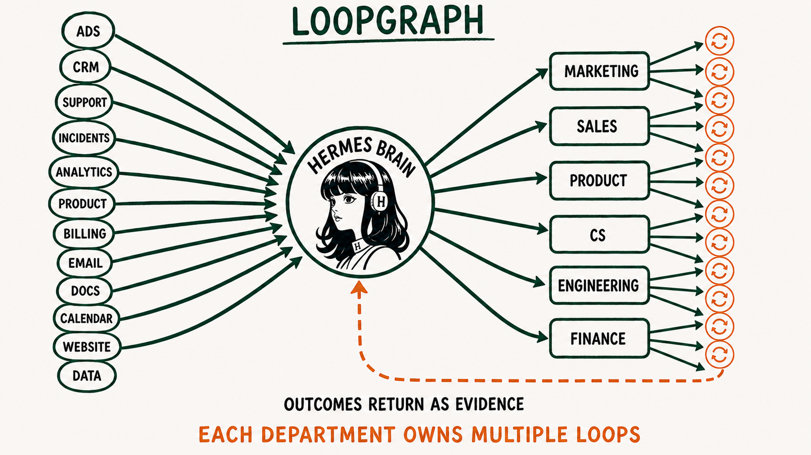
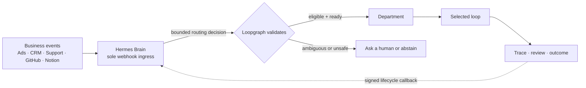

<div align="center">

# Loopgraph

### Design the business loops. Let Hermes route the work. Keep humans in control.

**Loopgraph is the open-source control plane for recurring AI work.** It turns a short department interview into governed, visual automation loops—then gives [Hermes Agent](https://github.com/NousResearch/hermes-agent) one safe place to receive business events and decide which loop should respond.

[](https://github.com/mrrkrieg/loopgraph/actions/workflows/ci.yml)
[](LICENSE)
[](https://www.typescriptlang.org/)
[](https://github.com/mrrkrieg/loopgraph/stargazers)

[Quickstart](#quickstart) · [How it works](#how-it-works) · [Department examples](#department-examples) · [Documentation](#documentation) · [Contributing](#contributing)



</div>

## Why Loopgraph?

AI agents can call tools. The harder problem is deciding **what recurring business process should run, when it should run, what evidence it needs, and when a human must step in**.

Without that operating layer, teams end up with disconnected prompts and brittle webhooks: the wrong automation reacts, duplicate events create duplicate work, risky actions lack approval, and nobody can explain what happened.

Loopgraph gives Hermes a governed map of the company:

- **Discover** high-value automation opportunities by department.
- **Design** complete loops from the current stack, biggest problem, ideal outcome, and risk boundaries.
- **Route** every business event through one Hermes company brain.
- **Validate** Hermes's decision against registered loops, event contracts, readiness, policy, and deduplication rules.
- **Visualize** the company as `Hermes Brain → Department → Loop`.
- **Simulate locally** with generated fixtures before connecting credentials or allowing external writes.
- **Trace and approve** what the loop observed, proposed, verified, escalated, and changed.

> **One brain, many loops.** Every provider webhook terminates at Hermes—not at an individual workflow. Hermes understands the incoming business problem and proposes a route; Loopgraph decides whether that route is valid and safe to run.

## How it works



Hermes and Loopgraph deliberately do different jobs:

| | Hermes Agent — the company brain | Loopgraph — the governed control plane |
|---|---|---|
| **Receives** | Provider webhooks and business signals | Normalized events and bounded routing decisions |
| **Decides** | What business problem the event represents and which loop may fit | Whether that loop exists, accepts the event, has enough evidence, is ready, and is allowed to run |
| **Owns** | Webhook routes, provider secrets, event normalization, semantic routing | LoopSpecs, routing contracts, deduplication, policy, simulation, approvals, traces, and outcomes |
| **When uncertain** | Proposes human/context review instead of guessing | Rejects invalid, stale, forged, duplicate, incompatible, or unsafe routes |

This separation lets Hermes reason broadly without giving an unvalidated model decision direct authority over business systems.

## From a conversation to a running loop

1. **Choose a department.** Management, Marketing, Sales, Product, Customer Success, Engineering, Ops / Finance, HR / Talent, Legal / Compliance, or a custom workflow.
2. **Answer five focused question bundles.** Current stack and sources, biggest recurring problem, useful automation and hard boundaries, ideal measurable outcome, and ownership/rollout.
3. **Review the proposed loops.** A high-reasoning design pass returns triggers, inputs, actions, verification, metrics, assumptions, risks, connections, and required human decisions.
4. **Accept only what you want.** Direct designs materialize only accepted proposals. Opportunity-driven add, update, split, merge, or retirement proposals use a content-bound approval receipt and atomic graph transaction.
5. **Rehearse locally.** Test positive, missing-context, and risk-escalation cases without API keys or external writes.
6. **Connect and promote carefully.** New loops begin in shadow mode. Live work stays blocked until routing, capabilities, approvals, and exact prepared-action fingerprints are ready.
7. **Keep the worker running.** Accepted Hermes routes become durable jobs. The worker claims them atomically, verifies the immutable LoopSpec binding, runs the configured shadow/recommend/approval/autonomous policy, and returns signed lifecycle evidence to Hermes.
8. **Measure the outcome.** Exact metric bindings schedule provider reads through trusted Hermes connectors, record evidence-qualified samples, evaluate primary outcomes and guardrails, and reconcile missing scopes, stale health, route drift, and overdue work.
9. **Keep improving.** The continuous controller evaluates durable outcomes, detects missing or weak loops, asks Hermes for only the missing evidence, and applies only low-risk policy-approved additions in shadow mode.

<p align="center">
  
  <br />
  <sub>The hosted Hermes Brain preview opens on the Product path: incoming data points feed Hermes, Product owns the selected loops, and outcomes return as evidence. A fresh local install starts empty until you create your own loops.</sub>
</p>

## Quickstart

### Requirements

- Node.js 22+ and npm
- A local [Hermes Agent](https://github.com/NousResearch/hermes-agent) installation for the company-brain flow

### 1. Clone Loopgraph and run the guided Hermes setup

```bash
git clone https://github.com/mrrkrieg/loopgraph.git
cd loopgraph
npm ci --no-audit
npm run audit:prod
npm run loopgraph -- hermes setup --project .
```

Use `npm run loopgraph --` from a repository clone. The same commands work as `loopgraph ...` once you are using a published package that includes the Hermes commands.

`npm install` runs npm's full audit, including local lint/build tooling. For the live-credential safety gate, use `npm run audit:prod`; it checks the packages that ship into production use.

The setup command initializes the local workspace, writes the project-local Hermes skill/MCP files, runs doctor checks, and prints the exact next actions.

```text
.loopgraph/hermes/mcp.loopgraph.yaml
.loopgraph/hermes/skills/
~/.hermes/config.yaml
```

Merge the generated MCP snippet into your Hermes config and make sure Hermes can load the generated skills directory. The setup output shows both paths. Loopgraph does **not** copy provider credentials, webhook secrets, or OAuth tokens into `.loopgraph/`.

### 2. Ask Hermes to design the first department

```text
start Loopgraph
```

Hermes should immediately show the department catalog, suggest starting with Product, ask you to pick one or more departments, move through compact question bundles, explain the proposed loops, and materialize only the proposals you accept.

### 3. Open the local company graph

```bash
npm run loopgraph -- studio --project . --start
```

Open the printed local URL. A new local workspace will be intentionally sparse: only loops you create through Hermes or the browser appear. You can inspect each accepted loop's connection checklist, routing receipt, readiness, generated fixtures, recent runs, reviews, and cases from the graph.

### 4. Plan and rehearse Hermes event routes

```bash
npm run loopgraph -- hermes webhooks plan --project .
npm run loopgraph -- hermes webhooks sync --project .
npm run loopgraph -- hermes webhooks doctor --project .
```

`sync` writes a **non-secret local route manifest**. Hermes still owns the real provider subscriptions and signing secrets; Loopgraph only records the route families and capabilities it must validate.

Test a generated, synthetic event before connecting a real webhook:

```bash
npm run loopgraph -- events test --project . \
  --source google_ads* \
  --fixture .loopgraph/generated/hermes/marketing/marketing_ads/fixtures/happy-path.json \
  --expected-action route \
  --expected-loop marketing_ads \
  --require-synced-manifest
```

For the full walkthrough, see the [Hermes Quickstart](docs/HERMES-QUICKSTART.md).

### 5. Process accepted Hermes routes

Run one safe local batch:

```bash
npm run loopgraph -- worker run --project .
```

Or keep the project-local worker polling:

```bash
npm run loopgraph -- worker run --project . --watch --interval 5
```

Shadow, recommend, and simulate jobs stay local. Approval-bound jobs pause on exact prepared-action fingerprints. Autonomous work still fails closed unless the live execution gate, connector readiness, and low-risk policy all pass. See the [route-job worker](docs/ROUTE-JOB-WORKER.md).

### 6. Bind and collect outcome evidence

After Hermes connects a provider, register only its non-secret metadata and opaque credential reference, then bind each LoopSpec metric to an exact provider field and schedule:

```bash
npm run loopgraph -- connections register --project . --file connection.json
npm run loopgraph -- measurements bindings set --project . --file metric-binding.json
npm run loopgraph -- measurements schedule --project . --backfill 2
npm run loopgraph -- connections reconcile --project .
```

Hermes retains every credential. A trusted collector claims the structured measurement jobs, executes them through the referenced connector, and returns values with durable provider evidence. Loopgraph evaluates complete primary/baseline windows and guardrails automatically; missing data stays incomplete. See [Hermes connector measurements](docs/CONNECTOR-MEASUREMENTS.md).

### 7. Keep the Hermes Brain improvement cycle running

Run one evidence-to-design cycle:

```bash
npm run loopgraph -- controller run --project . --trigger-type manual
```

Or keep the trusted local controller processing idempotent triggers:

```bash
npm run loopgraph -- controller run --project . --trigger-type schedule --watch --interval 900
```

Event intake, routing decisions, worker results, reviews, outcomes, and management schedules enqueue controller triggers automatically. Only strict low-risk additions can materialize automatically, and they remain in shadow mode. See the [continuous loop controller](docs/CONTINUOUS-LOOP-CONTROLLER.md).

### 8. Operate the improvement cycle

Open Studio and choose **Operate**:

```bash
npm run loopgraph -- studio --project . --start
```

- **Opportunities** explains which recurring problem Hermes detected and why it was scored.
- **Change review** shows the exact add, update, split, merge, or retire operation plus its approval and transaction receipts.
- **Controller** shows what triggered Hermes, what it decided, and which policy rule allowed or stopped the action.
- **Learning** traces a connector binding through scheduled measurement jobs to samples, guardrails, and an observed outcome.
- **Value** subtracts review, rework, botsitting, escalation, and governance cost while keeping observed, modeled, and incomplete claims separate.

The hosted preview uses clearly labeled illustrative records. A fresh local install shows only evidence from the active project and stays empty until Hermes creates or observes something.

### 9. Check before live credentials

Before connecting live provider credentials or production webhook routes, run:

```bash
npm run audit:prod
```

Treat production audit findings as blockers for live credentials. You can still use local discovery, generated designs, redacted fixtures, and simulation while remediation is in progress because those flows do not store provider secrets or perform live external writes.

## Department examples

The same Hermes-brain pattern works across the company. Product is shown first; expand any other department to see its stack, proposed graph, routing decisions, and safety boundary.

### Product — Feedback Clustering + Release Learning

Suppose Product uses Productboard, Linear, Intercom, PostHog, Notion, and Slack. The team says feedback is fragmented, roadmap discussions start from anecdotes, release outcomes are reviewed late, and product direction must remain with the product lead.

Loopgraph can design two independent loops:

```text
Hermes Brain
└── Product
    ├── Feedback Clustering
    └── Release Learning
```

| Incoming problem | Hermes decision | Loopgraph response |
|---|---|---|
| New feedback crosses a repeated-theme threshold with linked customer evidence | Route to **Feedback Clustering** | Group the evidence, preserve source links, and prepare a product-problem brief |
| A release reaches its measurement window with adoption and outcome data | Route to **Release Learning** | Compare expected and observed outcomes and prepare a traceable learning review |
| A single strategic customer asks for an immediate roadmap change | Request product-owner review | Do not treat one request as a validated cluster or change roadmap priority automatically |
| The same feedback item arrives from a replayed sync | Repeat the same route decision | Attach no duplicate evidence and avoid opening a second problem |

Loopgraph may draft evidence and tickets, but roadmap, scope, and customer-commitment changes require product-owner approval.

<details>
<summary><strong>Sales — Lead Qualification + Follow-Up Latency</strong></summary>

Suppose Sales uses Salesforce or HubSpot, Gmail, Calendar, call notes, and Slack. The team says good leads wait too long, sellers spend hours reconstructing account context, CRM records are incomplete, and every customer-facing message must remain seller-approved.

Loopgraph can design two independent loops:

```text
Hermes Brain
└── Sales
    ├── Lead Qualification
    └── Follow-Up Latency
```

| Incoming problem | Hermes decision | Loopgraph response |
|---|---|---|
| New lead with fit, intent, account, and source evidence | Route to **Lead Qualification** | Validate the CRM event, prepare an evidence-backed score, and assign the appropriate review/queue |
| Lead or opportunity has no next activity after the allowed follow-up window | Route to **Follow-Up Latency** | Load relationship context and prepare—not send—a personalized follow-up draft |
| Late-stage deal is blocked by pricing, legal terms, or an executive commitment | Request seller or manager choice | Abstain from the two loops because a Close Readiness or expert-owned decision may be needed |
| CRM retries the same update | Repeat the same route decision | Suppress duplicate work using the lead/opportunity identity and event ID |

Customer-facing sends, pricing exceptions, negotiation, and commitments stay human-owned.

</details>

<details>
<summary><strong>Marketing — Ads + Content Creation</strong></summary>

Suppose Marketing uses Google Ads, product analytics, HubSpot, Notion, Webflow, and Slack. The team says campaign review is slow, content preparation is inconsistent, publishing and budget changes require approval, and qualified pipeline matters more than surface-level engagement.

Loopgraph can design two independent loops:

```text
Hermes Brain
└── Marketing
    ├── Ads
    └── Content Creation
```

The important part is not the diagram—it is the routing contract behind it:

| Incoming problem | Hermes decision | Loopgraph response |
|---|---|---|
| Campaign spend or efficiency anomaly with the required campaign evidence | Route to **Ads** | Validate the event contract, open/update the business problem, and start in the configured rollout mode |
| Approved content brief with trusted source material | Route to **Content Creation** | Validate the content route and prepare the governed content loop |
| Landing-page conversion drop with no campaign mapping | Request context or human choice | Abstain instead of guessing between Ads and Content Creation |
| Duplicate provider delivery | Repeats the same route decision | Suppress duplicate work through durable event/problem identity |

The committed golden flow covers positive Ads and Content events, duplicates, no-match events, and ambiguous events that require human/context review.

</details>

<details>
<summary><strong>Customer Success — Customer Health + Renewal Risk</strong></summary>

Suppose Customer Success uses Salesforce or HubSpot, Intercom or Zendesk, product usage analytics, billing data, Calendar, and Slack. The team says risk is discovered too late, account context is scattered, renewal preparation is reactive, and service or roadmap commitments require an accountable CSM.

Loopgraph can design two independent loops:

```text
Hermes Brain
└── Customer Success
    ├── Customer Health
    └── Renewal Risk
```

| Incoming problem | Hermes decision | Loopgraph response |
|---|---|---|
| Usage decline, rising support severity, or sentiment change crosses the health threshold | Route to **Customer Health** | Validate account evidence and prepare a health-risk brief for the account owner |
| Renewal window opens with commercial context and credible churn signals | Route to **Renewal Risk** | Build an intervention plan using the renewal date, relationship history, and verified risk evidence |
| Angry support ticket has no stable account or renewal mapping | Request context or human triage | Avoid guessing between health, renewal, and ticket-escalation work |
| Support and CRM deliver the same normalized event | Repeat the same route decision | Merge evidence into the open account problem rather than creating duplicate work |

Customer messages, service credits, discounts, roadmap promises, and contractual commitments stay human-owned.

</details>

<details>
<summary><strong>Engineering — GitHub Issue Triage + Release Readiness</strong></summary>

Suppose Engineering uses GitHub, Linear, CI, Sentry, PagerDuty, and Slack. The team says issue triage is noisy, release checks are reconstructed manually, reviewers lack risk context, and no agent may merge, deploy, roll back, or close an incident without approval.

Loopgraph can design two independent loops:

```text
Hermes Brain
└── Engineering
    ├── GitHub Issue Triage
    └── Release Readiness
```

| Incoming problem | Hermes decision | Loopgraph response |
|---|---|---|
| New GitHub issue includes repository, issue body, and applicable maintainer policy | Route to **GitHub Issue Triage** | Classify the issue, prepare labels or a response draft, and escalate security-sensitive evidence |
| Release candidate is created with checks, changed files, migration state, owner, and rollback evidence | Route to **Release Readiness** | Verify the release checklist and prepare a go/no-go review packet |
| Production incident is still active | Request incident-owner handling | Do not misroute active response work into post-incident learning or ordinary issue triage |
| GitHub redelivers the same webhook | Repeat the same route decision | Suppress the duplicate using delivery and subject identity |

Code changes, merges, deployments, rollbacks, and incident closure require accountable engineering approval.

</details>

<details>
<summary><strong>Ops / Finance — Invoice Variance + Approval Bottleneck</strong></summary>

Suppose Ops / Finance uses NetSuite or QuickBooks, Stripe, Bill.com, spreadsheets, a procurement system, and Slack. The team says invoice exceptions are slow to reconcile, approval queues stall without an owner, finance data is split across systems, and no automation may approve payments or budget changes.

Loopgraph can design two independent loops:

```text
Hermes Brain
└── Ops / Finance
    ├── Invoice Variance
    └── Approval Bottleneck
```

| Incoming problem | Hermes decision | Loopgraph response |
|---|---|---|
| New invoice exceeds the configured amount, PO, quantity, tax, or vendor tolerance | Route to **Invoice Variance** | Reconcile authoritative records and prepare a variance explanation for the finance owner |
| Approval item has exceeded its SLA with a valid owner and policy reference | Route to **Approval Bottleneck** | Prepare the missing-context summary and route an approval reminder or decision packet |
| Event requests an immediate payment, collection action, or budget transfer | Block and request finance approval | Refuse autonomous financial commitment even when the underlying numbers are available |
| Finance provider retries the same invoice event | Repeat the same route decision | Update the existing variance problem without creating a second case |

Payments, collections, vendor commitments, budget changes, and resource allocation always require finance or leadership approval.

</details>

<details>
<summary><strong>HR / Talent — Candidate Pipeline + Onboarding Progress</strong></summary>

Suppose HR / Talent uses Greenhouse or Lever, an HRIS, an onboarding system, Calendar, approved documents, and Slack. The team says interview feedback goes missing, new-hire tasks slip between teams, sensitive data must be minimized, and employment decisions must never be delegated to an agent.

Loopgraph can design two independent loops:

```text
Hermes Brain
└── HR / Talent
    ├── Candidate Pipeline
    └── Onboarding Progress
```

| Incoming problem | Hermes decision | Loopgraph response |
|---|---|---|
| Candidate stage has stalled because approved interview feedback or a next action is missing | Route to **Candidate Pipeline** | Prepare a process-status summary and request the missing human input without ranking the person |
| New-hire onboarding milestone is overdue with an assigned owner | Route to **Onboarding Progress** | Identify the operational gap and prepare an owner follow-up/checklist |
| Event asks for candidate rejection, compensation, discipline, performance judgment, or inferred engagement risk | Block and route to HR | Exclude the sensitive decision from autonomous routing and require policy-reviewed human judgment |
| ATS retries the same stage-change event | Repeat the same route decision | Suppress duplicate work against the candidate/process subject identity |

Candidate ranking or rejection, compensation, performance, discipline, and other employment decisions remain fully human-owned.

</details>

<details>
<summary><strong>Legal / Compliance — Contract Risk Triage + Compliance Evidence</strong></summary>

Suppose Legal / Compliance uses a contract repository, Vanta or Drata, an approved policy library, access logs, a security questionnaire system, and email. The team says experts spend too much time gathering evidence, answers lack provenance, contracts arrive without structured triage, and risk acceptance must remain with qualified reviewers.

Loopgraph can design two independent loops:

```text
Hermes Brain
└── Legal / Compliance
    ├── Contract Risk Triage
    └── Compliance Evidence
```

| Incoming problem | Hermes decision | Loopgraph response |
|---|---|---|
| Contract draft arrives with counterparty, playbook, version, and approved clause sources | Route to **Contract Risk Triage** | Extract and compare relevant clauses, then prepare an exception packet for expert review |
| Control owner requests evidence with approved sources, freshness rules, and redaction confirmation | Route to **Compliance Evidence** | Assemble a cited evidence packet without sending an external answer |
| Event asks Hermes to interpret law, accept risk, approve access, or change contract terms | Block and request expert review | Keep the loop in evidence-preparation mode and require legal/compliance judgment |
| Questionnaire or contract system retries the same event | Repeat the same route decision | Reuse the existing business problem and suppress duplicate work |

Legal interpretation, risk acceptance, contract changes, access approval, and external submissions require expert approval. Sensitive Legal / Compliance loops begin at stricter autonomy levels.

</details>

<details>
<summary><strong>Management — Daily Operating Review + Decision Memo</strong></summary>

Suppose leadership uses Loopgraph traces, OKRs, project trackers, finance dashboards, Slack, and weekly operating reviews. The team says decisions wait for context, cross-functional dependencies age silently, the same issues recur, and staffing, budget, or priority changes must remain accountable leadership decisions.

Loopgraph can design two independent loops:

```text
Hermes Brain
└── Management
    ├── Daily Operating Review
    └── Decision Memo
```

| Incoming problem | Hermes decision | Loopgraph response |
|---|---|---|
| Scheduled operating review finds open cases, stale dependencies, blocked loops, and verified metric anomalies | Route to **Daily Operating Review** | Produce a trace-supported operating summary with owners and next decisions |
| Explicit decision request includes alternatives, evidence, accountable owner, and deadline | Route to **Decision Memo** | Prepare options, tradeoffs, unresolved assumptions, and a review packet |
| Signal implies a staffing, budget, legal, or strategic-priority change without an accountable decision owner | Request leadership review | Abstain from changing resources or inventing authority |
| Several departments report the same dependency | Update the existing management problem | Consolidate evidence instead of opening duplicate executive work |

Management loops coordinate evidence and accountability; they do not autonomously change staffing, budget, commitments, or company priorities.

</details>

These examples use Loopgraph's shipped department blueprints and safety rules. The exact loops, event fields, systems, thresholds, metrics, owners, and rollout modes are generated from each company's discovery answers rather than hard-coded for every installation.

## What a loop contains

A loop is more than a prompt or a tool chain. Each versioned `loopgraph/v1alpha1` LoopSpec defines:

- the event or cadence that starts work;
- the evidence it may observe and the provenance required;
- the routine and the actions it may prepare;
- allowed, forbidden, and approval-gated behavior;
- verification and completion/failure signals;
- the owner, reviewers, escalation conditions, and rollout mode;
- primary outcomes, leading indicators, and guardrail metrics;
- the routing contract Hermes must satisfy before the loop can run.

Materialization also creates connection requirements and three starter fixtures: **happy path**, **missing context**, and **risk escalation**.

## What you connect

Each proposal includes a concrete connection checklist, so the user sees what is required before a loop can move beyond local simulation:

| Connection | Why the loop needs it | Typical examples |
|---|---|---|
| **Event source → Hermes** | Tell the company brain that a business problem may exist | Ads anomaly, CRM stage change, support escalation, approved content brief, GitHub issue |
| **Source of truth** | Read the authoritative business object and required evidence | CRM, analytics, ad platform, issue tracker, approved documents, finance system |
| **Action destination** | Store a draft or perform an explicitly allowed action | CMS draft, CRM task, ticket, review packet, experiment tracker |
| **Outcome source** | Verify that the problem was actually handled | Qualified pipeline, activation, resolution time, approval result, audit evidence |
| **Human owner/reviewer** | Resolve ambiguity and approve risky or external-facing work | Department lead, finance, legal, security, people manager |

Real webhook secrets and provider credentials remain with Hermes or an approved credential store. Loopgraph records non-secret capability requirements and readiness—not raw secrets.

## Safe by default

| Mode | What it does | External writes |
|---|---|---|
| **Validate** | Checks schema, routing contracts, and policy | None |
| **Simulate** | Runs deterministic/redacted fixtures and produces traces and review packets | None |
| **Shadow routing** | Records what Hermes would have selected and measures routing quality | None |
| **Recommend** | Prepares a governed recommendation for review | None by default |
| **Execute** *(experimental)* | Runs only after live activation, connector readiness, route validation, and approval/fingerprint gates | Explicitly gated |

Provider secrets, OAuth tokens, and webhook signing keys stay in Hermes or an approved credential store—never in chat or committed `.loopgraph` state.

## Runnable reference examples

| Example | What it demonstrates |
|---|---|
| [Product: Feedback Clustering + Release Learning](docs/HERMES-EXAMPLES.md#product-feedback-clustering--release-learning) | Product-first Hermes path for feedback, release learning, product-owner review, and outcome evidence |
| [Marketing: Ads + Content Creation](docs/HERMES-EXAMPLES.md#marketing-ads--content-creation) | Two loops in one department with distinct Hermes routing contracts |
| [Legal / Compliance evidence review](docs/HERMES-EXAMPLES.md#sensitive-department-legal--compliance-evidence-review) | Sensitive work capped in shadow mode with expert approval and blocked actions |
| [Custom field-ops route](docs/HERMES-EXAMPLES.md#custom-department-field-ops-custom-app-route) | A custom department using the same event-brain pattern |
| [`examples/department-skills/sales.yaml`](examples/department-skills/sales.yaml) | Lead qualification, pipeline forecast, close readiness, follow-up latency, and CRM hygiene |
| [`examples/department-skills/customer-success.yaml`](examples/department-skills/customer-success.yaml) | Customer health, renewal risk, QBR prep, ticket escalation, and knowledge-base maintenance |
| [`examples/department-skills/engineering.yaml`](examples/department-skills/engineering.yaml) | GitHub issue triage, PR review prep, incident learning, release readiness, QA, and bug clustering |
| [`examples/department-skills/ops-finance.yaml`](examples/department-skills/ops-finance.yaml) | Approval bottlenecks, invoice variance, cash collection, forecast variance, and resource allocation |
| [`examples/department-skills/hr-talent.yaml`](examples/department-skills/hr-talent.yaml) | Candidate pipeline, onboarding progress, performance review prep, manager coaching, and engagement risk |
| [`examples/department-skills/legal-compliance.yaml`](examples/department-skills/legal-compliance.yaml) | Policy drift, security questionnaires, contract risk, compliance evidence, and access review |
| [`examples/department-skills/management.yaml`](examples/department-skills/management.yaml) | Daily operating review, decision memos, anomaly detection, resource allocation, and loop governance |
| [`examples/department-skills/marketing.yaml`](examples/department-skills/marketing.yaml) | Campaign learning, landing-page experiments, brand claim review, competitor monitoring, and SEO refresh |
| [`examples/github-issue-triage`](examples/github-issue-triage) | Code-first validate/simulate workflow |
| [`examples/strategic-account-escalation`](examples/strategic-account-escalation) | Management escalation and evidence handoff |
| [`examples/support-ticket-triage`](examples/support-ticket-triage) | Support prioritization with review-aware routing |
| [`examples/management-review`](examples/management-review) | Scheduled management review loop for operating cadence, ownership, and follow-up decisions |

## CLI at a glance

```bash
# Local project + Hermes
npm run loopgraph -- workspace inspect --project .
npm run loopgraph -- hermes doctor --project .
npm run loopgraph -- studio --project . --start

# Code-first loops
npm run loopgraph -- validate examples/github-issue-triage
npm run loopgraph -- simulate examples/github-issue-triage \
  --fixture fixtures/github-issue-triage/security-issue.json

# Operations
npm run loopgraph -- trace <runId> --review
npm run loopgraph -- review packet <runId>
npm run loopgraph -- case list
npm run loopgraph -- case resolve <caseId> --summary "Resolved"

# Semantic graph governance
npm run loopgraph -- graph history --project .
npm run loopgraph -- graph change decide <changeSetId> --help
npm run loopgraph -- graph promotion approve <loopId> --help
npm run loopgraph -- graph promotion rehearse <loopId> --to recommend --by <actor>
npm run loopgraph -- graph rollback approve <transactionId> --help
```

From an installed package, use `loopgraph` in place of `npm run loopgraph --`.

## Built with

- TypeScript, Node.js, and Zod for versioned contracts
- Next.js and React for the local Design Studio
- MCP tools and project-local skills for Hermes integration
- Deterministic fixtures and Vitest for reproducible local validation
- Optional Supabase persistence for the browser Design Studio

Loopgraph does not replace LangGraph, Mastra, Temporal, Langfuse, or HumanLayer. It provides the operating contract around recurring AI work: **context, routing, policy, evidence, approval, escalation, and outcome**. Read the [competitive boundary](docs/competitive-boundary.md).

## Project status

Loopgraph is in active early development. The local Hermes discovery → design → governed graph transaction → visualize → route → durable worker → scheduled measurement → outcome/controller flow is implemented and covered by regression tests. The Operate workspace exposes opportunities, graph change review, controller decisions, learning evidence, and net value as project-local views. Exact metric bindings, leased provider-read jobs, connector/route reconciliation, baseline/outcome evaluation, and a net-value ledger distinguish observed, modeled, and incomplete evidence without inventing local value. Semantic changes are content-bound, atomic, and reversible; provider API clients, OAuth, and live webhook subscription application remain Hermes-owned integration steps, and live external writes remain experimental.

The safest supported path today is **design locally, materialize, rehearse routing, run the worker in shadow/simulate mode, and review the resulting trace**.

## Documentation

- [Hermes Quickstart](docs/HERMES-QUICKSTART.md) — complete local setup and event rehearsal
- [Hermes design bridge](docs/HERMES-DESIGN-BRIDGE.md) — durable design tasks, focused evidence gaps, secure proactive activation, and callbacks
- [Loop opportunity engine](docs/LOOP-OPPORTUNITY-ENGINE.md) — detect missing or weak loops from operating evidence and start governed Hermes design
- [Durable route-job worker](docs/ROUTE-JOB-WORKER.md) — atomic claims, activation gates, approval reconciliation, retries, and lifecycle evidence
- [Outcomes and value](docs/OUTCOMES-AND-VALUE.md) — source-qualified measurements, business outcomes, and net value after operating cost
- [Hermes connector measurements](docs/CONNECTOR-MEASUREMENTS.md) — exact provider bindings, scheduled jobs, evidence collection, and reconciliation
- [Continuous loop controller](docs/CONTINUOUS-LOOP-CONTROLLER.md) — durable evidence-to-design cycles with strict automatic-shadow policy receipts
- [Semantic graph transactions](docs/SEMANTIC-GRAPH-TRANSACTIONS.md) — exact approvals, atomic add/update/split/merge/retire changes, promotion, lifecycle, and rollback
- [Promotion rehearsal](docs/PROMOTION-REHEARSAL.md) — automatic simulation, routing, ambiguity, regression, policy, and evidence gates before promotion
- [Hermes examples](docs/HERMES-EXAMPLES.md) — Marketing, Legal / Compliance, and custom flows
- [Hermes completion audit](docs/HERMES-COMPLETION-AUDIT.md) — implementation-to-test evidence map
- [Event-brain integration plan](docs/HERMES-EVENT-BRAIN-INTEGRATION-PLAN.md) — detailed architecture and product plan
- [LoopSpec reference](docs/loop-spec.md) — the loop contract
- [Approval model](docs/approval-model.md) — exact-action review and fingerprint binding
- [Topology guide](docs/topology-guide.md) — understanding the operating map
- [Current build state](docs/CURRENT-STATE.md) — what is implemented now
- [Hosted security](docs/HOSTED-SECURITY.md) — Supabase Auth, organization roles, RLS, service-role boundaries, and production limitations
- [Hosted runtime namespaces](docs/HOSTED-RUNTIME-NAMESPACES.md) — organization/project isolation for persistent runtime state and its current single-writer boundary

## Contributing

Loopgraph is being built in the open, and contributions are welcome. High-leverage areas include:

- new department skill packs and high-quality discovery questions;
- provider capability adapters and safe connector contracts;
- real-world routing fixtures, especially ambiguous and no-match cases;
- loop templates for recurring business problems;
- graph, review, and operational debugging UX;
- documentation and reproducible examples.

Read [CONTRIBUTING.md](CONTRIBUTING.md), open an [issue](https://github.com/mrrkrieg/loopgraph/issues), or propose a focused pull request. For sensitive vulnerabilities, follow [SECURITY.md](SECURITY.md) instead of opening a public issue.

If Loopgraph's direction is useful to you, [star the repository](https://github.com/mrrkrieg/loopgraph) and share the department or business loop you want to build next.

## License

[MIT](LICENSE)
