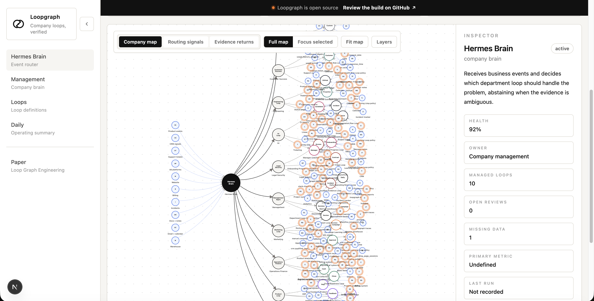
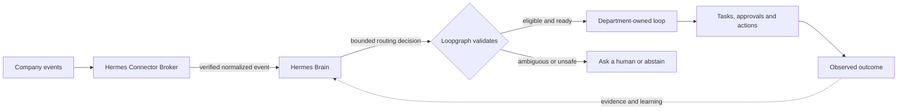

<div align="center">

# Loopgraph

### Give Hermes a governed operating model of your company.

Loopgraph turns company events into department-owned business loops. Hermes understands the problem and chooses which loop should respond; Loopgraph validates the decision, controls execution, and records whether the work created value.

[Live demo](https://loopgraph.vercel.app/brain?catalog=1) · [Quickstart](#quickstart) · [Product example](#product-example) · [Security](#designed-for-governed-company-use) · [Documentation](#documentation)

[](https://github.com/mrrkrieg/loopgraph/actions/workflows/ci.yml)
[](LICENSE)
[](https://www.typescriptlang.org/)
[](https://github.com/mrrkrieg/loopgraph/stargazers)



<sub>The hosted preview uses illustrative company data. A fresh local workspace starts empty and shows only the loops you create and accept.</sub>

</div>

> **One Hermes Brain. Multiple departments. Governed loops. Shared business learning.**

## Why Loopgraph?

AI agents can call tools. Companies still need to decide:

- which recurring business process should respond to an event;
- what context, permissions, and approvals the process requires;
- whether the work produced a meaningful business outcome.

Without that operating layer, teams accumulate disconnected prompts and brittle webhooks. The wrong automation reacts, duplicate events create duplicate work, context disappears between departments, and nobody can explain why an action happened.

Loopgraph gives [Hermes Agent](https://github.com/NousResearch/hermes-agent) a versioned map of the company:

- **Discover** recurring problems and automation opportunities by department.
- **Design** complete operating loops from the current stack, problem, outcome, owner, and risk boundaries.
- **Route** verified business events through one Hermes company brain.
- **Govern** routing, capabilities, approvals, rollout, and exact external actions.
- **Visualize** the live topology as `Hermes Brain → Department → Loop`.
- **Measure** outcomes and return evidence to future routing and loop-improvement decisions.

Hermes decides. Loopgraph validates, governs, and records.

## How it works



| Component | Responsibility |
|---|---|
| **Hermes Connector Broker** | Verifies provider events, protects credentials, runs leased bounded detectors for non-webhook sources, normalizes payloads, and exposes only capability-scoped provider operations |
| **Hermes Brain** | Determines what business problem occurred, which company object is affected, and which loop—or human review—should respond |
| **Loopgraph** | Defines the topology and LoopSpecs, validates routing and readiness, enforces policy, records execution, and evaluates outcomes |

This separation allows Hermes to reason across the company without treating a model decision as trusted authorization.

### What Hermes evaluates

For every verified event, Hermes can ask:

1. What happened, and which company object is affected?
2. Is this a new problem or additional evidence for an existing problem?
3. Which loops claim to handle this problem type?
4. Which loops have the required context and active connections?
5. Do exclusions, risk rules, or human-ownership boundaries apply?
6. Is there one clear route, or is explicit fan-out permitted?
7. Should Hermes abstain and request more context or human judgment?

Loopgraph independently confirms that the proposed route exists, accepts the event, has the required evidence, is active, and is permitted to run.

## Product example

Suppose Product uses Intercom, PostHog, Productboard, Linear, Notion, and Slack. Customer feedback is fragmented, roadmap discussions begin with anecdotes, and release outcomes are reviewed too late.

```text
Intercom feedback ─┐
PostHog usage ─────┼──→ Hermes Brain
CRM account data ──┘         │
                             ▼
                           Product
                             ├── Feedback Clustering
                             ├── Product Problem
                             └── Release Learning
                                      │
                                      ▼
                          Adoption and retention evidence
```

When several customers report the same onboarding problem:

1. The Connector Broker verifies and normalizes the provider events.
2. Hermes resolves the affected accounts and determines whether the reports belong to one existing product problem.
3. Hermes selects **Feedback Clustering** as the primary loop and invokes supporting loops only when the topology permits it.
4. Loopgraph verifies the event contract, required evidence, exclusions, connection health, and rollout mode.
5. Hermes prepares a product-problem brief with source evidence and affected-company context.
6. Product scope, roadmap changes, and customer commitments remain product-owner decisions.
7. Release adoption and retention outcomes return as evidence for future Product and Customer Success decisions.

The automation is not successful merely because it produced a brief. It is successful only when the observed outcome supports the loop's goal without violating its guardrails.

## What makes it different

| Traditional automation | Loopgraph with Hermes |
|---|---|
| A trigger connects directly to one workflow | Verified events reach a company-level semantic router |
| Every workflow maintains separate context | Loops share company objects, problems, and accumulated evidence |
| A workflow runs when conditions match | Hermes interprets the problem; Loopgraph validates eligibility and authority |
| Success means the workflow completed | Success is evaluated through an observed business outcome |
| The worker often receives reusable credentials | Hermes receives capabilities, not reusable provider tokens |
| The diagram documents the workflow | Governed graph changes update backend topology and routing contracts |
| Automations optimize local activity | Evidence can improve decisions across departments |

Loopgraph does not replace LangGraph, Mastra, Temporal, Langfuse, or HumanLayer. It provides the company operating contract around recurring AI work: **context, routing, policy, evidence, approval, escalation, and outcome**. See the [competitive boundary](docs/competitive-boundary.md).

## What a loop contains

A loop is more than a prompt or tool chain. Each versioned `loopgraph/v1alpha1` LoopSpec defines:

- the event, schedule, or business condition that starts work;
- the company object and problem types it claims;
- the evidence it may observe and the provenance required;
- the tasks and capability-scoped actions it may prepare;
- allowed, forbidden, and approval-gated behavior;
- verification, completion, and failure signals;
- the owner, reviewers, escalation conditions, and rollout mode;
- primary outcomes, leading indicators, and guardrail metrics;
- routing exclusions and the context Hermes must supply before the loop can run.

Materialization creates the graph nodes, connection requirements, routing contract, and three starter fixtures: **happy path**, **missing context**, and **risk escalation**.

## Quickstart

### Requirements

- Node.js 22+ and npm
- A local [Hermes Agent](https://github.com/NousResearch/hermes-agent) installation

Confirm Hermes is available:

```bash
hermes --version
```

Clone Loopgraph and activate the project-local Hermes integration:

```bash
git clone https://github.com/mrrkrieg/loopgraph.git
cd loopgraph
npm ci --no-audit
npm run audit:prod
npm run loopgraph -- setup --project . --activate
```

The top-level setup command creates an empty local workspace, generates the Loopgraph Hermes skill, registers the scoped MCP servers, synchronizes the non-secret route manifest, prepares the Studio launch plan, and runs doctor checks. It does not copy preview loops, provider credentials, OAuth tokens, or webhook secrets into `.loopgraph/`. Omit `--activate` when you want to inspect the generated Hermes configuration before applying it.

Open Hermes and say:

```text
start Loopgraph
```

Hermes will show the department catalog, recommend Product as the first example, ask compact questions about your stack and goals, explain the proposed loops, and materialize only the proposals you accept.

Start the local operating plane and company graph:

```bash
npm run loopgraph -- start --project .
```

One process now owns the worker lifecycle, controller scheduler, Hermes route synchronization, connector reconciliation, measurement scheduling, opportunity scans, installed-app update checks, aggregate health, and—when run from the repository clone—the Studio server. It uses an exclusive local lease, component-specific cadences, secret-redacted errors, atomic status snapshots, and graceful shutdown. The Brain page shows whether the supervisor is running and the last aggregate result. Run `npm run loopgraph -- start --project . --once` for a complete non-daemon health/work cycle. The advanced worker, controller, measurement, route, and Studio commands remain available for diagnosis.

The printed URL opens the editable Hermes Brain topology. Local and hosted workspaces both save layout changes as backend graph transactions. Hosted receipts are tenant/project scoped and bound to the authenticated operator. Proposing a loop, valid workflow connection, or improve/split/merge/retire lifecycle change automatically opens a durable opportunity, versioned graph change set, and Hermes design task. The graph reloads those correlations from durable records, marks affected live loops with an amber pending-change ring, and gives operators the exact Hermes-question or accountable-review handoff in the loop inspector. The review surface can approve or reject the exact change set, but approval fails closed until the completed Hermes task, immutable design run, validated proposal identities, and proposal-content hash all agree. Application is a separate operator action: the server reloads the content-bound approval and Hermes artifacts, snapshots the current graph, rejects stale state, and commits or rolls back one atomic topology transaction. The ring is explicitly a proposal overlay: it never changes routing or presents a draft edge as live topology. If context is missing, Hermes asks only the blocking questions; nothing becomes runnable until design, accountable approval, readiness, and promotion checks pass.

For event rehearsal, advanced service operation, and hosted deployment, continue with the [Hermes Quickstart](docs/HERMES-QUICKSTART.md) and [local supervisor contract](docs/LOCAL-SUPERVISOR.md).

## Install a complete business capability

Loopgraph Apps package one or more cooperating loops, Hermes skills, connector requirements, setup questions, policies, fixtures, metrics, and graph relationships into one immutable, inspectable release.

Opinionated apps also declare a typed evidence topology in the signed pack: shared company objects, evidence inputs, produced evidence, learning returns, and the exact supporting-loop edges Hermes may use. A loop allowing multiple routes is not enough on its own—Hermes must select exactly one primary route, every supporting route must be eligible, and the primary loop must explicitly permit that supporting loop. The Marketplace preview and installed company graph are compiled from this same contract.

### Start with a complete department

For a company-wide starting point, the official **SaaS Company Operating System** Blueprint composes all nine Department Packs under Hermes Brain. It defines canonical Account, Campaign, Product Problem, Incident, Contract, Forecast, and Decision objects plus the precise evidence conditions for cross-department handoffs. The Blueprint is visual and inspectable in Marketplace, but remains read-only: it opens the next safe Department Pack rather than installing the company automatically.

```bash
npm run loopgraph -- apps company-blueprints "saas recurring revenue"
npm run loopgraph -- apps company-blueprint loopgraph.company.saas-operating-system
```

See [Company Blueprints](docs/COMPANY-BLUEPRINTS.md) for the shared-object and cross-department routing contract.

Department Packs group the official Apps that commonly work together for Product, Sales, Marketing, Customer Success, Engineering, Operations & Finance, HR & Talent, Legal & Compliance, and Management. Each Pack declares an install order, shared company-context keys, shared logical capabilities, dependencies, and the only cross-App handoffs or evidence returns Hermes may consider.

A Pack is intentionally not a bulk installer. Selecting one changes nothing. Hermes inspects the Pack, follows the prerequisite chain for its default App, and brings every App through the same governed onboarding journey and separate approval boundaries. This gives a company an opinionated topology without turning a template into authority.

```bash
# Explore the default topologies without changing the workspace
npm run loopgraph -- apps departments
npm run loopgraph -- apps departments "renewal risk"
npm run loopgraph -- apps department loopgraph.department.customer-success
```

The Marketplace exposes the same service visually. See [Department Packs](docs/DEPARTMENT-PACKS.md) for the contract, current catalog, and extension rules.

| Official app | Department | Business result |
|---|---|---|
| [Turn Customer Feedback Into Validated Product Problems](packs/official/product/turn-feedback-into-product-problems) | Product | Join feedback, usage, issue, and release evidence into validated problems and measurable release learning |
| [Qualify and Route Inbound Leads](packs/official/sales/qualify-route-inbound-leads) | Sales | Research, qualify, route, and learn from inbound demand |
| [Find and Recover Deals Going Cold](packs/official/sales/find-recover-cold-deals) | Sales | Diagnose stalled deals, prepare governed recovery, and learn from pipeline outcomes |
| [Learn Which Campaigns Create Qualified Pipeline](packs/official/marketing/learn-qualified-pipeline) | Marketing | Connect campaign spend to qualification, activation, pipeline, and governed allocation learning |
| [Run Engineering Issue and Incident Operations](packs/official/engineering/run-issue-incident-operations) | Engineering | Route issues and incidents through planning, customer impact, release readiness, and recurrence learning |
| [Explain Forecast Variance and Govern Financial Operations](packs/official/operations-finance/manage-forecast-controls) | Operations & Finance | Reconcile forecast, approval, close, receivable, vendor, and capacity evidence into controlled financial decisions |
| [Operate Fair and Accountable People Workflows](packs/official/hr-talent/operate-people-workflows) | HR & Talent | Reduce hiring, onboarding, manager, retention-review, and performance-review friction without automating employment judgment |
| [Govern Legal, Security, and Compliance Evidence](packs/official/legal-compliance/govern-evidence-and-exceptions) | Legal & Compliance | Assemble source-cited contract, control, access, incident, questionnaire, and audit evidence while preserving expert judgment |
| [Run the Company Operating System](packs/official/management/run-company-operating-system) | Management | Turn cross-department outcomes, constraints, decisions, loop health, and verified value into accountable follow-through and system improvement |
| [Catch Strategic Account and Renewal Risk](packs/official/customer-success/catch-renewal-risk) | Customer Success | Join health, support, billing, adoption, and renewal evidence into governed account recovery |
| [Triage GitHub Issues Safely](packs/official/engineering/triage-github-issues) | Engineering | Classify repository issues and govern security-sensitive escalation |
| [Triage and Escalate Support Tickets](packs/official/customer-success/triage-support-tickets) | Customer Success | Route support demand, prepare responses, and identify material risk |
| [Escalate Strategic Account Risk](packs/official/customer-success/escalate-strategic-accounts) | Customer Success | Join service, incident, renewal, and ownership evidence into a recovery response |

The three original runnable examples remain available for low-level LoopSpec teaching, but LoopPacks are now the marketplace source of truth for new installations. Every official app is indexed from its pack files and includes the complete deterministic safety contract.

Official pack loop contracts also generate the Hermes candidate library and Design Studio template cards. Update the pack manifest, loop YAML, topology, fixtures, or outcome dashboard, then run `npm run generate:app-catalog`; CI runs `npm run check:app-catalog` and rejects drift. Older code-defined entries remain only as an explicit fallback where no official pack successor exists, and legacy template IDs resolve to their canonical pack loop when a successor is available.

Ask Hermes:

```text
Find an app that qualifies inbound leads.
Show me the permissions and graph changes.
Use HubSpot, Gmail, and Slack, and ask only for missing company settings.
Install it, test it, and keep it in shadow mode.
```

Or open **Marketplace** in the browser. Hermes, CLI, and the browser now use one resumable eight-step onboarding contract: choose stack and modules, connect systems, answer only unresolved questions, confirm fields, review the exact installation, rehearse, activate shadow, and operate. Module choices are executable composition, not display preferences: disabled loops, exclusive skills, routes, metrics, permissions, and topology edges are absent from the plan and generated backend. Dependencies and required shared skills are preserved; an empty or dependency-invalid composition fails closed. Before installation, the impact review names every immutable LoopSpec, Hermes skill, routing card, event contract, schedule, metric, fixture, evaluation, dashboard, connector binding, field mapping, and graph asset that the App will create or reuse. It also exposes blocking contract conflicts, exact permission decisions, declared outcomes, and signed evidence or learning edges. Duplicate LoopSpecs and incompatible asset contracts fail during planning instead of after installation begins. The current step and next approval boundary remain visible after installation instead of dropping the user into disconnected controls. The install button stays disabled until required context, connections, mappings, confirmations, permissions, and conflicts are resolved. Shadow activation consumes a short-lived approval receipt bound to the exact installation, artifact, state, and mode; an actor label or chat confirmation cannot promote it. Provider writes remain blocked after installation.

Field mappings are connection-bound and reusable. An authenticated Hermes connector may record a short-lived, redacted-only provider schema snapshot; Loopgraph then explains its logical-field suggestions and shows bounded sample values. An operator must confirm the exact mappings before they can satisfy installation readiness. Loopgraph never treats name similarity as approval and never stores a provider credential in the mapping registry.

In a hosted workspace, the installer reads eligible connections directly from the Hermes Connector Broker through a server-only, secret-free projection. App Platform receives only the installation identity, provider, environment, health, granted scopes, and broker-authorized capabilities—not access tokens, refresh tokens, or vault references. It resolves each app's logical capability against that bounded authority, deep-links operators into supported provider onboarding when a connection is missing, and labels providers outside the current broker catalog as **Custom connector required** instead of implying one-click support.

The same application service is available through the CLI:

```bash
# Discover and inspect without changing the workspace
npm run loopgraph -- apps search "qualify inbound leads"
npm run loopgraph -- apps get loopgraph.sales.qualify-route-inbound-leads
npm run loopgraph -- apps onboard loopgraph.sales.qualify-route-inbound-leads

# After Hermes connects the stack, inspect and confirm provider fields
npm run loopgraph -- apps mappings loopgraph.sales.qualify-route-inbound-leads \
  --preset hubspot-gmail-slack
npm run loopgraph -- apps mapping-confirm --file reviewed-field-mappings.json

# Review an exact, read-only plan before installation
npm run --silent loopgraph -- apps plan loopgraph.sales.qualify-route-inbound-leads \
  --preset hubspot-gmail-slack > install-plan.json

# After connections, mappings, and required answers are ready
npm run loopgraph -- apps install --plan install-plan.json
npm run loopgraph -- apps test <installation-id>
npm run loopgraph -- apps activate <installation-id> --mode shadow
```

`apps onboard` is read-only. Re-run it after each connection, answer, mapping, install, test, or activation to receive only the unresolved blockers and the exact safe next action. See the [Hermes-guided App onboarding journey](docs/APP-ONBOARDING-JOURNEY.md).

The Marketplace and Installed Apps screens call the same governed service as Hermes and the CLI. A downloaded pack is never active automatically, installation never enables provider writes, and company-specific changes never mutate the signed upstream artifact. Each Installed App also joins only the recent Hermes events, problems, routed runs, task/tool/approval counts, failures, durable outcomes, review burden, and value-ledger entries belonging to the runtime loops owned by that exact installation. Its bounded operating topology shows sources → Hermes Brain → department → Installed App → owned loops → agents/runs/approvals → outcomes, with links into durable run and review records. It never mixes Marketplace samples or another App’s activity into the operating record.

After synthetic conformance passes, Hermes or an operator can run a bounded historical preview:

```bash
npm run loopgraph -- apps replay <installation-id> --dataset historical-events.json
npm run loopgraph -- apps label <eval-id> <scenario-id> --label correct --minutes 1
npm run loopgraph -- apps recommendation <installation-id>
```

Historical replay is limited to 500 events and 90 days, records no raw provider credentials, blocks all provider writes, keeps entity resolution and routing constraints active, and cannot promote an app automatically.

Installed Apps also support a complete governed lifecycle through the same Hermes service:

```bash
# Inspect the immutable base, effective configuration, overlay, and history
npm run loopgraph -- apps diff <installation-id>

# Company-specific changes always return to write-blocked testing
npm run loopgraph -- apps configure <installation-id> --values company-values.json --expected <configuration-digest>
npm run loopgraph -- apps overlay <installation-id> --file overlay.json --expected <artifact-digest>
npm run loopgraph -- apps repair <installation-id>

# Create a private variant without colliding with the upstream LoopSpecs
npm run loopgraph -- apps duplicate <installation-id> --id private.sales.my-lead-qualification

# Review graph, permission, and overlay changes before an update
npm run --silent loopgraph -- apps update-plan <installation-id> > update-plan.json
npm run loopgraph -- apps update --plan update-plan.json --approve crm.lead.update

# Recovery and removal are bound to the exact artifact currently installed
npm run loopgraph -- apps rollback <installation-id> --expected <artifact-digest>
npm run loopgraph -- apps uninstall <installation-id> --expected <artifact-digest> --reason "Replaced by private variant" --yes
```

Updates use a three-way merge between the original base, the company overlay, and the new immutable base. New or higher-risk permissions require explicit review. Duplicate apps receive namespaced LoopSpecs; detach pins a local immutable snapshot. Rollback restores the exact prior revision but does not reactivate it, and uninstall retains shared connections, field mappings, company context, entity identities, evaluations, and lifecycle evidence.

### Build and share a private App

The publisher workflow uses the same service through Hermes, MCP, and the CLI. A new app is scaffolded with a Hermes routing contract, setup questions, connector recipe, approval policy, outcome metrics, fixtures, and all 13 required safety cases—so authors begin from a runnable contract rather than an empty folder.

```bash
# `app` is an alias for `apps`
npm run loopgraph -- app init apps/customer-risk \
  --id acme.customer-success.customer-risk \
  --name "Customer Risk" \
  --department customer_success \
  --publisher acme

npm run loopgraph -- app dev apps/customer-risk
npm run loopgraph -- app preview apps/customer-risk
npm run loopgraph -- app validate apps/customer-risk
npm run loopgraph -- app keygen acme --id acme.release.primary
npm run loopgraph -- app sign apps/customer-risk --key acme.release.primary
npm run loopgraph -- app pack apps/customer-risk dist/customer-risk.loopgraph-pack
npm run loopgraph -- app publish apps/customer-risk --catalog acme.private
```

`app dev` returns the compiled loop, skill, connector, setup, permission, and graph inventory plus exact validation blockers without installing anything. `app preview` runs every declared fixture through the compiled Hermes routing contracts and shows expected versus actual route, abstention, deferral, and approval decisions. Both commands are declarative and provider-write-blocked; they do not call provider APIs or execute pack code.

`app capture` turns an existing installation into a namespaced private pack, but it copies no configuration values, tokens, credentials, or private provider payloads. It returns only configuration key names and overlay paths that the author must deliberately parameterize.

Publisher keys are Ed25519 keys stored under the project-ignored `.loopgraph/` directory with private files restricted to mode `0600`. Signed catalogs pin the publisher ID, algorithm, key ID, and exact public key. Key names alone do not establish trust. Published `appId@version` content is immutable: publishing the same digest is idempotent, a different digest is rejected, and exact releases can be deprecated or revoked.

```bash
npm run loopgraph -- app capture <installation-id> apps/private-variant \
  --id acme.sales.private-qualification \
  --name "Private Qualification" \
  --publisher acme

npm run loopgraph -- app sources
npm run loopgraph -- app deprecate acme.customer-success.customer-risk \
  --version 0.1.0 --catalog acme.private \
  --message "Use the reviewed v2 contract."
```

Private catalogs can remain project-confined. Signed catalogs can also be synchronized from a GitHub repository. A GitHub source must pin an exact commit, the canonical `snapshotDigest` returned by publishing, and exact Ed25519 publisher public keys. Loopgraph checks out the repository into an untrusted staging directory, verifies the full catalog, and only then promotes it into an immutable local cache. Branches, tags, credential-bearing URLs, unsigned packs, digest mismatches, and untrusted keys fail closed. The default transport supports public repositories; private repository authentication requires a workload-identity or broker-backed synchronizer. See [Signed GitHub App catalogs](docs/GITHUB-APP-CATALOGS.md).

Every marketplace version carries its exact source ID, transport, URI, commit when applicable, snapshot digest, trust policy, and synchronization time. Refreshing a catalog replaces only versions owned by that source; mirrored versions from other sources survive, while the same semantic version with a different digest fails as an immutable conflict. Marketplace discovery cards show the exact included-loop count, required and optional capabilities, compatible stack presets, publisher, maturity, artifact trust, and honest historical-preview readiness from that immutable version. Maturity is evidence-derived: discovery alone remains `concept`, and `tested` requires a digest-bound receipt proving every required synthetic routing and safety scenario passed with provider writes blocked. A signature proves publisher origin, not behavioral maturity. Installed results open the installed App directly. The detail view also compiles the audience, problem, Hermes behavior, loops, expected outputs, setup inputs, permissions, compatible stacks, topology, proof modes, limitations, maturity evidence, version history, and changelog from that exact artifact. Synthetic examples remain clearly separate from an installed, connected, rehearsed, bounded historical replay.

After installation, Loopgraph computes a stricter operational maturity ceiling that cannot skip gates. `connected` means every required logical capability and setup contract is ready for the exact tested artifact. `production_proven` requires reviewed historical routing plus completed work and observed outcome/value records—not task volume or modeled savings. `loopgraph_verified` additionally requires a signed receipt from an explicitly trusted independent verifier key. The installed-App view shows all four gates, their evidence references, and the next action needed to advance safely.

Hermes, the CLI, and the browser use the same maturity service and durable workspace trust registry:

```bash
# Inspect the evidence-derived ceiling for one exact installation.
loopgraph apps maturity <installation-id>

# Trust only an approved verifier PUBLIC key with approver and change references.
loopgraph apps verifier-trust --file verifier-public-key.json

# Import a content-bound signed verification receipt for the installed digest.
loopgraph apps verification-import --file verification-receipt.json \
  --imported-by security-admin --reference change:SEC-42

# Revoke compromised or retired trust immediately.
loopgraph apps verifier-revoke <verifier-id> <key-id> \
  --revoked-by security-admin --reference incident:IR-42
```

The verifier signs outside Loopgraph. These commands never accept a verifier private key. Unknown, forged, revoked-key, wrong-installation, wrong-App, and stale-artifact receipts are rejected before persistence. Local trust state is workspace-bound and written with owner-only permissions. Hosted mode uses tenant/project/workspace-scoped Supabase tables, service-role-only access, bounded mutation functions, and the tamper-evident security audit chain; it fails closed if distributed verification storage is unavailable instead of falling back to ephemeral server disk.

Hosted deployments add a tenant-scoped private marketplace behind organization
RLS. Search remains metadata-only; when an operator opens or plans a
hosted app, the server fetches only that exact verified release, validates its
archive, file digests, identity, and publisher signature again, and atomically
promotes it into a content-addressed project cache. The existing readiness,
conformance, review, and atomic-install path then runs unchanged, with provider
writes still blocked. Cached hosted releases are re-authorized before use and
evicted when they are revoked or no longer shared with the tenant. See
[Hosted marketplace installation](docs/HOSTED-MARKETPLACE-INSTALL.md).

Hermes MCP and managed runners access the same private catalog with short-lived
ambient OIDC workload identity and a durable, tenant-scoped `marketplace.consume`
grant. A person can instead run `loopgraph auth login`, approve an eight-character
code in the hosted browser, and receive a separate capability-scoped CLI session.
Hosted admins can inspect and revoke those human sessions at
`/settings/cli-sessions`; the inventory never returns credential digests, and every
MFA-gated revocation is tenant-scoped and atomically audit-chained.
Human access expires quickly, refresh rotates, membership is rechecked on every
request, and local secrets are kept in a current-user-only `0600` file. Neither path
receives a Supabase service key or provider token, treats the cache as authorization,
or skips exact archive verification. See [workload access](docs/HOSTED-MARKETPLACE-WORKLOAD-ACCESS.md)
and [interactive CLI authorization](docs/CLI-DEVICE-AUTHORIZATION.md).

Production promotion can also require `npm run validate:marketplace-staging`.
The protected gate uses separate projected allowed, foreign-tenant, revoked,
and observability identities to prove exact signed delivery, isolation,
revocation, replay rejection, and audit evidence before promotion. It emits a
secret-free JSON receipt; it never accepts token text in configuration.

## Department loop library

A new workspace starts empty. Hermes proposes relevant candidates from the shipped library, and only accepted loops become part of the company topology.

| Department | Prebuilt loop examples |
|---|---|
| **Product** | Feedback Clustering, Product Problem, Release Learning, Roadmap Evidence |
| **Marketing** | Campaign Learning, Content Creation, Landing-Page Experiment, SEO Refresh |
| **Sales** | Lead Qualification, Follow-Up Latency, Close Readiness, Pipeline Forecast |
| **Customer Success** | Customer Health, Renewal Risk, Strategic Account Escalation, QBR Preparation |
| **Engineering** | Issue Triage, Incident Response, Release Readiness, Bug Clustering |
| **Operations / Finance** | Invoice Variance, Approval Bottleneck, Forecast Variance, Resource Allocation |
| **HR / Talent** | Candidate Pipeline, Onboarding Progress, Manager Coaching, Review Preparation |
| **Legal / Compliance** | Contract Risk Triage, Compliance Evidence, Policy Drift, Access Review |
| **Management** | Daily Operating Review, Decision Memo, Anomaly Review, Loop Governance |

Each department also includes a Hermes operating skill describing its goals, common problem types, required evidence, exclusions, human ownership boundaries, and suitable rollout modes. Explore the [company loop library](docs/COMPANY-LOOP-LIBRARY.md) and [department examples](docs/HERMES-EXAMPLES.md).

## What you connect

Every accepted proposal includes a concrete readiness checklist:

| Connection | Purpose | Examples |
|---|---|---|
| **Event source** | Tell Hermes that a business problem may exist | CRM stage change, support escalation, campaign anomaly, incident |
| **Source of truth** | Load the authoritative object and required evidence | CRM, analytics, issue tracker, approved documents, finance system |
| **Action destination** | Store a draft or perform an explicitly allowed action | CRM task, CMS draft, ticket, review packet, experiment tracker |
| **Outcome source** | Verify whether the problem was actually handled | Qualified pipeline, activation, resolution time, approval result |
| **Human owner** | Resolve ambiguity and approve risky or external-facing work | Department lead, finance, legal, security, people manager |

The repository ships explicit contracts for HubSpot, Google Ads, Slack, Notion, Salesforce, Stripe, GitHub, Zendesk, Intercom, Workday, Greenhouse, NetSuite, and QuickBooks.

```bash
npm run loopgraph -- hermes providers list
```

Provider application registration and tenant consent still require an operator with access to the provider account.

## Designed for governed company use

- **No provider tokens in Hermes.** OAuth and API credentials remain inside the Connector Broker's configured vault.
- **Capability-scoped tools.** Provider operations use fixed hosts, methods, schemas, scopes, and response limits—never an arbitrary HTTP proxy.
- **Workload identity.** Production workers can use issuer/JWKS-verified short-lived identity instead of shared static bearer secrets.
- **Verified intake.** Provider-specific raw-body signatures, timestamps, delivery identities, and replay claims are checked before normalization.
- **Exact-action approval.** Privileged writes use prepare, approve, and single-use commit with a content-bound fingerprint.
- **Tenant isolation.** Credential namespaces bind organization, project, environment, provider, and installation.
- **Emergency containment.** Hierarchical kill switches can block a tenant, project, environment, provider, connection, or capability before credential resolution.
- **Secret-safe telemetry.** Central redaction covers logs, errors, metadata, traces, authorization headers, tokens, and credential-shaped values.
- **Auditable administration.** Consent, scopes, health, rotation, grants, revocation, deletion, and credential access produce durable receipts.

Read the [Enterprise Connector Broker security model](docs/ENTERPRISE-CONNECTOR-SECURITY.md) and [Security policy](SECURITY.md).

## Safe rollout modes

| Mode | Behavior | External writes |
|---|---|---|
| **Validate** | Checks schemas, routing contracts, and policy | None |
| **Simulate** | Runs deterministic or redacted fixtures and produces traces | None |
| **Shadow** | Records what Hermes would select and measures routing quality | None |
| **Recommend** | Prepares a governed recommendation for review | None by default |
| **Execute** *(experimental)* | Runs after connector, route, approval, and fingerprint gates pass | Explicitly gated |

Sensitive departments and high-impact actions stay at stricter autonomy levels. New loops begin in simulation or shadow mode unless an accountable owner promotes them.

## What improves over time

Loopgraph records the complete operating chain:

```text
Event → Problem → Hermes decision → Loop → Tasks → Approval → Outcome
```

This lets a company identify:

- which recurring problems consume the most work;
- which loops reliably resolve them;
- where Hermes regularly lacks context or abstains;
- which connectors, owners, and approvals create bottlenecks;
- which automations create measurable value after review, supervision, and operating cost;
- which loops should be improved, split, merged, retired, or added.

“Learning” here means evidence-driven routing and LoopSpec improvement. Loopgraph does not silently retrain a model or convert modeled savings into proven customer value.

## Enterprise deployment

Local discovery and simulation work without provider credentials. A hosted company deployment additionally requires:

1. tenant-scoped Supabase persistence and the connector migration;
2. a customer-owned vault or cloud secret manager and optional customer-managed encryption key;
3. provider OAuth applications, callback registration, consent, and webhook subscriptions;
4. workload-identity issuers, principals, exact capability grants, and optional trusted mTLS confirmation;
5. staging validation, alerts, revocation drills, backup and restore rehearsal, and independent audit retention.

Warehouse sources use a durable scheduled-detector path: fixed read-only templates produce explicitly material observations, signed events reach Hermes, and checkpoints advance only after delivery. Raw query rows remain process-local. See the [provider detector scheduler](docs/PROVIDER-DETECTOR-SCHEDULER.md).

Use **Settings → Integrations** to review provider consent and scopes, inspect health, rotate or revoke credentials, manage workload grants, activate kill switches, and disconnect providers. See [Hosted security](docs/HOSTED-SECURITY.md) and [Production operations](docs/PRODUCTION-OPERATIONS.md).

## Runnable examples

| Example | What it demonstrates |
|---|---|
| [Product: Feedback Clustering + Release Learning](docs/HERMES-EXAMPLES.md#product-feedback-clustering--release-learning) | Product-first routing, owner review, and outcome evidence |
| [Marketing: Ads + Content Creation](docs/HERMES-EXAMPLES.md#marketing-ads--content-creation) | Two loops in one department with distinct routing contracts |
| [Legal / Compliance evidence review](docs/HERMES-EXAMPLES.md#sensitive-department-legal--compliance-evidence-review) | Sensitive work capped in shadow mode with expert approval |
| [`examples/github-issue-triage`](examples/github-issue-triage) | Code-first validation and simulation |
| [`examples/strategic-account-escalation`](examples/strategic-account-escalation) | Cross-department escalation and evidence handoff |
| [`examples/support-ticket-triage`](examples/support-ticket-triage) | Support prioritization with review-aware routing |

## CLI at a glance

```bash
# Inspect the local company workspace and Hermes integration
npm run loopgraph -- setup --project . --activate
npm run loopgraph -- start --project .
npm run loopgraph -- start --project . --once
npm run loopgraph -- workspace inspect --project .
npm run loopgraph -- hermes doctor --project .

# Validate and simulate a code-first loop
npm run loopgraph -- validate examples/github-issue-triage
npm run loopgraph -- simulate examples/github-issue-triage \
  --fixture fixtures/github-issue-triage/security-issue.json

# Inspect governed operations
npm run loopgraph -- trace <runId> --review
npm run loopgraph -- case list
npm run loopgraph -- graph history --project .
```

From a compatible published package, use `loopgraph` in place of `npm run loopgraph --`.

## Built with

- TypeScript, Node.js, and Zod for versioned contracts
- Next.js and React for the local and hosted control plane
- MCP tools and project-local skills for Hermes integration
- Deterministic fixtures and Vitest for reproducible validation
- Supabase for tenant-scoped hosted persistence and durable claims
- Provider-specific OAuth, webhook, workload-identity, and vault adapters

## Project status

Loopgraph is in active early development.

Implemented today:

- Hermes-guided discovery and structured LoopSpec generation;
- editable, governed company topology with add, connect, improve, split, merge, and retire proposals;
- durable event routing, route jobs, execution assignments, and receipts;
- local simulation and generated positive, missing-context, and risk fixtures;
- department loop and Hermes operating-skill libraries;
- outcomes, continuous improvement opportunities, controller decisions, and net-value evidence;
- enterprise connector protocol, vault adapters, workload identity, OAuth lifecycle, webhook verification, revocation, and audited administration.

External deployment setup is still required for provider applications, tenant consent, cloud IAM, production webhook subscriptions, alert receivers, and backup/restore validation. Real-world value remains unproven until observed outcomes include connector, review, supervision, and organizational-change costs.

The safest path today is to **design locally, accept only relevant loops, rehearse with fixtures, run in shadow or recommendation mode, and review the resulting evidence before promotion**.

## Documentation

### Get started

- [Hermes Quickstart](docs/HERMES-QUICKSTART.md)
- [Local supervisor](docs/LOCAL-SUPERVISOR.md)
- [Hermes examples](docs/HERMES-EXAMPLES.md)
- [Company loop library](docs/COMPANY-LOOP-LIBRARY.md)
- [Provider onboarding](docs/HERMES-PROVIDER-ONBOARDING.md)
- [Provider detector scheduler](docs/PROVIDER-DETECTOR-SCHEDULER.md)

### Core concepts

- [LoopSpec reference](docs/loop-spec.md)
- [Topology guide](docs/topology-guide.md)
- [Approval model](docs/approval-model.md)
- [Outcomes and value](docs/OUTCOMES-AND-VALUE.md)

### Runtime and enterprise operations

- [Hermes execution runtime](docs/HERMES-EXECUTION-RUNTIME.md)
- [Continuous loop controller](docs/CONTINUOUS-LOOP-CONTROLLER.md)
- [Enterprise connector security](docs/ENTERPRISE-CONNECTOR-SECURITY.md)
- [Production operations](docs/PRODUCTION-OPERATIONS.md)
- [Production promotion evidence](docs/PRODUCTION-PROMOTION-EVIDENCE.md)
- [Independent audit retention protocol](docs/AUDIT-RETENTION-PROTOCOL.md)

For the implementation-to-test evidence map, see the [Hermes completion audit](docs/HERMES-COMPLETION-AUDIT.md).

## Contributing

Loopgraph is built in the open. High-leverage contributions include:

- department skill packs and discovery questions;
- safe provider capabilities and connector contracts;
- ambiguous, duplicate, exclusion, and no-match routing fixtures;
- loop templates for recurring business problems;
- graph, review, and operational-debugging UX;
- documentation and reproducible examples.

Read [CONTRIBUTING.md](CONTRIBUTING.md), open an [issue](https://github.com/mrrkrieg/loopgraph/issues), or propose a focused pull request. Report sensitive vulnerabilities through [SECURITY.md](SECURITY.md), not a public issue.

If this direction is useful, [star the repository](https://github.com/mrrkrieg/loopgraph) and share the department or business loop you want to build next.

## License

[MIT](LICENSE)
