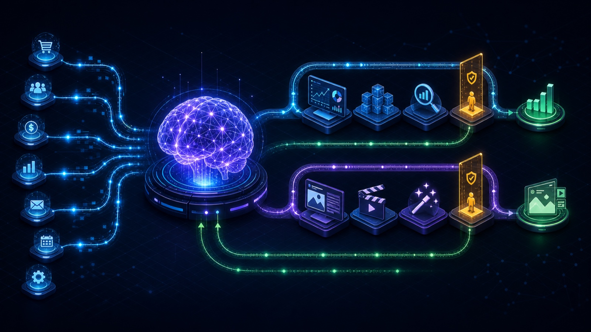
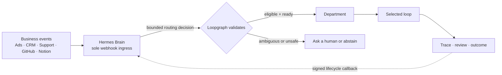
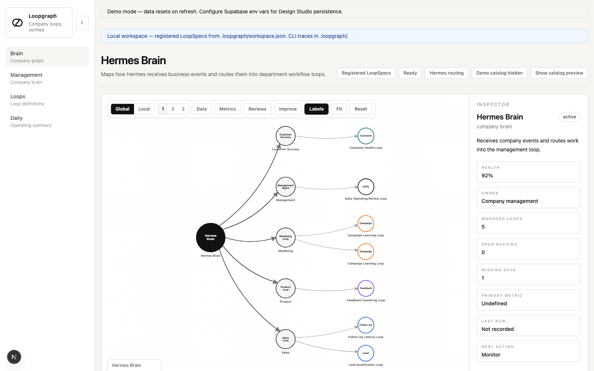

<div align="center">

# Loopgraph

### Design the business loops. Let Hermes route the work. Keep humans in control.

**Loopgraph is the open-source control plane for recurring AI work.** It turns a short department interview into governed, visual automation loops—then gives [Hermes Agent](https://github.com/NousResearch/hermes-agent) one safe place to receive business events and decide which loop should respond.

[](https://github.com/mrrkrieg/loopgraph/actions/workflows/ci.yml)
[](LICENSE)
[](https://www.typescriptlang.org/)
[](https://github.com/mrrkrieg/loopgraph/stargazers)

[Quickstart](#quickstart) · [How it works](#how-it-works) · [Examples](#examples) · [Documentation](#documentation) · [Contributing](#contributing)



</div>

## Why Loopgraph?

AI agents can call tools. The harder problem is deciding **what recurring business process should run, when it should run, what evidence it needs, and when a human must step in**.

Without that operating layer, teams end up with disconnected prompts and brittle webhooks: the wrong automation reacts, duplicate events create duplicate work, risky actions lack approval, and nobody can explain what happened.

Loopgraph gives Hermes a governed map of the company:

- **Discover** high-value automation opportunities by department.
- **Design** complete loops from the current stack, biggest problem, ideal outcome, and risk boundaries.
- **Route** every business event through one Hermes company brain.
- **Validate** Hermes's decision against registered loops, event contracts, readiness, policy, and deduplication rules.
- **Visualize** the company as `Hermes Brain → Department → Loop`.
- **Simulate locally** with generated fixtures before connecting credentials or allowing external writes.
- **Trace and approve** what the loop observed, proposed, verified, escalated, and changed.

> **One brain, many loops.** Every provider webhook terminates at Hermes—not at an individual workflow. Hermes understands the incoming business problem and proposes a route; Loopgraph decides whether that route is valid and safe to run.

## How it works



Hermes and Loopgraph deliberately do different jobs:

| | Hermes Agent — the company brain | Loopgraph — the governed control plane |
|---|---|---|
| **Receives** | Provider webhooks and business signals | Normalized events and bounded routing decisions |
| **Decides** | What business problem the event represents and which loop may fit | Whether that loop exists, accepts the event, has enough evidence, is ready, and is allowed to run |
| **Owns** | Webhook routes, provider secrets, event normalization, semantic routing | LoopSpecs, routing contracts, deduplication, policy, simulation, approvals, traces, and outcomes |
| **When uncertain** | Proposes human/context review instead of guessing | Rejects invalid, stale, forged, duplicate, incompatible, or unsafe routes |

This separation lets Hermes reason broadly without giving an unvalidated model decision direct authority over business systems.

## From a conversation to a running loop

1. **Choose a department.** Management, Marketing, Sales, Product, Customer Success, Engineering, Ops / Finance, HR / Talent, Legal / Compliance, or a custom workflow.
2. **Answer five focused question bundles.** Current stack and sources, biggest recurring problem, useful automation and hard boundaries, ideal measurable outcome, and ownership/rollout.
3. **Review the proposed loops.** A high-reasoning design pass returns triggers, inputs, actions, verification, metrics, assumptions, risks, connections, and required human decisions.
4. **Accept only what you want.** Accepted proposals become versioned LoopSpecs, routing cards, graph nodes, readiness requirements, and local test fixtures in one materialization step.
5. **Rehearse locally.** Test positive, missing-context, and risk-escalation cases without API keys or external writes.
6. **Connect and promote carefully.** New loops begin in shadow mode. Live work stays blocked until routing, capabilities, approvals, and exact prepared-action fingerprints are ready.

<p align="center">
  
  <br />
  <sub>The local Hermes Brain view: explore the company map, inspect readiness, and open the exact loop that handled an event.</sub>
</p>

## Quickstart

### Requirements

- Node.js 22+ and npm
- A local [Hermes Agent](https://hermes-agent.nousresearch.com/) installation for the company-brain flow

### 1. Install Loopgraph and bind the local project

```bash
git clone https://github.com/mrrkrieg/loopgraph.git
cd loopgraph
npm install

npm run loopgraph -- workspace init --project .
npm run loopgraph -- hermes install --project .
npm run loopgraph -- hermes doctor --project .
```

The Hermes installer creates project-local skills and MCP configuration under `.loopgraph/hermes/`. It does **not** copy provider credentials into Loopgraph.

### 2. Ask Hermes to design the first department

```text
/loopgraph design automations for a department
```

Hermes shows the department catalog, resumes the same discovery session as the browser, asks the Loopgraph question bundles, explains the proposed loops, and materializes only the proposals you accept.

### 3. Open the local company graph

```bash
npm run loopgraph -- studio --project . --start
```

Open the printed local URL. You can inspect the design, connection requirements, routing readiness, generated fixtures, recent runs, reviews, and cases from the graph.

### 4. Plan and rehearse Hermes event routes

```bash
npm run loopgraph -- hermes webhooks plan --project .
npm run loopgraph -- hermes webhooks sync --project .
npm run loopgraph -- hermes webhooks doctor --project .
```

`sync` writes a **non-secret local route manifest**. Hermes still owns the real provider subscriptions and signing secrets.

Test a generated, synthetic event before connecting a real webhook:

```bash
npm run loopgraph -- events test --project . \
  --source google_ads* \
  --fixture .loopgraph/generated/hermes/marketing/marketing_ads/fixtures/happy-path.json \
  --expected-action route \
  --expected-loop marketing_ads \
  --require-synced-manifest
```

For the full walkthrough, see the [Hermes Quickstart](docs/HERMES-QUICKSTART.md).

## Marketing example

Suppose Marketing uses Google Ads, product analytics, HubSpot, Notion, Webflow, and Slack. The team says campaign review is slow, content preparation is inconsistent, publishing and budget changes require approval, and qualified pipeline matters more than surface-level engagement.

Loopgraph can design two independent loops:

```text
Hermes Brain
└── Marketing
    ├── Ads
    └── Content Creation
```

The important part is not the diagram—it is the routing contract behind it:

| Incoming problem | Hermes decision | Loopgraph response |
|---|---|---|
| Campaign spend or efficiency anomaly with the required campaign evidence | Route to **Ads** | Validate the event contract, open/update the business problem, and start in the configured rollout mode |
| Approved content brief with trusted source material | Route to **Content Creation** | Validate the content route and prepare the governed content loop |
| Landing-page conversion drop with no campaign mapping | Request context or human choice | Abstain instead of guessing between Ads and Content Creation |
| Duplicate provider delivery | Repeats the same route decision | Suppress duplicate work through durable event/problem identity |

The committed golden flow covers positive Ads and Content events, duplicates, no-match events, and ambiguous events that require human/context review.

## What a loop contains

A loop is more than a prompt or a tool chain. Each versioned `loopgraph/v1alpha1` LoopSpec defines:

- the event or cadence that starts work;
- the evidence it may observe and the provenance required;
- the routine and the actions it may prepare;
- allowed, forbidden, and approval-gated behavior;
- verification and completion/failure signals;
- the owner, reviewers, escalation conditions, and rollout mode;
- primary outcomes, leading indicators, and guardrail metrics;
- the routing contract Hermes must satisfy before the loop can run.

Materialization also creates connection requirements and three starter fixtures: **happy path**, **missing context**, and **risk escalation**.

## What you connect

Each proposal includes a concrete connection checklist, so the user sees what is required before a loop can move beyond local simulation:

| Connection | Why the loop needs it | Typical examples |
|---|---|---|
| **Event source → Hermes** | Tell the company brain that a business problem may exist | Ads anomaly, CRM stage change, support escalation, approved content brief, GitHub issue |
| **Source of truth** | Read the authoritative business object and required evidence | CRM, analytics, ad platform, issue tracker, approved documents, finance system |
| **Action destination** | Store a draft or perform an explicitly allowed action | CMS draft, CRM task, ticket, review packet, experiment tracker |
| **Outcome source** | Verify that the problem was actually handled | Qualified pipeline, activation, resolution time, approval result, audit evidence |
| **Human owner/reviewer** | Resolve ambiguity and approve risky or external-facing work | Department lead, finance, legal, security, people manager |

Real webhook secrets and provider credentials remain with Hermes or an approved credential store. Loopgraph records non-secret capability requirements and readiness—not raw secrets.

## Safe by default

| Mode | What it does | External writes |
|---|---|---|
| **Validate** | Checks schema, routing contracts, and policy | None |
| **Simulate** | Runs deterministic/redacted fixtures and produces traces and review packets | None |
| **Shadow routing** | Records what Hermes would have selected and measures routing quality | None |
| **Recommend** | Prepares a governed recommendation for review | None by default |
| **Execute** *(experimental)* | Runs only after live activation, connector readiness, route validation, and approval/fingerprint gates | Explicitly gated |

Provider secrets, OAuth tokens, and webhook signing keys stay in Hermes or an approved credential store—never in chat or committed `.loopgraph` state.

## Examples

| Example | What it demonstrates |
|---|---|
| [Marketing: Ads + Content Creation](docs/HERMES-EXAMPLES.md#marketing-ads--content-creation) | Two loops in one department with distinct Hermes routing contracts |
| [Legal / Compliance evidence review](docs/HERMES-EXAMPLES.md#sensitive-department-legal--compliance-evidence-review) | Sensitive work capped in shadow mode with expert approval and blocked actions |
| [Custom field-ops route](docs/HERMES-EXAMPLES.md#custom-department-field-ops-custom-app-route) | A custom department using the same event-brain pattern |
| [`examples/github-issue-triage`](examples/github-issue-triage) | Code-first validate/simulate workflow |
| [`examples/strategic-account-escalation`](examples/strategic-account-escalation) | Management escalation and evidence handoff |
| [`examples/support-ticket-triage`](examples/support-ticket-triage) | Support prioritization with review-aware routing |

## CLI at a glance

```bash
# Local project + Hermes
npm run loopgraph -- workspace inspect --project .
npm run loopgraph -- hermes doctor --project .
npm run loopgraph -- studio --project . --start

# Code-first loops
npm run loopgraph -- validate examples/github-issue-triage
npm run loopgraph -- simulate examples/github-issue-triage \
  --fixture fixtures/github-issue-triage/security-issue.json

# Operations
npm run loopgraph -- trace <runId> --review
npm run loopgraph -- review packet <runId>
npm run loopgraph -- case list
npm run loopgraph -- case resolve <caseId> --summary "Resolved"
```

From an installed package, use `loopgraph` in place of `npm run loopgraph --`.

## Built with

- TypeScript, Node.js, and Zod for versioned contracts
- Next.js and React for the local Design Studio
- MCP tools and project-local skills for Hermes integration
- Deterministic fixtures and Vitest for reproducible local validation
- Optional Supabase persistence for the browser Design Studio

Loopgraph does not replace LangGraph, Mastra, Temporal, Langfuse, or HumanLayer. It provides the operating contract around recurring AI work: **context, routing, policy, evidence, approval, escalation, and outcome**. Read the [competitive boundary](docs/competitive-boundary.md).

## Project status

Loopgraph is in active early development. The local Hermes discovery → design → materialize → visualize → route rehearsal → simulate flow is implemented and covered by regression tests. Live execution remains experimental, and applying real provider webhook subscriptions remains a Hermes-owned setup step.

The safest supported path today is **design locally, materialize, rehearse routing, simulate with fixtures, and review the resulting trace**.

## Documentation

- [Hermes Quickstart](docs/HERMES-QUICKSTART.md) — complete local setup and event rehearsal
- [Hermes examples](docs/HERMES-EXAMPLES.md) — Marketing, Legal / Compliance, and custom flows
- [Hermes completion audit](docs/HERMES-COMPLETION-AUDIT.md) — implementation-to-test evidence map
- [Event-brain integration plan](docs/HERMES-EVENT-BRAIN-INTEGRATION-PLAN.md) — detailed architecture and product plan
- [LoopSpec reference](docs/loop-spec.md) — the loop contract
- [Approval model](docs/approval-model.md) — exact-action review and fingerprint binding
- [Topology guide](docs/topology-guide.md) — understanding the operating map
- [Current build state](docs/CURRENT-STATE.md) — what is implemented now

## Contributing

Loopgraph is being built in the open, and contributions are welcome. High-leverage areas include:

- new department skill packs and high-quality discovery questions;
- provider capability adapters and safe connector contracts;
- real-world routing fixtures, especially ambiguous and no-match cases;
- loop templates for recurring business problems;
- graph, review, and operational debugging UX;
- documentation and reproducible examples.

Read [CONTRIBUTING.md](CONTRIBUTING.md), open an [issue](https://github.com/mrrkrieg/loopgraph/issues), or propose a focused pull request. For sensitive vulnerabilities, follow [SECURITY.md](SECURITY.md) instead of opening a public issue.

If Loopgraph's direction is useful to you, [star the repository](https://github.com/mrrkrieg/loopgraph) and share the department or business loop you want to build next.

## License

[MIT](LICENSE)
