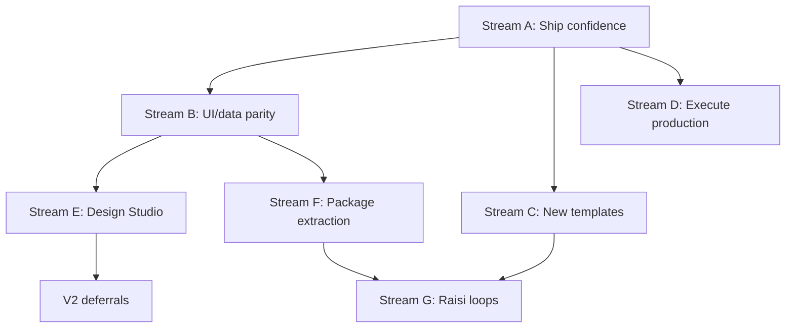

# Loopgraph build plan

Last updated: 2026-06-30

Comprehensive plan for what still needs to be built — platform completion, consumer packaging (e.g. Raisi.ai), and explicit deferrals. Supersedes the tactical list in [NEXT-PRIORITIES.md](./NEXT-PRIORITIES.md) for sequencing and scope; keep NEXT-PRIORITIES for the short weekly punch list.

---

## Executive summary

**Loopgraph today:** A credible **code-first loop runtime** — `loopgraph.yaml` → validate → simulate → trace → review → case resolve — works in CLI and browser on file storage. **58 tests** green; CI validates hero templates.

**Not done:** UI/data parity gaps, trace-derived improvements in the UI, production execute path, Design Studio export/hardening, package extraction for external apps, and domain templates beyond GitHub + account escalation.

**Recommended focus order:**

1. ~~**Ship confidence**~~ — M1 shipped (CI matrix + governance tests)
2. ~~**Close the learning loop in UI**~~ — M2 shipped (improvements + management rollup)
3. ~~**One new hero example**~~ — M3 shipped (`support-ticket-triage`)
4. **Package extraction** — private consumable library for Raisi (before public npm)
5. **Raisi loop specs + adapters** — three product loops on top of the library

### Milestones M1–M3 (shipped 2026-06-30)

| Milestone | Delivered |
|-----------|-----------|
| **M1** | Full CI fixture matrix (14 simulates + validate); `governance-path.test.ts` (reject → improvement, two-step approve) |
| **M2** | `loadImprovementsFromStorage`, workspace + management UI wiring; `management-rollup.ts` + cron persistence |
| **M3** | `examples/support-ticket-triage` (5 fixtures, snapshots), `init support-ticket-triage`, management-review fixture |

**70 tests** green. Browser manual QA on clean clone still recommended before tagging `v1.1.0`.

---

## Maturity snapshot

| Area | Status | Notes |
|------|--------|-------|
| LoopSpec contract (`loopgraph-core`) | **Shipped** | `v1alpha1`, JSON Schema, semantic validation |
| Simulate runtime | **Shipped** | Deterministic fixtures, policy, verifiers, traces |
| Review governance | **Mostly shipped** | CLI + UI fingerprint binding; some Epic 3 acceptance unchecked |
| Escalation cases | **Mostly shipped** | Create, list, show, resolve; outcome + improvement_signal on trace |
| Management consumer | **Shipped (deterministic)** | Cron route; no DB persistence of rollup |
| Web UI governance | **Mostly shipped** | Runs, reviews, cases; local workspace improvements empty |
| Topology | **In progress** | `topology-runtime.ts`, inspector actions; runtime filters landing |
| Execute (live) | **Experimental** | OpenAI + GitHub behind env flags; not E2E production |
| Design Studio | **Partial** | Wizard + demo catalog; YAML export/import incomplete |
| Supabase mode | **Scaffolded** | Storage adapter exists; multi-user prod not validated |
| npm package | **Not started** | Internal `lib/` modules only; leaky boundaries |
| CI | **Expanded** | 14 fixture simulates in CI; 70 unit/integration tests |

---

## Stream A — Ship confidence (P0)

**Goal:** Tag a release candidate with evidence that CLI and UI tell the same story on a clean clone.

### A1. Manual QA sign-off

Execute [manual-qa-v1.1.md](./manual-qa-v1.1.md) and [DAN-WALKTHROUGH.md](./DAN-WALKTHROUGH.md) checklists on a **fresh clone** (no `.loopgraph/`, no Supabase).

| Task | Acceptance |
|------|------------|
| CLI simulate → browser run history | Run appears on `/loops/<id>/runs` after simulate |
| Trace detail | Context precedence, prepared actions, mode badges visible |
| UI partial approve | Internal approve leaves customer draft pending; second approve completes |
| CLI/UI parity | Same `trace.status` after equivalent approve sequence |
| Case lifecycle | `case list` → `/cases/[id]` → resolve → trace has `case_outcome` + `improvement_signal` |
| Management cron | `GET /api/cron/management-review` returns plans for open cases only |

**Owner effort:** ~0.5–1 day · **Blocks:** `v1.1.0` tag

### A2. Close Epic 3 acceptance gaps

Several items in [V1-EXECUTION-PLAN.md](./V1-EXECUTION-PLAN.md) Phase 3 are implemented but not formally signed off.

| Task | Current state | Remaining |
|------|---------------|-----------|
| Payload change invalidates approval | Test exists (`review-service.test.ts`) | Add to CI acceptance doc; verify UI surfaces mismatch error |
| Per-action + customer-facing gates | Tests + UI exist | QA on strategic-account-escalation two-step approve |
| Review reassign | CLI exists | Wire reassign in review UI if missing |
| Reject / request-evidence → improvement | `buildImprovementItemFromReview` in runtime | **UI does not read trace outputs yet** (see Stream B) |
| Role, minutes, teacher feedback on review | Types + service support | Confirm review form captures all fields in UI |

### A3. Expand CI fixture matrix

CI today runs 2 of 9 hero fixtures. Extend `.github/workflows/ci.yml`:

- All 4 github-issue-triage fixtures
- All 5 strategic-account-escalation fixtures
- `validate examples/management-review`
- Optional: spawn CLI `review approve` on a review-required fixture in CI

**Effort:** ~0.5 day

---

## Stream B — UI and data parity (P1)

**Goal:** Browser workspace reflects **runtime truth** (traces, cases, improvements), not demo stubs.

### B1. Improvements from traces (highest gap)

**Problem:** `improvement_signal` is written to trace outputs on reject and case resolve (`review-service.ts`, `case-service.ts`), but:

- Local/file workspace sets `improvements: []` in `selectLocalWorkspace()`
- Improvements page reads `workspace.improvements` (demo or Supabase `improvement_items` table only)
- No bridge from `.loopgraph/traces/*.json` → improvement items

| Task | Deliverable |
|------|-------------|
| `loadImprovementsFromStorage(storage, loopId?)` | Scan traces for `outputs` where `type === "improvement_signal"` |
| Wire workspace | Populate improvements in local + demo modes from storage |
| Loop improvements page | Filter by `loopId`; link to source `runId` |
| Management page | Roll up open improvements across loops |
| Supabase sync (optional) | On review/case resolve, upsert `improvement_items` row |

**Acceptance:** Reject a review in CLI → improvement appears on `/loops/<id>/improvements` without DB.

**Effort:** ~2–3 days

### B2. Management rollup persistence

**Problem:** `GET /api/cron/management-review` computes plans on read; nothing persists weekly rollup, decisions, or historical management runs.

| Task | Deliverable |
|------|-------------|
| Persist management plans | Table or `.loopgraph/management/` JSON keyed by week |
| Management review loop fixtures | `examples/management-review` + fixture with open cases array |
| Simulate management loop | `loopgraph simulate examples/management-review --fixture …` |
| UI management page | Show last rollup + link to source cases |

**Effort:** ~2–3 days

### B3. Context inspector (Epic 5)

Trace detail should expose full `ContextSnapshot`: source, precedence, freshness, sensitivity, trusted/redacted, hash.

| Task | Deliverable |
|------|-------------|
| Context section on `/runs/[runId]` | Structured inspector, not raw JSON only |
| Claim → evidence drill-down | Link evidence refs to context entries |

**Effort:** ~1–2 days

### B4. Topology runtime integration (in flight)

Recent work: `topology-runtime.ts`, `topology-inspector-actions.tsx`, run-filters, graph hidden-labor.

| Task | Deliverable |
|------|-------------|
| Finish runtime summary wiring | Attention filters use real run/case indices |
| Inspector actions | Review pending, open case, open trace links work for catalog + registered loops |
| Informational vs semantic edges | Dashed style + tooltip on non-executable edges |
| Acceptance | Topology shows loop → case → management path without overclaiming execution |

**Effort:** ~2–4 days (partially started)

### B5. Supabase multi-user validation

| Task | Deliverable |
|------|-------------|
| Fresh Supabase + seed | Acme topology renders; no silent demo fallback |
| Auth/RBAC (minimal) | Org-scoped loops; service role not required for read paths |
| Storage parity | CLI simulate → traces visible in UI when Supabase configured |
| `createLoop()` org attachment | P0-2 from launch plan |

**Effort:** ~3–5 days

---

## Stream C — Templates and examples (P1)

**Goal:** Prove Loopgraph on a third domain; provide patterns for Raisi-style loops.

### C1. Support-ticket / Intercom example

Listed P1 in [NEXT-PRIORITIES.md](./NEXT-PRIORITIES.md).

| Task | Deliverable |
|------|-------------|
| `examples/support-ticket-triage/loopgraph.yaml` | Triage + escalate pattern |
| Fixtures (4–5) | Low/medium/high severity, incomplete context, duplicate |
| Expected trace snapshots | CI-locked deterministic behavior |
| `loopgraph init support-ticket-triage` | Template in init catalog |

**Maps to Raisi:** Investor reply triage (founder-facing, daily).

**Effort:** ~3–4 days

### C2. Acme company topology (optional org map)

| Task | Deliverable |
|------|-------------|
| `examples/acme-company-topology/topology.yaml` | Org metadata referencing LoopSpecs |
| Seed script idempotency | P0-7; fresh clone → Acme in Supabase |
| Topology renders org map | Without requiring hierarchy for standalone simulate |

**Effort:** ~2 days

### C3. Campaign learning loop template (new)

No hero template exists for **optimize-from-outcomes** loops. Scaffolding exists (`measurement.ts`, `improvement-service.ts`).

| Task | Deliverable |
|------|-------------|
| `examples/campaign-learning/loopgraph.yaml` | Scheduled trigger; reads metrics + improvement signals |
| Fixtures | Underperforming campaign, winning variant, insufficient data |
| Output schema | Structured recommendations (no auto-commit) |

**Maps to Raisi:** Campaign learning loop.

**Effort:** ~4–5 days

---

## Stream D — Execute and production path (P2)

**Goal:** Optional live path for teams with API keys; not required for Raisi v1 (simulate + review is enough).

| Task | Deliverable |
|------|-------------|
| E2E execute on test GitHub repo | Documented in [github-production-setup.md](./github-production-setup.md) |
| Webhook dedupe + idempotency | Verified under load |
| `commitPreparedAction` after approval | Live writes only post-fingerprint approve |
| Assessment provider switching | Fixture default; OpenAI opt-in |
| Intercom / CRM live adapters | **Deferred** — mocks only in V1 |

**Effort:** ~1–2 weeks · **Risk:** External API drift, secret handling

---

## Stream E — Design Studio hardening (P2)

**Goal:** Preserve visual product without blocking code-first path. **After Streams A–B.**

| Task | Deliverable |
|------|-------------|
| Export LoopSpec YAML from spec page | `flatSpecToV1alpha1` → downloadable `loopgraph.yaml` |
| Import + validate | Upload YAML → core validator → register spec |
| P0 fixes (launch plan §15) | Demo banner, template picker, hidden-labor labels, run history |
| Deprecate canned `agent.ts` simulation | `startLoopRun` → `runLoop` via runtime-bridge everywhere |
| Studio ↔ CLI round-trip | Exported spec passes `loopgraph validate` without semantic loss |

**Effort:** ~1 week

---

## Stream F — Package extraction (P1 for Raisi, P2 for OSS)

**Goal:** Consumable library in Raisi.ai (and other apps) without shipping the Next.js UI.

### F1. Boundary cleanup (blockers today)

| Leak | Fix |
|------|-----|
| `loopgraph-core/studio-adapter.ts` → `loop-engineering-builder` | Move flat schema types into core or split `studio-adapter` to optional package |
| `loopgraph-sdk/providers.ts` → `loopgraph-runtime` | Invert: runtime registers providers; sdk exports interface only |
| `loopgraph-sdk/supabase-storage.ts` → `lib/db/supabase` | Move to `app/` adapter or optional `@loopgraph/storage-supabase` |
| `topology-runtime.ts`, `trace-labor.ts` → engineering-builder | Keep in app package or `loopgraph-studio` — exclude from consumer bundle |

### F2. Package layout

```text
packages/
├── loopgraph/              # or @loopgraph/core + runtime + sdk
│   ├── src/core/
│   ├── src/runtime/
│   ├── src/sdk/
│   ├── dist/
│   └── package.json        # exports, types, bin: loopgraph
```

| Task | Deliverable |
|------|-------------|
| `tsup` or `tsc` build | `noEmit: false` for packages only |
| `exports` map | `./core`, `./runtime`, `./sdk` |
| CLI `bin` | `loopgraph` command without `tsx` in consumer |
| `files` whitelist | No `app/`, `components/`, Next deps in default export |
| Peer deps | `zod`, `yaml`; optional `openai` |

### F3. Consumer integration contract

Document for Raisi:

```typescript
import { loadLoopSpecFromPath, validateLoopSpec } from "loopgraph/core";
import { runLoop, applyReviewDecision } from "loopgraph/runtime";
import type { IntegrationAdapter, StorageAdapter } from "loopgraph/sdk";
```

- Loop specs live **in Raisi repo** (`raisi-loops/investor-reply-triage/`)
- Raisi implements adapters (inbox, CRM, campaign analytics)
- Raisi implements `StorageAdapter` (Postgres) or uses file storage in dev

### F4. Versioning policy

- Start `0.x`; document `loopgraph/v1alpha1` may change
- No public `1.0.0` until Raisi loops stable in production
- Private git dependency acceptable before npm publish

**Effort:** ~3–5 days for private package · +2 days for public npm hygiene (CHANGELOG, CONTRIBUTING)

---

## Stream G — Raisi.ai product loops (consumer work)

**Depends on:** Stream F (or interim git submodule of `lib/loopgraph-*`).

These are **not** built inside the Loopgraph repo long-term; they belong in Raisi with Loopgraph as engine. Documented here for end-to-end planning.

| Raisi loop | Loopgraph pattern | Adapters needed | Human gates |
|------------|-------------------|-----------------|-------------|
| **1. Investor reply triage** | `github-issue-triage` / support-ticket | Inbox (email/LinkedIn), investor CRM, thread context | Founder approves draft replies |
| **2. Campaign health escalation** | `strategic-account-escalation` | Campaign metrics, send health, founder account | Raisi ops + founder; `EscalationCase` |
| **3. Campaign learning loop** | New `campaign-learning` template | Analytics, A/B results, past improvement signals | Review recommendations before apply |

### G1. Per-loop deliverables (in Raisi)

For each loop:

1. `loopgraph.yaml` + 4–5 fixtures + snapshot tests
2. Raisi `IntegrationAdapter` implementations
3. Trigger wiring (cron / webhook / event bus)
4. Review UI or delegate to Loopgraph review API
5. CI: `loopgraph validate` + `simulate` on every spec change

**Effort:** ~1–2 weeks per loop (with package ready)

---

## Stream H — V2 and explicit deferrals

Do **not** schedule these before Streams A–C unless product demands otherwise.

| Item | Why deferred |
|------|--------------|
| Durable external job queue (Redis, Temporal) | In-process stub sufficient for V1 |
| Marketplace / adapter registry | No third-party adapters yet |
| Auto-improving loop specs | Improvement signals exist; no spec editor loop |
| ROI claims from production data | Measurement module is modeled estimates only |
| Enterprise audit modes | No customer requirement |
| Public npm `@loopgraph` | Until private consumer proves API |
| Full LangGraph/Temporal replacement | Competitive boundary — interoperate, don't replace |

See [roadmap.md](./roadmap.md) and [competitive-boundary.md](./competitive-boundary.md).

---

## Dependency graph



**Critical path to Raisi:**

```text
A1 manual QA → B1 improvements from traces → F1 boundary cleanup → F2 package
  → G1 investor reply triage loop in Raisi
  → C1 support-ticket example (validates pattern in Loopgraph repo)
  → G2 campaign escalation
  → C3 + G3 campaign learning
```

---

## Suggested milestones

| Milestone | Streams | Outcome |
|-----------|---------|---------|
| **M1: Release candidate** | A | `v1.1.0` tagged; manual QA green |
| **M2: Learning loop closed** | B1, B2 | Improvements + management visible from traces |
| **M3: Third hero** | C1 | Support-ticket example in CI |
| **M4: Raisi-ready library** | F | Private package; Raisi imports `runLoop` |
| **M5: First Raisi loop live** | G | Investor triage in simulate + founder review |
| **M6: Design Studio parity** | E | YAML export/import round-trip |

---

## Effort summary (rough)

| Stream | Days (eng) | Priority |
|--------|------------|----------|
| A — Ship confidence | 1–2 | P0 |
| B — UI/data parity | 8–14 | P1 |
| C — Templates | 7–11 | P1 |
| D — Execute production | 5–10 | P2 |
| E — Design Studio | 5–7 | P2 |
| F — Package extraction | 3–7 | P1 (Raisi) |
| G — Raisi loops (in Raisi) | 15–25 | P1 (product) |

**Total platform to M4:** ~4–6 weeks focused work. Raisi loops add ~3–5 weeks parallelized per loop after M4.

---

## Related docs

- [CURRENT-STATE.md](./CURRENT-STATE.md) — what works today
- [NEXT-PRIORITIES.md](./NEXT-PRIORITIES.md) — short weekly punch list
- [V1-EXECUTION-PLAN.md](./V1-EXECUTION-PLAN.md) — epic acceptance criteria (some stale)
- [topology-guide.md](./topology-guide.md) — topology workflow
- [template-authoring.md](./template-authoring.md) — how to author new loops
- [manual-qa-v1.1.md](./manual-qa-v1.1.md) — release QA checklist
