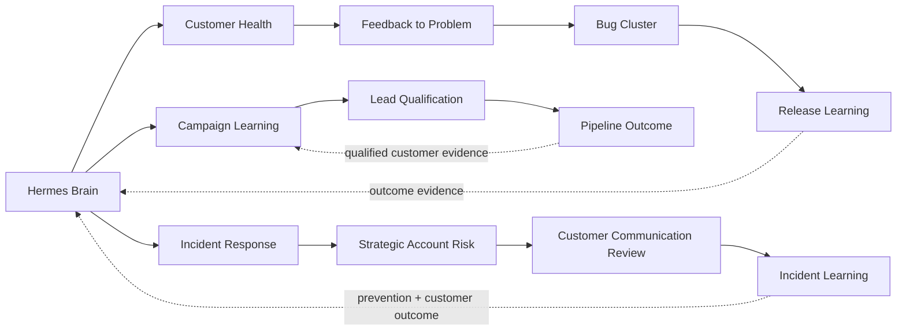

# Company Loop Library

Loopgraph ships a canonical company operating library for Hermes. It is a starting topology, not a claim that every company should enable every automation.

Every prebuilt loop includes:

- the business problem types it claims;
- accepted normalized events and affected company-object types;
- required context and Hermes connector capabilities;
- exclusion rules, confidence threshold, concurrency, and duplicate behavior;
- whether fan-out is forbidden, independent-only, or declared and ordered;
- the evidence the loop must return and which departments learn from it;
- shadow-mode LoopSpec generation, fixtures, verification, approval, and trace policy.

A fresh local workspace remains empty. The library is available to Hermes for discovery and design, and only loops accepted by the user are materialized into the local graph.

## Hermes routing decision

For every normalized event, Hermes evaluates:

1. What happened?
2. Which company object is affected?
3. Is this a new problem or additional evidence for an existing problem?
4. Which loops claim to handle this problem type?
5. Which loops have the required context?
6. Which loops are currently active and connected?
7. Are any exclusion rules matched?
8. Is there one clear route?
9. Is explicit fan-out permitted?
10. Should Hermes abstain and ask a human?

Hermes makes the semantic choice. Loopgraph compiles eligible routing cards, validates the submitted choice, applies exclusions and readiness/policy gates, suppresses duplicates, records the durable receipt, and visualizes the result.

## Prebuilt loops by department

### Product

| Loop | Problems handled | Main learning returned |
|---|---|---|
| Feedback to Problem | Repeated feedback and evidence clusters | Validated problem, impacted segment, evidence strength |
| Problem to Product Bet | Validated problems ready for a scoped response | Assumptions, success metric, decision tradeoffs |
| Release Learning | Shipped outcome window closes or changes | Adoption, retention, support impact, continue/adjust/rollback evidence |
| Bug Cluster to Product Problem | Recurring defects across issues or customer reports | Root-cause hypothesis, affected workflow, recurrence |
| Roadmap Signal | Material demand/strategy/capacity tradeoff | Roadmap evidence packet and revisit condition |

Hermes approaches Product work by separating anecdotes from repeated evidence, joining qualitative feedback to behavior and account context, and preserving product-owner judgment for roadmap and scope decisions.

### Marketing

| Loop | Problems handled | Main learning returned |
|---|---|---|
| Campaign Learning | Spend, efficiency, or cohort outcome changes | Qualified-customer and pipeline quality by campaign |
| Channel Allocation | Budget-to-outcome imbalance | Downstream quality comparison and allocation recommendation |
| Creative Testing | Fatigue or a governed test request | Message/creative hypothesis and test result |
| Landing Page Conversion | Conversion degradation or experiment request | Diagnosis, experiment evidence, downstream lead quality |
| ICP / Messaging Learning | Repeated objections, win/loss, or customer language | Segment and message-market-fit evidence |

Hermes does not equate cheap clicks with value. Campaign evidence flows through qualification and pipeline outcomes before it returns to Marketing.

### Sales

| Loop | Problems handled | Main learning returned |
|---|---|---|
| Lead Qualification | New leads and campaign cohorts | Fit/intent decision and eventual opportunity outcome |
| Pipeline Outcome | Cohort or opportunity outcome recorded | Qualified pipeline, revenue conversion, customer quality |
| Account Research | Meeting or research request | Verified buying trigger and corrected account context |
| Follow-up | Completed meeting or overdue next step | Commitment completion and response outcome |
| CRM Hygiene | Stale or incomplete opportunity state | Proposed correction and forecast impact |
| Deal Risk | Stalled opportunity or changed risk | Risk diagnosis, intervention, and forecast outcome |

Hermes keeps qualification evidence distinct from relationship judgment, pricing, legal terms, and customer commitments, which remain human-owned.

### Customer Success

| Loop | Problems handled | Main learning returned |
|---|---|---|
| Support Ticket Triage | New or reprioritized support request | Triage reason, response draft, escalation evidence |
| Customer Health Risk | Usage, sentiment, feedback, or incident risk | Risk reason, intervention, recovery outcome |
| Renewal Risk | Renewal or subscription risk changes | Risk driver, save plan, renewal outcome |
| Strategic Account Escalation | Executive escalation or material incident impact | Account action plan and relationship outcome |
| Customer Communication Review | Incident or material service communication | Approved facts, customer response, promise accuracy |
| QBR Preparation | Business review due | Goal progress, evidence packet, owned next actions |

Hermes learns whether repeated complaints are a support-process problem, onboarding gap, usability problem, recurring defect, or strategic-account risk.

### Engineering

| Loop | Problems handled | Main learning returned |
|---|---|---|
| GitHub Issue Triage | New or changed repository issue | Classification, risk, maintainer corrections |
| Incident Response | Open, changed, or customer-impacting production incident | Ownership, mitigation, customer-impact evidence |
| Issue to Implementation Plan | Accepted issue or plan request | Scoped implementation/test plan and dependency risks |
| PR Review Prep | Review requested | Risk summary and test evidence |
| Release Readiness | Release candidate created | Readiness, rollback proof, measurement plan |
| Incident Learning | Incident resolved or impact confirmed | Root cause, prevention actions, recurrence evidence |

Incident Response is the primary route. Customer/account and communication loops are supporting routes only for evidenced impact, and Incident Learning runs after resolution.

### Operations & Finance

| Loop | Problems handled | Main learning returned |
|---|---|---|
| Approval Bottleneck | Overdue approval or forecast-linked delay | Bottleneck owner and latency evidence |
| Forecast Variance | Material forecast change | Reconciled drivers and decision threshold |
| Finance Resource Allocation | Budget/capacity tradeoff | Financial impact and accountable decision evidence |
| Vendor Review | Renewal or usage change | Value, risk, and renewal recommendation |
| Close Readiness | Close blocker or review due | Reconciliation gaps and owner actions |
| Cash Collection | Overdue invoice or receivable risk | Collection action and payment/dispute outcome |

Hermes prepares decisions but never invents financial values, moves money, changes budgets, or represents a forecast as reconciled without source evidence.

### HR & Talent

| Loop | Problems handled | Main learning returned |
|---|---|---|
| Candidate Pipeline | Stalled stage or missing interview feedback | Delay, next action, candidate-experience outcome |
| Onboarding Progress | Missing or overdue onboarding work | Setup gap, manager action, completion |
| Manager Coaching | Coaching review due | Human-reviewed theme and follow-up |
| Retention Signal | Approved retention review | Evidence limits, fairness review, owned intervention |
| Performance Review Prep | Review due | Balanced goal evidence and missing-evidence flags |

These loops minimize people data and cannot make employment, compensation, performance, or retention decisions. They prepare evidence for accountable human owners.

### Legal & Compliance

| Loop | Problems handled | Main learning returned |
|---|---|---|
| Contract Triage | Redline or review request | Exact clause comparison and expert exception queue |
| Policy Drift | Product/process/control change | Specific drift, owner, and remediation state |
| Access Review | Privileged/access review due | Owner decision and least-privilege evidence |
| Incident Evidence | Security/legal evidence request | Source-cited timeline and evidence gaps |
| Security Questionnaire | Customer assurance request | Current cited answer and unsupported claims |
| Compliance Evidence | Audit/control evidence request | Freshness, control gaps, qualified approval |

Hermes assembles and compares evidence; it cannot make autonomous legal conclusions, declare compliance, approve policy exceptions, or disclose sensitive evidence.

### Management

| Loop | Problems handled | Main learning returned |
|---|---|---|
| Management Review | Recurring company review | Company constraints, decisions, owners |
| Weekly Anomaly Review | Material metric change | Validated anomaly and leadership options |
| Department Loop Review | Unhealthy or high-overhead loops | Value, supervision cost, repeated failures |
| Decision Memo | Ambiguous cross-functional choice | Evidence, alternatives, risk, accountable decision |
| Resource Allocation | Goal/capacity/budget constraint | Allocation decision and constraint outcome |
| Improvement | Repeated correction or loop failure | Policy/topology change and verification |
| Operating Rhythm | Leadership cadence due | Trace-backed agenda, decisions, follow-through |

Management loops coordinate evidence; they do not silently change company strategy, budgets, staffing, or ownership.

## Shared-learning topology

Canonical playbooks currently cover:

- repeated complaints to customer, product, defect, and release learning;
- campaign to lead qualification, pipeline, and Marketing evidence return;
- production incident to strategic-account, customer communication, and prevention learning;
- forecast variance to approval bottleneck, decision memo, and resource allocation;
- renewal risk to commercial and independent product evidence;
- contract exception to deal risk and repeated policy learning.

Fan-out is never inferred from a visually adjacent node. It must be declared in the routing contracts and the playbook, satisfy each loop's context and connection requirements, and pass Loopgraph validation.

## Installed Hermes skills

`loopgraph hermes setup` writes project-local skills under `.loopgraph/hermes/skills/`:

- `loopgraph` for discovery, high-reasoning design, materialization, connection planning, simulation, promotion, and continuous improvement;
- `loopgraph-event-router` for isolated normalized event decisions;
- `loopgraph-department-product`;
- `loopgraph-department-marketing`;
- `loopgraph-department-sales`;
- `loopgraph-department-customer-success`;
- `loopgraph-department-engineering`;
- `loopgraph-department-ops-finance`;
- `loopgraph-department-hr-talent`;
- `loopgraph-department-legal-compliance`;
- `loopgraph-department-management`.

The same library is available to trusted Hermes sessions through `loopgraph://catalog/company-loops` and enriched `loopgraph://departments/{departmentType}` MCP resources. The Templates and Department Skills screens expose the claims, events, required context, fan-out policy, task approach, boundaries, and shared learning to human operators.

## Extending the library

Custom loops use the same contract. Define a stable problem type, affected company object, accepted events, context, connectors, exclusions, confidence, fan-out policy, approval boundaries, metric bindings, and learning consumers. Start in shadow mode, run positive/missing-context/exclusion/duplicate/ambiguity fixtures, and promote only with an accountable approval receipt.
