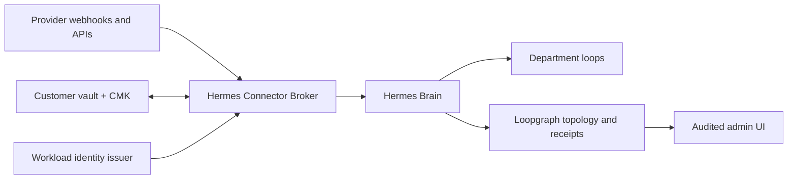

# Enterprise Hermes Connector Broker security

Loopgraph does not ask an enterprise to paste provider tokens into chat, the browser, a LoopSpec,
or the Loopgraph database. The Hermes Connector Broker is the credential and provider-execution
boundary. Hermes decides which business loop should run; the broker performs only an explicitly
allowlisted provider operation; Loopgraph records the non-secret decision, evidence, and outcome.



## Enforced trust boundaries

1. `hermes-connector-broker/v1` requests contain tenant, provider installation, capability,
   operation, actor, expiry, correlation, and idempotency identity. They do not accept an arbitrary
   URL, host, HTTP method, proxy, or headers.
2. Provider operations must exist in the compiled provider operation catalog, match the requested
   capability, have every minimum OAuth scope, and pass the immutable prepare/commit fingerprint.
   Privileged writes additionally require a server-side human-approval receipt; draft writes stay
   fingerprint-bound without inventing an unnecessary human approval.
3. The installation must belong to the same organization/project and be active. Revocation removes
   allowed capabilities before remote cleanup, so a broker outage cannot leave new actions enabled.
4. Credentials are resolved only inside the selected handler and cannot be returned. Broker output,
   errors, structured logs, and metadata pass through the central secret boundary.
5. Every accepted, denied, or failed call produces an idempotent receipt containing hashes—not raw
   inputs or outputs—and appends an event to the tenant security audit chain.

Before a provider handler runs, a tenant-scoped idempotency lease is atomically reserved. Concurrent
duplicates return `request_in_progress`, and reuse of the key for a different actor, environment,
company object, loop, route job, installation, capability, operation, or input returns
`idempotency_conflict`. Any future provider write handler
must also forward this key to the provider's native idempotency mechanism when one exists.

Production broker routes fail closed unless `LOOPGRAPH_HOSTED_ORGANIZATION_ID` binds the deployment
to one organization; every protocol tenant/project must match that deployment binding. The admin
routes and broker use the same Supabase connector control plane so an emergency `revoking` state is
visible to operation authorization before remote provider cleanup is attempted.

## Vault adapters and tenant namespaces

Supported opaque references are:

- `aws-sm://...` — AWS Secrets Manager using temporary EKS IRSA/Lambda/ECS/EC2 workload-role
  credentials and SigV4. New secrets can specify an `aws-kms://...` customer-managed key.
- `gcp-sm://...` — GCP Secret Manager using a metadata-issued workload access token.
- `azure-kv://...` — Azure Key Vault using managed identity.
- `vault://...` — HashiCorp Vault using a projected workload JWT exchanged at a configured auth mount.
- `keychain://...` — macOS Keychain for local development.
- `env-ref://...` — development-only compatibility; rejected in production.

Each provider installation receives the logical namespace:

```text
organizations/{organization}/projects/{project}/environments/{environment}/providers/{provider}/installations/{installation}
```

The credential reference must contain that namespace or its deterministic fingerprint. Database
records can therefore point to a secret but cannot read a different tenant's secret. The template
configured in `LOOPGRAPH_CONNECTOR_CREDENTIAL_TEMPLATE` must include `{namespace}` or
`{namespaceHash}`.

Use a reference shape supported by the selected vault:

```dotenv
# AWS Secrets Manager
LOOPGRAPH_CONNECTOR_CREDENTIAL_TEMPLATE=aws-sm://loopgraph/{namespaceHash}/{providerId}/{installationId}
# GCP Secret Manager
LOOPGRAPH_CONNECTOR_CREDENTIAL_TEMPLATE=gcp-sm://projects/PROJECT_ID/secrets/{namespaceHash}
# Azure Key Vault
LOOPGRAPH_CONNECTOR_CREDENTIAL_TEMPLATE=azure-kv://VAULT_NAME/{namespaceHash}
# HashiCorp KV v2 (mount/path is deployment-specific)
LOOPGRAPH_CONNECTOR_CREDENTIAL_TEMPLATE=vault://secret/data/loopgraph/{namespace}/{providerId}/{installationId}
# macOS local development
LOOPGRAPH_CONNECTOR_CREDENTIAL_TEMPLATE=keychain://loopgraph/{namespaceHash}
```

OAuth PKCE and webhook-signing material use separate derived vault objects. For GCP, Azure, and
Keychain, the child name is a deterministic hash rather than a path suffix, preventing a child write
from overwriting the provider token object.

## Workload identity

Set `LOOPGRAPH_WORKLOAD_IDENTITY_ISSUERS` to a JSON array of trusted issuer policies. The verifier:

- accepts RS256 and ES256 JWTs only;
- obtains keys from the configured JWKS URI and caches them for a bounded interval;
- checks issuer, audience, expiry/not-before, allowed subject patterns, tenant claims, and the exact
  machine capability;
- derives a non-secret credential ID from issuer + subject for durable replay and rate-limit receipts;
- requires a matching mTLS certificate fingerprint when the token contains `cnf`, and rejects that
  token unless the origin is isolated behind a trusted mTLS gateway;
- atomically claims the token-ID/request-ID pair so the same authenticated request cannot replay.

Ambient broker clients support a JWT projected specifically for the broker audience, SPIFFE JWT,
GCP metadata identity, and Azure managed identity. AWS vault access separately exchanges the EKS
web-identity token with STS or uses ECS/EC2/Lambda workload credentials. Static production machine
tokens fail closed unless `LOOPGRAPH_ALLOW_LEGACY_MACHINE_TOKENS=true` is deliberately enabled during
migration. Static AWS access keys are also rejected in production unless the temporary
`LOOPGRAPH_ALLOW_STATIC_AWS_CREDENTIALS=true` escape hatch is explicitly enabled.

For sender-bound identities, set `LOOPGRAPH_TRUSTED_MTLS_PROXY=true` only when the broker origin is
unreachable except through a gateway that removes inbound `x-loopgraph-mtls-*` headers, verifies the
client certificate, and writes its SHA-256 fingerprint into
`x-loopgraph-client-certificate-sha256`. The broker compares it in constant time with the JWT `cnf`
thumbprint and the durable workload-principal binding.

## OAuth lifecycle

The broker owns the complete lifecycle:

1. Generate state and PKCE verifier.
2. Write the verifier directly to the tenant vault and persist only its opaque reference plus a
   state hash.
3. Return the provider authorization URL to the admin browser.
4. On callback, atomically consume state once, load PKCE/client material inside the broker, exchange
   the code at the fixed provider token endpoint, and write the resulting token bundle to the vault.
5. Record scopes and token expiry without recording token contents.
6. Atomically lease refresh-due connections through the scheduled OAuth worker. Concurrent workers
   cannot rotate the same version; failed leases become retryable after the bounded lease window.
   Manual rotation uses the same code path.
7. Revoke at the provider when supported, remove vault material, disable every capability, and keep
   an immutable audit event.

Client registration JSON contains client IDs, callback URLs, token-auth modes, and opaque
`clientSecretRef` values only. It must never contain a client secret value.

## Provider webhooks

The generic endpoint is:

```text
POST /api/connector-broker/v1/webhooks/{installationId}
```

The installation—not an untrusted URL/body provider field—selects the provider verifier. Verification
reads the untouched raw body and implements provider-specific strategies for GitHub,
Slack, Stripe, HubSpot v3, Intercom, Notion, Zendesk, Greenhouse, and QuickBooks. Scheduled/event-stream
providers use their workload identity or stream receipt instead of pretending to have an HMAC.
Timestamp windows and durable delivery claims prevent replay. A claimed delivery is marked forwarded
only after Hermes accepts it; failed or expired leases can be retried with the identical body hash,
while already-forwarded deliveries and delivery-ID/body mismatches remain blocked. A signed receipt binds
provider, installation, delivery ID, and body hash. Only after verification does the broker normalize
the event and send it to Hermes using workload identity. Hermes—not Loopgraph—chooses the loop.

## Emergency disconnect and deletion

`/settings/integrations` supports normal or emergency disconnect plus kill switches for organization,
environment, provider, connection, capability, loop, and agent scopes. The transaction first changes the
installation to `locally_disabled`, clears capabilities, and revokes prepared actions, then creates a durable job. The broker attempts
provider revocation and vault deletion immediately; failures retry with leased jobs and bounded
backoff. After revocation, an admin may delete connector metadata. Audit events remain append-only.
Connector control-plane tables are service-role-only: browser Supabase sessions cannot read vault
references or mutate granted scopes/capabilities. Permission-checked server routes return a sanitized
view that omits credential namespaces, credential references, CMK references, and webhook-secret
references.

The same screen also manages durable workload principals and exact capability grants. Creating,
changing, revoking, activating, or clearing these controls requires an authoritative admin/owner
permission and hosted MFA step-up, and writes a non-secret audit event.

## Required deployment configuration

Use `.env.example` as the schema. At minimum configure:

```dotenv
LOOPGRAPH_CONNECTOR_BROKER_URL=https://broker.example/api/connector-broker/
LOOPGRAPH_CONNECTOR_BROKER_AUDIENCE=https://broker.example
LOOPGRAPH_WORKLOAD_IDENTITY_ISSUERS=[...]
# Only behind an origin-isolated gateway that verifies and rewrites mTLS headers:
LOOPGRAPH_TRUSTED_MTLS_PROXY=false
LOOPGRAPH_CONNECTOR_VAULT_PROVIDER=aws
LOOPGRAPH_CONNECTOR_CREDENTIAL_TEMPLATE=aws-sm://loopgraph/{namespaceHash}/{providerId}/{installationId}
LOOPGRAPH_OAUTH_CLIENTS_JSON=[...opaque clientSecretRef values only...]
LOOPGRAPH_WEBHOOK_RECEIPT_SIGNING_KEY_REF=aws-sm://loopgraph/platform/receipt-signing
LOOPGRAPH_CONNECTOR_PLATFORM_SECRET_NAMESPACE=loopgraph/platform
HERMES_WEBHOOK_URL=https://hermes.example/webhooks/loopgraph
LOOPGRAPH_HERMES_WEBHOOK_AUDIENCE=https://hermes.example
```

Apply `202608010001_enterprise_connector_broker.sql`, configure provider callback URLs, and validate
each provider in its sandbox before granting live scopes. Do not enable a provider if production
dependency audit, RLS checks, backup/restore rehearsal, revocation drill, alerting, or audit export
validation is failing.

## Operational verification

Before production promotion:

```bash
npm run typecheck
npm run test -w loopgraph -- enterprise-connector-security.test.ts
npm run audit:prod
npm run build
```

Also rehearse expired OAuth state, repeated callback, invalid provider signature, repeated delivery,
cross-tenant credential reference, missing scope, arbitrary-HTTP input, broker outage during emergency
revocation, vault deletion failure, and restoration of the connector tables plus audit chain.
