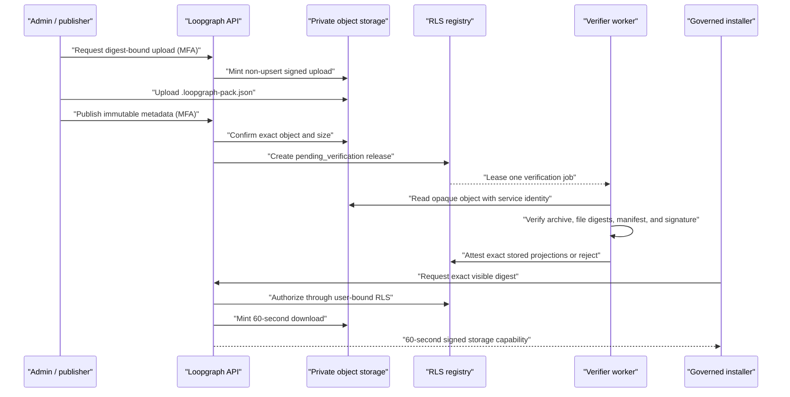

# Hosted marketplace delivery

This layer turns the tenant-scoped marketplace registry into a usable private
distribution service without making LoopPack bytes, standalone storage-key
fields, signatures, or service credentials browser-readable.

## Trust boundaries

The browser has no direct storage policy. The upload endpoint requires the
`marketplace.publish` capability and MFA step-up. Search and downloads require
`workspace.read`; the user-bound Supabase client proves organization
visibility before a service client looks up the opaque delivery key.
The key is never returned as a reusable catalog field, although Supabase's
signed capability URL may visibly contain its scoped storage path.

## HTTP contract

| Endpoint | Permission | Purpose |
| --- | --- | --- |
| `GET /api/marketplace/apps` | `workspace.read` | Search the latest active/deprecated visible releases by text, department, and connector capability |
| `GET /api/marketplace/apps/:appId` | `workspace.read` | Read all visible active/deprecated versions of one app |
| `POST /api/marketplace/artifacts/uploads` | `marketplace.publish` + MFA | Mint a non-upsert upload URL inside the caller's tenant namespace |
| `POST /api/marketplace/releases` | `marketplace.publish` + MFA | Confirm the uploaded object and stage immutable signed release metadata |
| `POST /api/marketplace/artifacts/downloads` | `workspace.read` | Mint a 60-second URL for one RLS-visible, verified digest |
| `POST /api/marketplace/verifier/worker` | `marketplace.verify` | Run bounded leased verification under a dedicated worker identity |
| `GET\|POST /api/cron/marketplace-verifier` | `schedule.marketplace_verifier` | Lease and verify pending releases |

All responses use `cache-control: no-store`. Publication requests are bounded
to 5 MiB, archive uploads to 100 MiB, and storage accepts only
`application/json`, the current LoopPack archive envelope media type.

## Verification and recovery

`marketplace_verification_jobs` provides durable, fenced work claiming with
`FOR UPDATE SKIP LOCKED`. A claim has a random lease token and expiry. A stale
worker cannot complete another worker's lease. Operational storage failures are
retried; malformed archives and identity/signature mismatches are rejected with
bounded reason codes instead of raw parser or storage errors.

Release attestation and queue completion are separate commits. If a process
stops after activation but before queue completion, the expired job is claimed
again, observes that the release is already active/rejected, and reconciles
without downloading or reactivating it. Completion is refused unless the
release has reached a final `active` or `rejected` verification state.

## Deploy

1. Apply `20260816110321_hosted_marketplace_registry.sql`, then
   `20260816225117_hosted_marketplace_delivery.sql`.
2. Configure the existing hosted Supabase variables, `CRON_SECRET`, and either
   workload identity or the documented temporary legacy cron compatibility.
3. Grant the cron workload only `schedule.marketplace_verifier`.
4. Verify the `loopgraph-marketplace-artifacts` bucket is private, limited to
   100 MiB, and has no authenticated browser storage policy.
5. Exercise owner/admin publication, viewer/operator denial, owner/grantee
   download, unrelated-tenant denial, expired URL, malformed archive, duplicate
   upload, crashed lease, and revocation cases in staging.
6. Alert on pending age, retry count, terminal job failure, and rejected release
   rate before production rollout.

## Remaining handoff

This delivery service exposes verified bytes but does not yet make the hosted
catalog the default browser/MCP/CLI catalog. The next slice should merge hosted
search results with configured local/GitHub sources, download an exact digest
into a temporary staging directory, re-run local verification, and pass that
directory to the existing conformance, review, and atomic install transaction.
