# Hosted marketplace installation

Hosted discovery and installation reuse the same governed App Platform as the
official and signed GitHub catalogs. The hosted layer is a tenant-aware source
and delivery boundary, not a second installer.

## Request path

```mermaid
flowchart LR
  U["Hosted operator"] --> S["RLS-visible metadata search"]
  S --> X["Exact app + version + digest selected"]
  X --> A["User-session visibility recheck"]
  A --> D["Server-side private artifact download"]
  D --> V["Archive, file digest, identity, and signature verification"]
  V --> C["Content-addressed project cache"]
  C --> P["Existing install plan and connector readiness"]
  P --> T["Synthetic conformance and review"]
  T --> I["Atomic install with provider writes blocked"]
```

Search is metadata-only. It does not download every visible app. Hosted
metadata is merged with the current official, local, and signed GitHub results;
publisher conflicts and one semantic version resolving to different digests
fail closed. Cached hosted metadata is excluded from search so revoked or
unshared releases cannot remain discoverable from a stale local index.

Opening an app, building its field mappings, or planning/applying an install
selects one exact release. The bridge then:

1. Checks the app through the user's RLS-bound organization session.
2. Cross-checks that visible release against the service-only delivery record.
3. Reads the private object without returning a reusable object key or service
   credential to the browser.
4. Extracts into a unique staging location with archive path confinement, file
   count/size limits, canonical digest checks, and detached publisher-signature
   verification.
5. Confirms the signed app ID, version, digest, publisher, and key against the
   selected registry record.
6. Atomically promotes the verified directory into
   `.loopgraph/apps/marketplace/hosted-cache/` and records a signed, immutable
   `hosted://marketplace/...` source.
7. Retries the original App Platform tool so compilation, setup questions,
   connection/mapping readiness, conformance, review, and installation use the
   same code as every other catalog.

Installation never enables provider writes. A new app still begins in its
declared simulation or shadow posture and must satisfy the existing promotion
gates.

## Revocation and cache behavior

The cache is an optimization, not an authorization source. Before a cached
hosted release is used, Loopgraph rechecks current tenant visibility. Cached
release identities absent from the current visible app are removed from the
local marketplace source and cache. Search always uses current hosted metadata.
A corrupt cache is deleted and rebuilt from the exact verified release; it is
never silently trusted or repaired from mutable content.

Official, project-local, and independently signed GitHub sources remain
separate trust roots. Removing a hosted source does not remove those versions
or any installed workspace state.

## Client boundaries

The Next.js browser bridge uses the operator's RLS-bound user session. Hermes
MCP and managed CLI runners use a separate short-lived OIDC workload identity
with an explicit durable `marketplace.consume` grant. Both paths recheck tenant
visibility and exact release identity before service-side storage access, then
feed the same verified local cache and governed installer.

See [hosted marketplace access for Hermes and CLI](./HOSTED-MARKETPLACE-WORKLOAD-ACCESS.md).
Interactive human CLI login/device authorization remains a separate UX layer;
the implemented direct client path is designed for Hermes and enterprise
workload runners and does not persist or print a static marketplace token.
