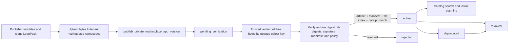

# Hosted marketplace registry

Loopgraph's local marketplace remains the portable development and self-hosted
path. The hosted registry adds a tenant-scoped distribution control plane for
private enterprise LoopPacks without making artifact storage or credentials
public.

## What this layer guarantees

- A publisher namespace and app namespace have one owning organization.
- An exact `appId@version` is immutable. Reusing it with different metadata,
  manifest, digest, snapshot, or object key fails.
- Publication requires an authenticated organization `admin` or `owner` and a
  signed private LoopPack.
- Tenant publishers cannot claim the reserved `loopgraph` publisher/app
  namespaces, self-assert a verified publisher, or self-assert marketplace
  maturity. Hosted private releases begin at `concept` maturity.
- A newly published release is `pending_verification`; publisher input cannot
  mark its own provenance as verified.
- A service-role verification worker must submit the verified manifest and file
  index and attest their canonical digests, the whole-artifact digest, and a
  content-addressed verification receipt before the release becomes active.
  The database requires the verified JSON projections to equal the immutable
  stored projections, so an artifact digest cannot activate unrelated catalog
  permissions, dependencies, presets, or files.
- Lifecycle transitions are one-way: `active → deprecated → revoked`, with
  direct `active → revoked` permitted for emergencies. Revocation is terminal.
- Private catalog grants are explicit organization-to-organization records.
- RLS permits reads only for the owner, an explicitly granted organization, or
  authenticated users when a future trusted publishing path marks an app
  public/official.
- Direct client writes are revoked. Authenticated mutations go through bounded
  `SECURITY DEFINER` functions with an empty search path.
- Namespace claims use transaction-scoped advisory locks and post-conflict
  ownership checks, so concurrent first publication cannot cross tenants.
- Authenticated reads receive an explicit safe column projection. Opaque object
  keys and raw release signatures remain service-only even for an otherwise
  visible catalog row.
- The registry stores only a tenant-prefixed opaque object key. It never returns
  storage credentials, provider tokens, signing private keys, or arbitrary
  artifact URLs to marketplace readers.

## Registry data model

| Table | Purpose |
| --- | --- |
| `marketplace_publishers` | Publisher namespace, owning organization, and verification class |
| `marketplace_apps` | Stable app identity, publisher, owner, and visibility |
| `marketplace_app_versions` | Immutable version metadata, manifest, digests, opaque artifact key, and lifecycle |
| `marketplace_app_artifacts` | Content-digested files in the LoopPack |
| `marketplace_app_dependencies` | Exact app dependency requirements |
| `marketplace_app_connector_requirements` | Required and optional logical connector capabilities |
| `marketplace_app_presets` | Immutable install presets for the version |
| `marketplace_app_eval_results` | Version-scoped conformance/evaluation receipts |
| `marketplace_release_signatures` | Public signing material and signature value; never a private key |
| `private_catalog_access` | Explicit private app access granted to another organization |

Application metadata lives with each immutable version. That lets names,
descriptions, tags, and documentation evolve without mutating the historical
meaning of an already published version.

## Publication and verification flow

The registry and verifier are deliberately separate. Database authorization
proves who may publish; cryptographic verification proves what was published.

## Server adapters

`SupabaseMarketplaceRegistryStore` uses a user-bound Supabase client and relies
on RLS for visibility. It supports:

- staging a signed private version;
- listing visible active/deprecated apps without exposing object keys or raw
  signature values;
- listing owner-visible release state, including pending/rejected releases;
- deprecating or revoking a release; and
- granting or revoking private catalog access.

`SupabaseMarketplaceReleaseVerifier` calls the service-role-only attestation
function with the already parsed and verified artifact. It derives the
canonical manifest and file-index digests and submits the exact verified JSON
for database comparison. Archive loading, signature verification, and policy
evaluation remain the out-of-process worker's responsibility; the adapter must
not be exposed to a browser.

## Applying the migration

The migration is
`supabase/migrations/20260816110321_hosted_marketplace_registry.sql`. Apply it
after `202607300001_hosted_tenant_security.sql`, because it uses the existing
organization membership and private authorization helpers.

Before production use:

1. Apply the migration to an isolated staging project.
2. Exercise owner, grantee, unrelated-member, suspended-member, anonymous, and
   service-role identities against every read and mutation.
3. Race different organizations for the same publisher/app namespace and race
   two publications for the same version; ownership must never cross tenants,
   and only byte-for-byte equal publication may be idempotent.
4. Verify that a pending/rejected/revoked release never appears in the install
   catalog.
5. Rotate the object-storage signing key and prove previously issued download
   URLs expire without changing registry identities.
6. Back up and restore the registry, then confirm digest, signature, access,
   and lifecycle history remains intact.

## Intentionally still separate

This migration does not upload or download artifact bytes, mint signed URLs,
run the verification worker, expose marketplace HTTP routes, or connect the
hosted registry to the local installation service. Those are separate trust
boundaries. The next layer must add a capability-scoped artifact service that
checks RLS-visible release eligibility, emits short-lived single-purpose URLs,
and re-verifies the digest before local staging and atomic installation.
