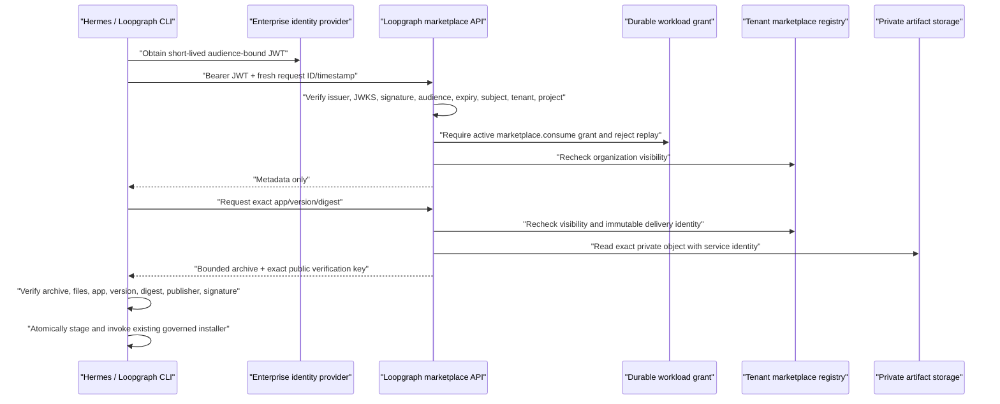

# Hosted marketplace access for Hermes and CLI

Hermes MCP and the Loopgraph CLI can discover and install private hosted apps
without receiving a Supabase service key, user cookie, or reusable provider
token. They use the same ambient, short-lived OIDC workload identity already
supported by the Connector Broker.

## Trust path



The JWT is not a marketplace artifact credential by itself. Production access
also requires a durable, tenant/project-scoped `marketplace.consume` grant.
Every request has a unique replay identity, a five-minute timestamp window,
database-enforced rate limiting, and an authorization audit event. The local
content-addressed cache is never an authorization source: a cached hosted app
is checked against the remote visible-version set before Hermes or the CLI can
use it again.

## Server configuration

Configure the hosted deployment's existing workload verifier. This example is
illustrative; use the issuer, JWKS, subject patterns, and audience managed by
your identity platform.

```bash
LOOPGRAPH_HOSTED_MODE=1
LOOPGRAPH_HOSTED_ORGANIZATION_ID=123e4567-e89b-12d3-a456-426614174000
LOOPGRAPH_HOSTED_PROJECT_KEY=main
LOOPGRAPH_WORKLOAD_IDENTITY_ISSUERS='[{"issuer":"https://issuer.example","jwksUri":"https://issuer.example/.well-known/jwks.json","audiences":["https://loopgraph.example/marketplace"],"allowedSubjectPatterns":["hermes:*","loopgraph-cli:*"] ,"requireTokenId":true}]'
```

In the authenticated Integrations admin API, register the exact issuer,
subject, audience, environment, and `marketplace.consume` capability. Staging
and production issuers must use HTTPS. Prefer a short expiry, require `jti`,
and bind the JWT to an mTLS confirmation key when the enterprise gateway
supports it.

The temporary `LOOPGRAPH_MARKETPLACE_API_TOKEN` compatibility path is for
non-production migration only. Production rejects static machine bearer
tokens unless the explicit legacy compatibility flag is enabled.

## Hermes / CLI configuration

Give the local process only the marketplace origin, expected audience, and an
ambient token source:

```bash
export LOOPGRAPH_MARKETPLACE_URL=https://loopgraph.example/
export LOOPGRAPH_MARKETPLACE_AUDIENCE=https://loopgraph.example/marketplace
export LOOPGRAPH_MARKETPLACE_ORGANIZATION_ID=123e4567-e89b-12d3-a456-426614174000
export LOOPGRAPH_MARKETPLACE_PROJECT_KEY=main
export LOOPGRAPH_WORKLOAD_IDENTITY_TOKEN_FILE=/var/run/secrets/loopgraph/marketplace.jwt
```

The token file must be absolute. Kubernetes projected service-account tokens,
SPIFFE JWT-SVID files, GCP workload identity, and Azure managed identity use
the existing ambient token provider. Development may use
`LOOPGRAPH_DEV_WORKLOAD_IDENTITY_TOKEN`; production may not.

With these variables in the Hermes MCP process or CLI environment, existing
commands work without a second installer:

```bash
npx loopgraph apps search "renewal risk" --department customer_success
npx loopgraph apps get acme.customer-success.renewal-risk --version 1.0.0
npx loopgraph apps plan acme.customer-success.renewal-risk \
  --version 1.0.0 --preset hubspot --project .
```

Hermes uses the same `loopgraph_marketplace_search`, `loopgraph_app_get`, and
`loopgraph_app_install_plan` MCP tools. A remote artifact is downloaded only
when an exact app is opened or planned/applied. Installation still performs
connection readiness, mapping checks, conformance, approval policy, and atomic
application; it does not enable provider writes.

## Revocation

Revoke either the workload principal/grant or the app share/release. The next
catalog or artifact request fails. On a later governed tool call, Loopgraph
reconciles the visible remote identities and removes stale hosted cache bytes
and source metadata. Existing installation records and evidence remain for
audit; revocation does not silently erase company history.

## Remaining deployment proof

Run the real staging matrix before production: issuer key rotation, expired and
replayed JWTs, disabled grants, cross-tenant claims, revoked shares, release
revocation, cache corruption, multiple replicas, large bounded artifacts, and
audit-retention export. Interactive human CLI login/device authorization is a
separate UX layer; the implemented enterprise path is workload identity for
Hermes and managed CLI runners.

The executable first release of that matrix is `npm run validate:marketplace-staging`.
It validates a private exact release with separate allowed, foreign-tenant,
revoked-grant, and observability identities, then emits a secret-free JSON receipt.
The protected staging workflow blocks production promotion unless all seven checks
pass. Issuer key rotation, rate-limit saturation, backup/restore, and external
retention remain separate operational drills.
