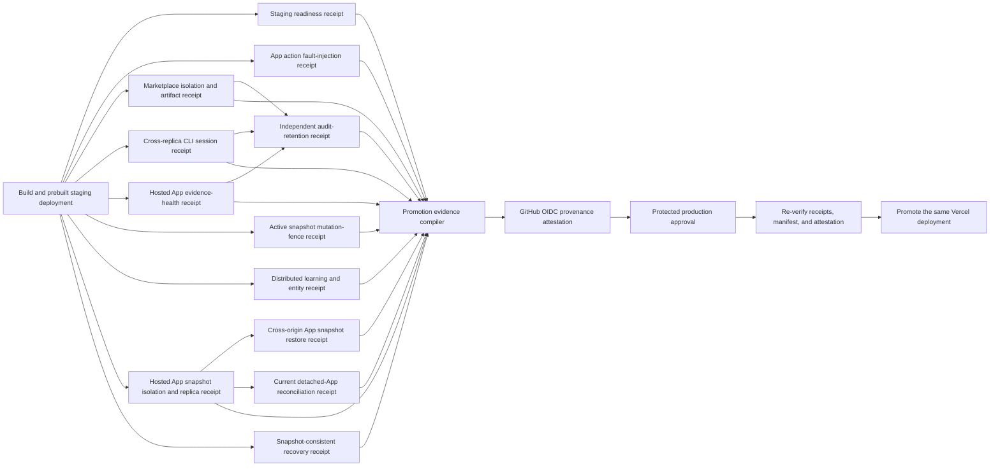

# Production promotion evidence

Loopgraph promotes an exact prebuilt deployment only when one workflow run proves eleven independent
environment control receipts plus the commit-bound App action exactly-once contract, then binds all
twelve receipts into one attested manifest. A build result, environment approval, or green staging
URL alone is not sufficient evidence.

## Evidence contracts

The compiler in `scripts/production-evidence-manifest.ts` accepts only these versions:

| Receipt | What it binds |
|---|---|
| `staging-validation/v5` | Exact HTTPS deployment origin, organization, project, readiness, protected metrics, zero pending/stale App action commits, the reviewed action-reconciliation threshold, verified audit checkpoint, unauthenticated/foreign/suspended user denial, and one complete database-owned user quota window ending in `429` |
| `app-action-exactly-once-proof/v1` | Exact source commit, real Broker prepare/commit/idempotency/reconcile code, a simulated lost App terminal write, receipt-only recovery, one replay, one provider-fixture invocation, and an explicit no-network/no-credential boundary |
| `hosted-marketplace-staging-validation/v2` | Exact origin and tenant, selected app/version/artifact digest, signature/cache verification, tenant denial, revocation, replay denial, and the pinned audit checkpoint containing the accepted request |
| `hosted-cli-session-staging-validation/v1` | Exact primary deployment, distinct replica, tenant/project, bounded device issuance and polling, cross-replica refresh rotation, stale-request denial, suspended/revoked-session denial, shared rate saturation, refresh replay family revocation, and the pinned audit checkpoint containing the accepted CLI request |
| `hosted-app-evidence-health-staging-validation/v3` | Exact deployment and tenant/project, separate schedule/observability workload boundaries, unauthenticated and cross-tenant denial, replay rejection, fresh aggregate-only App evidence status, complete fleet-count invariants, exact protected-metric parity, all six fixed classifier outcomes, and a pinned audit checkpoint containing the accepted schedule request |
| `hosted-app-snapshot-fence-probe/v1` | Pinned Storage origin and organization scope, real registry insert/update/delete plus private Storage upload/non-upserting replacement/delete generation advances, verified authority/generation cleanup, and an aggregate-only status surface |
| `hosted-learning-entity-staging-validation/v1` | Pinned Supabase origin and organization scope, one-winner distributed measurement claims, stale-lease rejection, cross-replica finalization, immutable metric/outcome/value conflicts, cross-replica entity visibility, single-owner provider aliases, and nonce-authorized exact cleanup |
| `hosted-app-snapshot-staging-validation/v1` | Exact Supabase Storage origin and tenant/project, private bounded bucket, authenticated read/insert/update/delete denial, first-writer immutability, content-bound recovery through a second replica root, and verified probe cleanup |
| `hosted-app-snapshot-restore-rehearsal/v1` | Exact validated source and separately reviewed restore origins, tenant/project, source export, first-writer restore, clean-target exact load, source preservation during target cleanup, exact probe cleanup, and the same artifact/file payload exercised by the isolation gate |
| `hosted-app-snapshot-reconciliation/v3` | Exact validated Storage origin and tenant/project scope digest, live service-only attestation of the full unconditional row-level trigger event masks plus independently pinned function bodies, owners, search paths, and execute capabilities, fixed control set, explicit empty-inventory policy, two identical full registry-plus-Storage passes within a bounded stability window, the same trigger-maintained mutation generation before/after and across those passes, complete current detached-installation scan, exact signed-archive verification, reverse Storage inventory, zero malformed objects, and an independently pinned opaque digest for intentionally retained unreferenced archives |
| `backup-restore-rehearsal/v2` | Protected source database identity digest, distinct disposable target, matching PostgreSQL versions, exact row-count/SHA-256 fingerprints for every application table, restored audit integrity, and evidence-family counts |
| `audit-drain/v5` | Exact staging origin and tenant, retained audit head, exact staging, marketplace, App evidence-health, and CLI-session sequence/hash proofs, receiver predecessor, Ed25519-signed external acknowledgement and its recomputed digest, and immutable-until deadline |

All receipt timestamps must fit the configured release window both when the manifest is built and
when production promotion is approved. The audit-retention receipt must prove the exact sequence and
hash of the staging, marketplace, App evidence-health, and CLI-session audit checkpoints, and all four checkpoints must fall inside the
externally acknowledged retained range. The recovery source must match the database identity
approved inside the protected recovery environment. A missing, stale, duplicated, cross-tenant, or
cross-deployment receipt fails the compiler.

The App snapshot recovery source must equal the Storage origin proven by the isolation gate, its
target must equal the independently protected restore origin, and the two origins must differ. Its
artifact and signed file-inventory digests must match the App payload exercised by the isolation
gate. A same-origin rehearsal or a different restored payload fails compilation.

The staging receipt includes only aggregate App action evidence: requested, succeeded, and failed
commit counts plus the zero-valued pending/stale backlog and reviewed stale threshold. It does not
include App IDs, action IDs, provider inputs, Broker receipts, credentials, or customer payloads.
Any nonterminal action commit blocks manifest compilation and production promotion.

The App snapshot retention digest is verified twice: first inside the isolated reconciliation
environment, then against independently configured release-evidence/production values. Reconciliation
therefore cannot silently bless newly orphaned archives. Malformed Storage objects always fail and
are never covered by the retention digest. No release receipt contains object keys or archive paths.

The resulting `loopgraph-production-promotion-evidence/v13` manifest records the repository, commit,
GitHub workflow run and attempt, deployment origin, tenant/project, database identity digest,
marketplace release, active mutation-probe and learning/entity probe scopes, approved unreferenced-snapshot inventory digest,
trusted retention key ID and
public-key digest, canonical SHA-256 digest of each receipt, essential control summaries, and one
digest over the entire evidence set. The compiler
verifies the receiver acknowledgement against that protected Ed25519 trust anchor. It does not
contain workload tokens, database URLs, passwords, provider payloads, or private signing material.

GitHub's provenance action attests the exact manifest file with workflow OIDC. The production job
downloads the current run's immutable artifacts, rebuilds and compares the manifest from the twelve
receipts, checks the upstream evidence-set digest, verifies the GitHub attestation, and only
then calls `vercel promote` for the same deployment URL.

## Protected environment setup

Use separate protected environments and runner identities.
The workflow refuses to start its job chain unless `github.ref` is the protected
`refs/heads/loopgraph/canvas-first` default branch. Configure every environment deployment rule to
match that branch as a second independent control; do not approve a credential-bearing staging run
from a pull-request or feature ref. The workflow accepts only the `staging-release`
`repository_dispatch` event; GitHub therefore loads its workflow and source SHA from the default
branch rather than accepting a caller-selected ref.
Every third-party workflow action is resolved to an immutable commit SHA, and every job checks out
that exact dispatch SHA with persisted Git credentials disabled. Human-readable release-major
comments are informational; the commit is the executable authority.

### `staging`

- `VERCEL_TOKEN` may build and deploy preview artifacts but should not own unrelated projects.

### `marketplace-staging`

- marketplace organization, project, audience, app ID, version, and artifact digest;
- projected mode-`0600` workload JWT paths for the allowed tenant, foreign tenant, revoked grant,
  and observability reader;
- Supabase origin and publishable key plus projected mode-`0600` session-bundle paths for an active
  target member, an active foreign-tenant member, and a suspended target member; and
- a reviewed staging-only `admin` quota override and the exact expected limit (recommended: three
  requests in a one-second window).

Each session bundle contains only `access_token` and `refresh_token`. It is exchanged in memory for
browser cookies and is never emitted in the staging receipt. The expected quota limit is bounded to
`1..10`, and the maximum synchronization wait is bounded to 30 seconds. A mismatch between the
configured expected limit and the database policy fails the release instead of weakening the check.

The job emits validated non-secret scope and artifact identities as job outputs. Later jobs do not
receive the token files or marketplace environment configuration.

### `app-evidence-health-staging`

- `LOOPGRAPH_STAGING_APP_EVIDENCE_SCHEDULE_TOKEN_FILE`: absolute mode-`0600` projected workload JWT
  granting only `schedule.app_evidence_health`;
- `LOOPGRAPH_STAGING_OBSERVABILITY_TOKEN_FILE`: a separate absolute mode-`0600` projected workload
  JWT granting only `observability.read`.

The job receives the exact deployment origin and tenant/project only from validated upstream job
outputs. It proves both identities reject a foreign tenant, the schedule rejects unauthenticated and
replayed requests, the response is fresh and aggregate-only, and the protected metrics match every
fleet count. It cannot replay an App, record evidence, create approval, activate an App, invoke a
connector, or write to a provider. Its secret-free receipt is downloaded independently by evidence
compilation and production verification.

### `cli-session-staging`

- one reviewed secondary HTTPS replica origin backed by the same tenant database as the promoted
  primary deployment;
- one staging-only disposable current refresh token, one access token for a now-suspended member,
  and one pre-revoked access token, each projected as an absolute mode-`0600` file;
- a separate projected `observability.read` workload identity; and
- the exact shared CLI request-rate limit, bounded from 2 through 20.

The job receives its primary origin and tenant/project only from validated upstream outputs. It
mutates only disposable staging sessions, proves refresh generations and revocation are shared
across replicas, verifies the accepted request in the tenant audit chain, and uploads a secret-free
ten-check receipt. The receipt is independently consumed by audit retention, evidence compilation,
and production re-verification. See [Hosted CLI session staging gate](./HOSTED-CLI-SESSION-STAGING-GATE.md).

### `app-snapshot-staging`

- the same reviewed Supabase origin and publishable key used by hosted staging;
- the allowed-user session bundle, projected as a private mode-`0600` file; and
- `LOOPGRAPH_STAGING_SUPABASE_SERVICE_ROLE_KEY_FILE`, projected only to this environment as an
  absolute mode-`0600` non-symlink file; and
- `LOOPGRAPH_EXPECTED_APP_SNAPSHOT_FENCE_PROBE_SCOPE_DIGEST`, independently reviewed from the exact
  Storage origin, lowercase organization UUID, and reserved `fence_probe` namespace.

Before the snapshot isolation check, the job creates a random reserved project scope and actively
proves registry insert/update/delete plus Storage upload/non-upserting replacement/delete all advance
the deployed mutation generation. Cleanup refuses to erase generation evidence while any probe
registry row or object remains. The job then creates a separate content-bound snapshot probe,
validates it through two isolated runtime roots, and removes it. Only the validated Storage origin
and two aggregate secret-free receipts leave this environment.

### `learning-entity-staging`

- the reviewed staging Supabase origin shared with the release Storage scope;
- `LOOPGRAPH_STAGING_SUPABASE_SERVICE_ROLE_KEY_FILE`, projected only to this protected self-hosted
  runner as an absolute mode-`0600` non-symlink file; and
- `LOOPGRAPH_EXPECTED_LEARNING_ENTITY_PROBE_SCOPE_DIGEST`, independently reviewed from that origin,
  the lowercase release organization UUID, and the fixed `learning_probe` namespace.

The job receives the organization only from the validated marketplace receipt, creates one random
reserved project scope, emits an aggregate nine-check receipt, and proves cleanup before success.
Its receipt is downloaded by both evidence compilation and production verification; omission,
staleness, wrong scope, or any missing, duplicated, or extra control blocks promotion.

### `app-snapshot-recovery`

- a source service-role credential projected as a private mode-`0600` file for the exact validated
  Storage origin;
- a distinct restore-target service-role credential projected with the same file protections;
- a target Supabase origin that differs from the source; and
- `LOOPGRAPH_EXPECTED_APP_SNAPSHOT_RESTORE_ORIGIN`, independently reviewed in this environment.

The workflow passes the source origin and tenant/project from earlier validated job outputs. The
rehearsal never receives an object key or selects a customer archive: it creates one fresh random
probe, restores and loads it on the isolated target, then deletes only that exact probe on both
origins. Only the validated restore origin and secret-free receipt leave this environment.

### `app-snapshot-reconciliation`

- a source service-role credential projected as a private mode-`0600` non-symlink file;
- the independently reviewed digest of the exact validated Storage origin, organization, and
  project scope; and
- the independently reviewed digest of the exact unreferenced archive inventory; and
- an explicit `yes` or `no` policy for whether a deployment with no detached Apps may pass.

The workflow supplies the validated Storage origin and marketplace tenant/project as upstream job
outputs. The job checks out the exact default-branch dispatch SHA, verifies every current detached
installation, first attests through a service-role-only RPC that both exact database triggers are
installed with their full unconditional event masks and that pinned function definitions, owners,
search paths, and execute capabilities are unchanged, and repeats the full registry-plus-Storage read until two consecutive content digests are
identical, inventories the exact tenant/project Storage prefix, and emits only aggregate counts plus
opaque scope/generation/retention digests. Database triggers increment the scoped generation in
the same transaction as every committed registry-payload or private-bucket mutation, and the job
reads it before the registry and after the last Storage page. Continuous mutation exhausts the
bounded pass window and fails the job. It cannot
select an App, workspace, object key, archive, or
alternate tenant at dispatch time. The same retention digest must be independently configured as
`LOOPGRAPH_RELEASE_EXPECTED_APP_SNAPSHOT_UNREFERENCED_INVENTORY_DIGEST` in `release-evidence` and
`production`; see [Hosted App snapshots](./HOSTED-APP-SNAPSHOTS.md) for the review procedure.

### `recovery-staging`

- `LOOPGRAPH_BACKUP_SOURCE_DB_URL_FILE`: mode-`0600` projected source PostgreSQL URL;
- `LOOPGRAPH_REHEARSAL_RESTORE_DB_URL_FILE`: mode-`0600` disposable target URL;
- `LOOPGRAPH_REHEARSAL_TARGET_MARKER`: the one-time database comment marker;
- `LOOPGRAPH_EXPECTED_SOURCE_DB_IDENTITY_DIGEST`: SHA-256 of
  `lowercase-hostname:port/database` with the `sha256:` prefix.

The expected digest is non-secret, but keeping it in the protected recovery environment prevents a
workflow edit or runner misconfiguration from silently rehearsing the wrong database. Compute it
from reviewed connection metadata—never by printing the credential-bearing URL.

### `audit-retention-staging`

Configure the projected identities, receiver public key, receipt state file, and retention policy in
[Independent audit retention protocol](./AUDIT-RETENTION-PROTOCOL.md). The receipt state file lives
on a protected persistent volume; the GitHub artifact is not its replacement. The workflow supplies
the current staging, marketplace, App evidence-health, and CLI-session receipts as bounded checkpoint inputs; do not replace them with
manually entered sequence values.

### `release-evidence`

- `LOOPGRAPH_AUDIT_RETENTION_KEY_ID`: the active external receiver key ID;
- `LOOPGRAPH_AUDIT_RETENTION_PUBLIC_KEY_PEM`: its reviewed Ed25519 public key;
- optionally set `LOOPGRAPH_RELEASE_EVIDENCE_MAX_AGE_MINUTES` from 5 to 1440.

This environment is a separate trust boundary from the self-hosted retention runner. Its public key
is not secret, but it must be protected from unauthorized replacement.

### `production`

- require accountable reviewers;
- keep `VERCEL_TOKEN` scoped to promotion of the target project;
- configure the same reviewed retention key ID and public key independently;
- optionally set `LOOPGRAPH_RELEASE_EVIDENCE_MAX_AGE_MINUTES` from 5 to 1440. The default is 360.

The repository workflow needs `id-token: write` and `attestations: write` only in the evidence job,
and `attestations: read` only in the production job. No build, marketplace, recovery, or audit
credential is forwarded into production promotion.

## Operational boundary

Repository tests validate schemas, content binding, freshness, mixed-evidence rejection, exact
user-boundary statuses, quota-window completeness, fingerprint coverage, and manifest reconstruction. A real workflow run is still required to prove
the Vercel deployment, Supabase database, protected runner mounts, receiver key, immutable storage,
GitHub attestation service, and environment approval all exist and are correctly configured.
The aggregate staging gate proves there is no unresolved App action backlog at promotion time. The
commit-bound fixture proof exercises the real Broker state machine without network or credential
access and fails unless interruption, receipt-only recovery, and replay cause exactly one fixture
mutation. An approved non-production provider account is still required to prove the external
provider's own idempotency behavior and the deployed distributed stores under a real process loss.

Retain the manifest, twelve receipts, GitHub attestation, workflow URL, promoted deployment URL, and
alert/configuration revisions according to enterprise policy. The external WORM receiver remains
the authoritative audit boundary even if GitHub artifacts expire.
