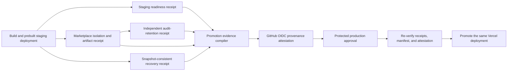

# Production promotion evidence

Loopgraph promotes an exact prebuilt deployment only when one workflow run proves four independent
control surfaces and binds their receipts into one attested manifest. A build result, environment
approval, or green staging URL alone is not sufficient evidence.

## Evidence contracts

The compiler in `scripts/production-evidence-manifest.ts` accepts only these versions:

| Receipt | What it binds |
|---|---|
| `staging-validation/v4` | Exact HTTPS deployment origin, organization, project, readiness, protected metrics, verified audit checkpoint, unauthenticated/foreign/suspended user denial, and one complete database-owned user quota window ending in `429` |
| `hosted-marketplace-staging-validation/v2` | Exact origin and tenant, selected app/version/artifact digest, signature/cache verification, tenant denial, revocation, replay denial, and the pinned audit checkpoint containing the accepted request |
| `backup-restore-rehearsal/v2` | Protected source database identity digest, distinct disposable target, matching PostgreSQL versions, exact row-count/SHA-256 fingerprints for every application table, restored audit integrity, and evidence-family counts |
| `audit-drain/v3` | Exact staging origin and tenant, retained audit head, exact staging and marketplace sequence/hash proofs, receiver predecessor, Ed25519-signed external acknowledgement and its recomputed digest, and immutable-until deadline |

All receipt timestamps must fit the configured release window both when the manifest is built and
when production promotion is approved. The audit-retention receipt must prove the exact sequence and
hash of the staging and marketplace audit checkpoints, and both checkpoints must fall inside the
externally acknowledged retained range. The recovery source must match the database identity
approved inside the protected recovery environment. A missing, stale, duplicated, cross-tenant, or
cross-deployment receipt fails the compiler.

The resulting `loopgraph-production-promotion-evidence/v1` manifest records the repository, commit,
GitHub workflow run and attempt, deployment origin, tenant/project, database identity digest,
marketplace release, trusted retention key ID and public-key digest, canonical SHA-256 digest of each
receipt, essential control summaries, and one digest over the entire evidence set. The compiler
verifies the receiver acknowledgement against that protected Ed25519 trust anchor. It does not
contain workload tokens, database URLs, passwords, provider payloads, or private signing material.

GitHub's provenance action attests the exact manifest file with workflow OIDC. The production job
downloads the current run's immutable v4 artifacts, rebuilds and compares the manifest from the
four receipts, checks the upstream evidence-set digest, verifies the GitHub attestation, and only
then calls `vercel promote` for the same deployment URL.

## Protected environment setup

Use separate protected environments and runner identities.

### `staging`

- `VERCEL_TOKEN` may build and deploy preview artifacts but should not own unrelated projects.

### `marketplace-staging`

- marketplace organization, project, audience, app ID, version, and artifact digest;
- projected mode-`0600` workload JWT paths for the allowed tenant, foreign tenant, revoked grant,
  and observability reader;
- Supabase origin and publishable key plus projected mode-`0600` session-bundle paths for an active
  target member, an active foreign-tenant member, and a suspended target member; and
- a reviewed staging-only `admin` quota override and the exact expected limit (recommended: three
  requests in a one-second window).

Each session bundle contains only `access_token` and `refresh_token`. It is exchanged in memory for
browser cookies and is never emitted in the staging receipt. The expected quota limit is bounded to
`1..10`, and the maximum synchronization wait is bounded to 30 seconds. A mismatch between the
configured expected limit and the database policy fails the release instead of weakening the check.

The job emits validated non-secret scope and artifact identities as job outputs. Later jobs do not
receive the token files or marketplace environment configuration.

### `recovery-staging`

- `LOOPGRAPH_BACKUP_SOURCE_DB_URL_FILE`: mode-`0600` projected source PostgreSQL URL;
- `LOOPGRAPH_REHEARSAL_RESTORE_DB_URL_FILE`: mode-`0600` disposable target URL;
- `LOOPGRAPH_REHEARSAL_TARGET_MARKER`: the one-time database comment marker;
- `LOOPGRAPH_EXPECTED_SOURCE_DB_IDENTITY_DIGEST`: SHA-256 of
  `lowercase-hostname:port/database` with the `sha256:` prefix.

The expected digest is non-secret, but keeping it in the protected recovery environment prevents a
workflow edit or runner misconfiguration from silently rehearsing the wrong database. Compute it
from reviewed connection metadata—never by printing the credential-bearing URL.

### `audit-retention-staging`

Configure the projected identities, receiver public key, receipt state file, and retention policy in
[Independent audit retention protocol](./AUDIT-RETENTION-PROTOCOL.md). The receipt state file lives
on a protected persistent volume; the GitHub artifact is not its replacement. The workflow supplies
the current staging and marketplace receipts as bounded checkpoint inputs; do not replace them with
manually entered sequence values.

### `release-evidence`

- `LOOPGRAPH_AUDIT_RETENTION_KEY_ID`: the active external receiver key ID;
- `LOOPGRAPH_AUDIT_RETENTION_PUBLIC_KEY_PEM`: its reviewed Ed25519 public key;
- optionally set `LOOPGRAPH_RELEASE_EVIDENCE_MAX_AGE_MINUTES` from 5 to 1440.

This environment is a separate trust boundary from the self-hosted retention runner. Its public key
is not secret, but it must be protected from unauthorized replacement.

### `production`

- require accountable reviewers;
- keep `VERCEL_TOKEN` scoped to promotion of the target project;
- configure the same reviewed retention key ID and public key independently;
- optionally set `LOOPGRAPH_RELEASE_EVIDENCE_MAX_AGE_MINUTES` from 5 to 1440. The default is 360.

The repository workflow needs `id-token: write` and `attestations: write` only in the evidence job,
and `attestations: read` only in the production job. No build, marketplace, recovery, or audit
credential is forwarded into production promotion.

## Operational boundary

Repository tests validate schemas, content binding, freshness, mixed-evidence rejection, exact
user-boundary statuses, quota-window completeness, fingerprint coverage, and manifest reconstruction. A real workflow run is still required to prove
the Vercel deployment, Supabase database, protected runner mounts, receiver key, immutable storage,
GitHub attestation service, and environment approval all exist and are correctly configured.

Retain the manifest, four receipts, GitHub attestation, workflow URL, promoted deployment URL, and
alert/configuration revisions according to enterprise policy. The external WORM receiver remains
the authoritative audit boundary even if GitHub artifacts expire.
