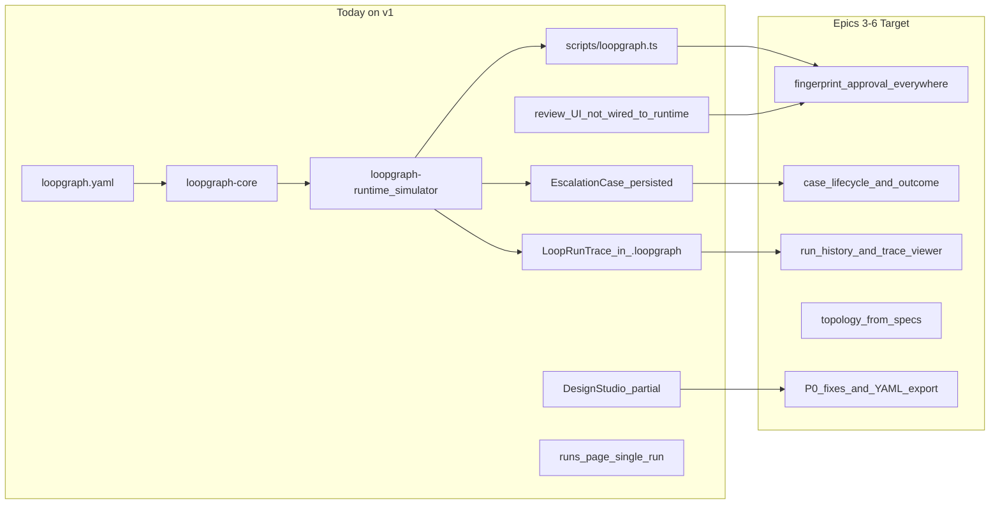
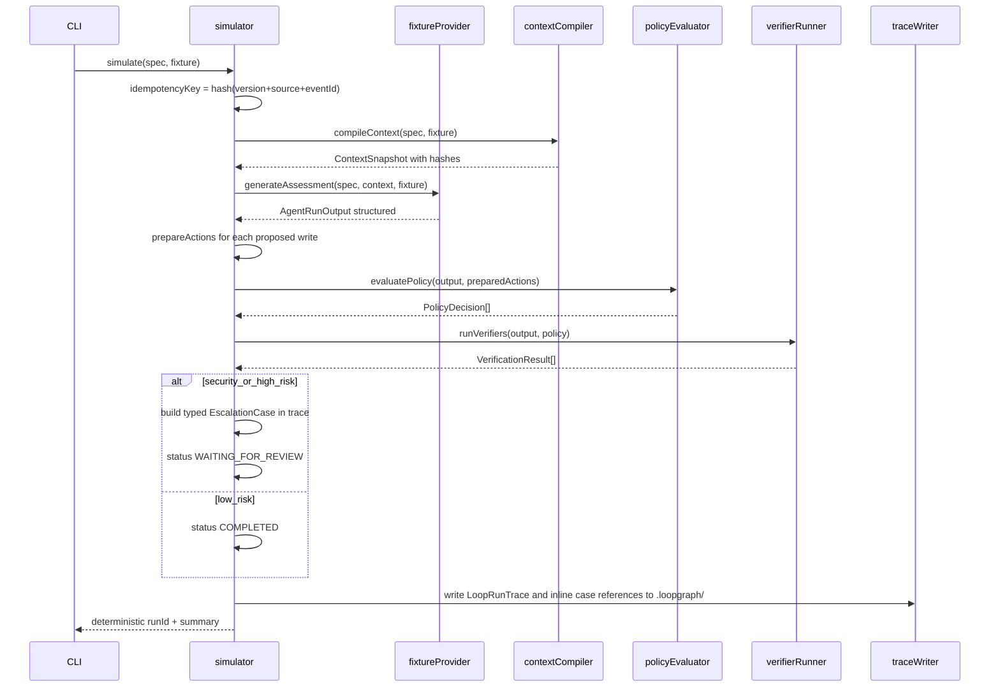

# Loopgraph V1 Execution Plan

This plan implements the authoritative contract in [V1-LAUNCH-CONTEXT-PLAN.md](../V1-LAUNCH-CONTEXT-PLAN.md).

**Active phase (2026-06-27):** Epics **3 → 6**. Epics 0–2 are complete; Epic 7 is partially complete (README, docs, CI, LICENSE — manual QA and release tag remain).

Build order for active work: **Epic 3 → Epic 4 → Epic 5 → Epic 6**, then finish Epic 7 release packaging.

---

## Current status snapshot (branch `v1`, pre-alpha)

### What works today

| Capability | Status | Notes |
|------------|--------|-------|
| `loopgraph/v1alpha1` LoopSpec | **Done** | `lib/loopgraph-core/` — Zod schema, semantic validation, JSON Schema at `docs/schemas/loop-v1alpha1.json` |
| Hero YAML templates | **Done** | `examples/github-issue-triage/`, `examples/strategic-account-escalation/` |
| Fixture library | **Done** | 9 JSON fixtures + `fixtures/expected-traces/*.summary.json` |
| CLI | **Done** | `npm run loopgraph --` init, validate, simulate, trace, export-graph, adapter test, review approve/reject/request-evidence, case show |
| Deterministic simulator | **Done** | Context compile → fixture assessment → policy → verifiers → trace + optional EscalationCase |
| Mock adapters + conformance | **Done** | 8 mocks in `lib/loopgraph-sdk/adapters/mock-adapters.ts` |
| File storage | **Done** | `.loopgraph/traces|reviews|cases/` + index |
| Design Studio bridge | **Done** | `studio-adapter.ts`, `exportPublicLoopSpec()` |
| Tests | **Done** | 33 tests — spec, loader, both hero simulators, 9 fixture snapshots, idempotency, studio adapter, adapter conformance |
| CI | **Done** | typecheck, test, build, validate, simulate, init, adapter test |
| Docs | **Mostly done** | ADR, loop-spec, competitive boundary, context/trace/approval/escalation/template/roadmap |
| Design Studio UI | **Partial** | Wizard, topology, demo mode banner; hero loops use `runtime-bridge` simulator |

### What is partial or missing (Epics 3–6)

| Gap | Epic | Impact |
|-----|------|--------|
| UI `submitHumanReview` no-ops without Supabase; does not call runtime fingerprint binding | 3 | Core differentiator broken in browser demo mode |
| Per-action approve checkboxes; customer-facing vs internal separation in UI | 3 | Review UX incomplete |
| Fingerprint invalidation tests; `review reassign` CLI | 3 | Governance not fully proven |
| `loopgraph case list`; case status transitions; outcome writeback | 4 | Escalation handoff is read-only after create |
| Review packet formatter (terminal + web) | 4 | Account escalation template incomplete |
| Runs page shows single workspace run, not `.loopgraph/` history | 5 | CLI and UI feel disconnected |
| Full trace viewer + context precedence inspector | 5 | Debugger story incomplete |
| Topology derived from specs/cases/runs; informational edge styling | 5 | Graph overclaims vs contract |
| Most loops still fall back to `agent.ts` canned runs | 5 | Inconsistent simulation |
| P0-1–P0-8 Design Studio fixes; YAML export from spec page | 6 | Persistence and honesty gaps |
| `SupabaseStorageAdapter`; Acme topology YAML; seed script | 6 | Optional prod persistence not unified |
| Manual QA checklist; `v0.1.0-alpha` tag | 7 | Not released |

### Explicitly out of scope until V1.1/V2

Live GitHub/CRM/support integrations, webhook ingestion, real LLM provider (assessments are fixture-driven), distributed execution, auto-executing topology edges.

---

## Current state vs target



| Area | Exists today | Next target (Epics 3–6) |
|------|--------------|-------------------------|
| LoopSpec | `loopgraph/v1alpha1` in `lib/loopgraph-core/` | YAML export/import from Design Studio (Epic 6) |
| Simulation | Fixture-driven CLI + hero loops via `runtime-bridge` | All workspace runs via simulator (Epic 5) |
| Review | CLI approve/reject; UI display only | UI wired to runtime; per-action gates (Epic 3) |
| EscalationCase | Create + show + management list | Lifecycle + outcome + case list CLI (Epic 4) |
| Topology | Legacy `loop-engineering-builder/graph.ts` | Derived from specs/traces/cases (Epic 5) |
| Design Studio | Question flow + partial labels | P0 fixes + seed + storage adapter (Epic 6) |

---

## Active implementation: Epics 3–6 (ordered)

### Epic 3 — start here (5–7 days)

**Priority 1:** Extract shared `applyReviewDecision()` from `scripts/loopgraph.ts` into `lib/loopgraph-runtime/review-service.ts` (or similar). Call from CLI and from `submitHumanReview` / review server actions when Supabase is absent.

**Priority 2:** Per-action approval UI with fingerprint checkboxes; separate customer-facing section.

**Priority 3:** Tests — approve fingerprint A, mutate payload B → commit rejected; partial approval leaves customer draft pending.

**Exit:** Demo mode review in browser updates `.loopgraph/traces/` same as CLI.

### Epic 4 — escalation lifecycle (5–7 days)

**Priority 1:** `loopgraph case list`; status transitions (`open` → `under_review` → `resolved`).

**Priority 2:** Outcome writeback on resolve → trace reference + improvement item stub.

**Priority 3:** Review packet formatter for account escalation (CLI + web).

**Exit:** Management page shows live case status; resolved cases carry outcome.

### Epic 5 — UI as debugger (5–7 days)

**Priority 1:** Runs page lists all traces from `FileStorageAdapter.listRuns()`; link to trace detail.

**Priority 2:** Expand `ContextTracePanel` into full context inspector (precedence, trust, redaction).

**Priority 3:** Wire `buildGraphFromSpecs()` + cases/runs into topology; dashed informational edges.

**Priority 4:** Remove remaining `agent.ts` canned run fallback for configured loops.

**Exit:** `npm run dev` + CLI simulate show identical trace semantics.

### Epic 6 — Design Studio hardening (5–7 days, after Epic 5)

Work through P0-1–P0-8 from launch doc §15; add YAML export on spec page; `SupabaseStorageAdapter` sharing file contract; `examples/acme-company-topology/topology.yaml`; idempotent seed script.

**Exit:** Clean clone demo; Supabase seed optional; exported studio spec validates via CLI.

---

This plan previously directed **Epic 0 → Epic 1 → Epic 2** first. That phase is complete. **Do not reopen topology polish before Epic 3 review binding is green.**

---

## Architecture: single-app module boundaries

Per the launch doc §4, **stay in one Next.js repo** (no Turborepo/npm publish for V1). Create clear internal packages:

```text
lib/
├── loopgraph-core/           # Pure contracts — no Next.js imports
│   ├── loop-spec.ts          # Zod v1alpha1 + validate + JSON Schema export
│   ├── policy.ts             # PolicyRule types + deterministic evaluator
│   ├── context.ts            # ContextSnapshot, ContextSource, compiler types
│   ├── trace.ts              # LoopRunTrace, ProposedAction, PreparedAction
│   ├── review.ts             # HumanReviewTrace, approval binding
│   ├── escalation.ts         # EscalationCase + invariants
│   ├── evidence.ts           # EvidenceRef, Assumption, PolicyInput
│   ├── graph.ts              # Derived topology from specs (migrate from loop-engineering-builder/graph.ts)
│   ├── hash.ts               # contentHash, idempotencyKey, actionFingerprint
│   └── index.ts
├── loopgraph-runtime/         # Deterministic execution — no Next.js imports
│   ├── loader.ts             # Load loopgraph.yaml / JSON / TS
│   ├── fixture-loader.ts
│   ├── context-compiler.ts   # Build ContextSnapshot from fixtures
│   ├── policy-evaluator.ts
│   ├── verifier-runner.ts
│   ├── tool-runner.ts        # prepareAction only in V1 (no commit)
│   ├── state-machine.ts
│   ├── simulator.ts          # validate + simulate orchestrator
│   ├── fixture-provider.ts   # Deterministic "LLM" — maps fixture → AgentRunOutput
│   ├── trace-writer.ts       # File-based trace storage for CLI
│   ├── management-consumer.ts # Constrained EscalationCase → ownership plan
│   └── index.ts
├── loopgraph-sdk/            # Public interfaces only
│   ├── adapters.ts           # IntegrationAdapter with prepareAction/commitPreparedAction
│   ├── providers.ts          # LLMProvider, FixtureProvider
│   ├── verifiers.ts
│   ├── storage.ts            # StorageAdapter + FileStorageAdapter contract
│   ├── conformance.ts        # Minimal adapter conformance suite
│   └── adapters/             # mock-github, mock-support, mock-crm, mock-product-analytics,
│                             # mock-status, mock-linear, local-json, webhook
└── loop-engineering-builder/ # Design Studio — gradually imports from loopgraph-core

examples/
├── github-issue-triage/
│   └── loopgraph.yaml
├── strategic-account-escalation/
│   └── loopgraph.yaml
└── acme-company-topology/
    └── topology.yaml          # Optional organization/topology metadata; not required by a LoopSpec

fixtures/
├── github-issue-triage/
│   ├── normal-bug.json
│   ├── duplicate-feature-request.json
│   ├── security-issue.json
│   ├── unclear-reproduction.json
│   └── expected-traces/
└── strategic-account-escalation/
    ├── enterprise-outage-near-renewal.json
    ├── low-risk-product-question.json
    ├── billing-dispute-without-renewal-risk.json
    ├── executive-escalation.json
    ├── incomplete-account-context.json
    └── expected-traces/

scripts/
└── loopgraph.ts              # CLI entry (tsx)

docs/
├── ADR-001-v1-architecture.md
├── loop-spec.md
├── context-snapshots.md
├── trace-model.md
├── approval-model.md
├── escalation-case.md
├── template-authoring.md
├── roadmap.md
└── competitive-boundary.md
```

**Dependency rule:** `loopgraph-core` has zero imports from `app/`, `components/`, or Supabase. `loopgraph-runtime` imports only `loopgraph-core` + `loopgraph-sdk`. Next.js app imports both.

---

## Phase 0 — Epic 0: Lock decisions (1–2 days)

**Goal:** Prevent contradictory implementations. No feature code until ADR is merged.

### Deliverables

1. **`docs/ADR-001-v1-architecture.md`** — encode all 10 decisions from launch doc §16 Epic 0:
   - Product name: **Loopgraph** (repository, CLI, docs, UI)
   - Source of truth: `loopgraph.yaml` / validated JSON
   - V1 runtime: `validate` + deterministic `simulate` required; `dry-run` is defined but experimental; `execute` is deferred
   - Storage: FileStorageAdapter for local CLI traces, reviews, and cases; Supabase optional for Design Studio
   - Hero templates: GitHub Issue Triage + Strategic Account Escalation
   - Company hierarchy: optional `topology` metadata, not required
   - No live integrations in V1
   - Approval: prepared-action fingerprint required
   - LLM: fixture provider required; live provider experimental
   - License: MIT or Apache 2.0 (pick one)

2. **Schema version constant:** `LOOPGRAPH_API_VERSION = "loopgraph/v1alpha1"`.

3. **Runtime invariants:** document deterministic run-ID derivation, event idempotency, maximum parent/child run depth, maximum escalation re-entry depth, and the rule that informational graph edges never auto-execute.

4. **Rename in UI copy:** "Design Studio" label on existing wizard routes ([app/loops/new/page.tsx](app/loops/new/page.tsx), loop tabs).

### Acceptance

- No open task contradicts ADR.
- ADR explicitly distinguishes `validate`, `simulate`, experimental `dry-run`, and deferred `execute`.
- Team agrees: **no topology polish or Supabase P0 work until Epic 2 CLI passes fixture tests**.

---

## Phase 1 — Epic 1: Public LoopSpec + file authoring (5–7 days)

**Goal:** LoopSpec is a portable, versioned developer artifact validatable outside the browser.

### 1.1 Core schema (`lib/loopgraph-core/loop-spec.ts`)

Implement the full shape from launch doc §6:

```ts
// Key top-level structure
{ apiVersion, kind: "Loop", metadata, trigger, input, output,
  context, routine, tools, policy, verification, approval,
  persistence, trace, topology? }
```

**Mandatory validation rules** (fail at `validate` time):
- `apiVersion`, `kind`, `metadata.id`, `metadata.version` required
- Write-capable tool → must have matching `policy.allowedActions` entry
- `requiresApproval` action → must define approval policy + fingerprint config
- Escalation rule → must have `routeTo.primaryOwner` + deadline/SLA + decision requirements
- `trace.evidenceRequired: true` → output schema must include evidence fields
- Structured agent output must include `decisionSummary`, `assumptions`, `proposedActions`, `evidence`, `policyInputs`, and `verificationRequest`; free-form prose cannot replace the structured output
- Output claims that trigger high-impact policy decisions must cite accepted `EvidenceRef` entries

**JSON Schema export:** add `zod-to-json-schema` (or hand-roll from Zod) for docs + external tooling.

### 1.2 Supporting contract modules

| Module | Types to define |
|--------|-----------------|
| [trace.ts](lib/loopgraph-core/trace.ts) | Full `LoopRunTrace`, `RunStatus`, `TriggerRef`, `InputSnapshot`, `ToolCallTrace`, `PolicyDecision`, `VerificationResult`, output artifacts, errors, latency, estimated cost |
| [review.ts](lib/loopgraph-core/review.ts) | `PreparedAction`, `ProposedAction`, `HumanReviewTrace`, `ApprovalPolicy`, review roles, decision state transitions, approval signatures |
| [evidence.ts](lib/loopgraph-core/evidence.ts) | `EvidenceRef`, `Assumption`, `PolicyInput`, `AgentRunOutput`, `VerificationRequest`, `EscalationRequest` |
| [context.ts](lib/loopgraph-core/context.ts) | Full immutable `ContextSnapshot`, `ContextSource`, `ContextPrecedenceRule`, redaction and token-budget types |
| [escalation.ts](lib/loopgraph-core/escalation.ts) | Full `EscalationCase`, case-status invariants, outcome and improvement-signal types |
| [hash.ts](lib/loopgraph-core/hash.ts) | `contentHash()`, `idempotencyKey()`, deterministic `runId()`, `actionFingerprint()` |

### 1.3 File loader (`lib/loopgraph-runtime/loader.ts`)

- Parse YAML (add `yaml` dependency) and JSON
- Resolve relative fixture refs in `input.fixtures`
- Return validated `LoopSpec` or structured validation errors
- Preserve source location diagnostics for YAML errors so a contributor can fix a spec without opening the UI

### 1.4 Hero template YAML files

**`examples/github-issue-triage/loopgraph.yaml`** — per §11:
- Trigger: `webhook` / `github` / `issues.opened`
- Context sources: repo policy, issue body, labels, related issues (all fixture-backed)
- Tools: `propose_labels`, `draft_response`, `create_follow_up`, `create_escalation_case`
- Policy: security escalation rule with `createEscalationCase.category: security`
- Forbidden: close issue, merge, publish advisory
- Output schema: structured triage assessment JSON

**`examples/strategic-account-escalation/loopgraph.yaml`** — per §12:
- Trigger: support ticket (single implemented trigger; others documented)
- Context sources: ticket, CRM account, renewal, usage, incidents (fixture keys)
- Output schema: `CustomerEscalationAssessment` (§12)
- Policy file reference or inline rules for enterprise-outage, renewal-risk, low-risk

### 1.5 Design Studio bridge (minimal for Epic 1)

Add **`lib/loopgraph-core/studio-adapter.ts`**:
- `flatSpecToV1alpha1(old: OldLoopSpec): LoopSpec` — map existing [loop-spec-schema.ts](lib/loop-engineering-builder/loop-spec-schema.ts) output
- `v1alpha1ToFlat(spec: LoopSpec): OldLoopSpec` — keep UI working during transition
- Preserve unsupported legacy UI-only fields in an explicit non-executable extension block; do not silently discard required semantics.

Update [spec-generator.ts](lib/loop-engineering-builder/spec-generator.ts) to emit v1alpha1 (or adapter at export boundary).

**Do not rewrite the question engine yet** — only ensure export validates and supports round-trip import/export without losing required public semantics.

### 1.6 Tests (Epic 1)

| Test file | Coverage |
|-----------|----------|
| `lib/loopgraph-core/loop-spec.test.ts` | Valid/invalid specs, mandatory rules |
| `lib/loopgraph-core/escalation.test.ts` | EscalationCase invariants |
| `lib/loopgraph-runtime/loader.test.ts` | YAML load, both hero templates validate, source diagnostics |
| `lib/loopgraph-core/studio-adapter.test.ts` | Design Studio → v1alpha1 → Design Studio round trip preserves required semantics |

### Epic 1 acceptance

- [x] Both hero YAML files validate via `validateLoopSpec()` with zero browser
- [x] Invalid write-without-policy spec fails with clear error
- [x] JSON Schema generated and checked into `docs/schemas/loop-v1alpha1.json`
- [x] Design Studio marketing spec exports to valid v1alpha1 and re-imports without loss of required public semantics
- [x] Generated JSON Schema is checked into `docs/schemas/loop-v1alpha1.json` and covered by a regression test

---

## Phase 2 — Epic 2: Deterministic simulator + CLI (7–10 days)

**Goal:** A developer can `validate` and `simulate` without API keys or UI. This is the primary V1 proof.

### 2.1 Runtime state machine (`lib/loopgraph-runtime/state-machine.ts`)

Implement transitions from launch doc §7:

```text
DRAFT
→ VALIDATED
→ READY
→ SIMULATING
→ PROPOSED_ACTIONS
→ VERIFYING
→ WAITING_FOR_REVIEW
→ APPROVED
→ COMMITTED
→ COMPLETED

Alternate outcomes:
→ FAILED_VALIDATION
→ FAILED_VERIFICATION
→ ESCALATED
→ REJECTED
→ BLOCKED_BY_POLICY
→ CANCELLED
```

The state type must include the complete V1 state machine even when the deterministic simulator initially reaches `COMMITTED` only through mock/no-op adapters. Every terminal outcome emits a complete `LoopRunTrace`.

### 2.2 Simulation pipeline (`lib/loopgraph-runtime/simulator.ts`)



**Determinism and safety requirements:**
- Fixture provider returns fixed structured output per fixture ID; no randomness and no `Date.now()` in hashes — use fixture `simulatedAt`.
- `runId` is deterministically derived from the LoopSpec hash and trigger/idempotency key, or snapshot comparisons normalize only an intentionally non-semantic storage path. The trace payload itself must remain byte-stable.
- Same fixture + spec version → identical trace JSON (snapshot tested).
- The simulator enforces maximum parent/child run depth, maximum escalation re-entry depth, and deduplicated event IDs.
- Informational edges such as `reports_to` and `learns_from` never auto-execute; management handoff is an explicit event.

### 2.3 Fixture provider (`lib/loopgraph-runtime/fixture-provider.ts`)

Each fixture JSON includes:
```json
{
  "eventId": "...",
  "simulatedAt": "2026-06-27T12:00:00.000Z",
  "trigger": { ... },
  "contextOverrides": { ... },
  "expectedAssessment": { ... }
}
```

For GitHub triage, map fixtures to triage outputs per §11 acceptance:
- `normal-bug.json` → labels + draft, no escalation
- `security-issue.json` → EscalationCase P1, review required

For account escalation, map per §12 acceptance:
- `enterprise-outage-near-renewal.json` → P1 case, cross-functional routing
- `low-risk-product-question.json` → no escalation
- `incomplete-account-context.json` → lowered confidence, need-more-evidence review state

### 2.4 Mock adapters (`lib/loopgraph-sdk/adapters/`)

Implement minimal read-only adapters used by context compiler:

| Adapter | Reads from fixture |
|---------|-------------------|
| `mock-github.ts` | issue, repo, labels, policy |
| `mock-support.ts` | ticket current + history |
| `mock-crm.ts` | account, contract, renewal, ARR |
| `mock-product-analytics.ts` | usage_30d, health score |
| `mock-status.ts` | current incidents |
| `mock-linear.ts` | deterministic prepared / approved internal task action |
| `local-json.ts` | generic key path into fixture |
| `webhook.ts` | local trigger shape and event injection |

**V1 adapter contract:** each mock implements the stable `IntegrationAdapter` surface: configuration/auth schemas, variables, actions, signals, `readVariable`, `prepareAction`, `commitPreparedAction`, and `healthCheck`. The mock implementations may return static/fixture-backed values, but the public method contract must exist now.

**V1 simulation behavior:** `prepareAction` returns a deterministic `PreparedAction` with a fingerprint; `commitPreparedAction` only records a mock "would commit" result. It never performs an external write.

### 2.5 Context compiler (`lib/loopgraph-runtime/context-compiler.ts`)

Implement the canonical precedence order: global policy → organization/account context → parent loop → current loop → integration/source data → trace summaries → scoped memory → current event → tools/action policy → verifier → escalation/approval rules.

Each immutable entry gets:
- `sourceId`, `sourceType`, `title`, `retrievedAt`, `freshness`, `sensitivity`, `trusted`, `redactionApplied`, `contentHash`
- an explicit precedence rank and token-budget allocation
- a fixture-backed value or a redacted/excluded value when policy requires it.

Untrusted text (issue body, ticket body, imported documents) is marked `trusted: false` and is never executable instruction. Tool instructions embedded in untrusted text cannot override system or loop policy. The snapshot ID and content hash are assigned before simulation starts and never mutate afterward.

### 2.6 Verifiers (`lib/loopgraph-runtime/verifier-runner.ts`)

| Verifier | V1 behavior |
|----------|-------------|
| Schema | Zod/JSON Schema check on structured output |
| Policy | Every proposed action has allowed/forbidden match |
| Evidence | High-severity claims cite `EvidenceRef` from fixture |
| Numeric threshold | Deterministic (renewal days, severity) |
| Approval-required | Flags actions needing review |
| Mock judge | Optional fixture quality score — never sole gate for P0/P1 |

### 2.7 File storage and trace writing (`lib/loopgraph-runtime/trace-writer.ts`)

Implement a `FileStorageAdapter` that satisfies the public `StorageAdapter` contract:

- `.loopgraph/traces/{runId}.json` — immutable `LoopRunTrace` files (gitignored)
- `.loopgraph/reviews/{reviewId}.json` — review records and approved fingerprints
- `.loopgraph/cases/{caseId}.json` — typed cases created by simulations; Epic 4 adds lifecycle, outcome, and management handling
- `.loopgraph/index.json` — minimal lookup index for CLI list/show commands

Every trace includes the complete V1 contract: LoopSpec version/hash, context snapshot, inputs, proposed and prepared actions, tool calls, policy decisions, verifier results, escalation-case references, reviews, outputs, metrics, errors, latency, and estimated cost.

### 2.8 CLI (`scripts/loopgraph.ts`)

Add dependencies: `tsx`, `commander` (or minimal arg parser), `yaml`.

```json
// package.json additions
"scripts": {
  "loopgraph": "tsx scripts/loopgraph.ts"
}
```

| Command | Implementation |
|---------|----------------|
| `loopgraph validate <path>` | loader → validateLoopSpec → exit 0/1 |
| `loopgraph simulate <path> --fixture <file>` | simulator → print summary + runId |
| `loopgraph trace <run-id>` | read `.loopgraph/traces/{id}.json`, pretty-print sections |
| `loopgraph export-graph <path>` | load spec → `buildGraphFromSpecs()` → stdout JSON |
| `loopgraph init <template>` | **Required V1 command.** Copy a self-contained local template and fixtures to a working directory; no credentials required. |
| `loopgraph adapter test <adapter-path>` | Run the minimal adapter conformance suite; it may be labeled experimental, but it must execute and fail clearly when the contract is incomplete. |

Terminal summary must show: trigger, severity, policy decision, review required Y/N, escalation case ID, fingerprint count, ContextSnapshot hash, and whether output claims passed evidence verification.

### 2.9 Tests (Epic 2)

| Test | Assertion |
|------|-----------|
| `simulator.github-triage.test.ts` | 4 fixtures → snapshot match `expected-traces/` |
| `simulator.account-escalation.test.ts` | 5 fixtures → snapshot match |
| `simulator.idempotency.test.ts` | same fixture twice → same idempotency key, deterministic run ID/trace payload, no duplicate action IDs |
| `simulator.context-security.test.ts` | precedence, redaction, untrusted-input handling, immutable snapshot hash |
| `simulator.event-safety.test.ts` | max depth, escalation re-entry limit, and no auto-execution of informational edges |
| `adapter-conformance.test.ts` | each required mock adapter passes the minimal public contract |
| `cli.validate.test.ts` | spawns CLI, checks exit codes and `init` creates a runnable working copy |

### Epic 2 acceptance

- [x] `npm run loopgraph -- init github-issue-triage ./tmp/github-issue-triage` creates a self-contained runnable working copy
- [x] `npm run loopgraph -- validate examples/github-issue-triage` passes
- [x] `npm run loopgraph -- simulate examples/github-issue-triage --fixture fixtures/github-issue-triage/security-issue.json` → review required and includes an inline typed EscalationCase reference
- [x] All 9 fixture scenarios pass deterministic snapshot tests in CI
- [x] All required mock adapters pass conformance tests; `loopgraph adapter test` reports actionable failures
- [x] Zero external writes; the simulate path has no external API request capability
- [x] Trace includes complete spec/context hashes, evidence, policy decisions, verification results, prepared actions, and complete terminal status

**Stop point reached:** CLI-only demo is credible. UI integration continues in Epics 3–5.

---

## Phase 3 — Epic 3: Prepared actions + review governance (5–7 days) — **IN PROGRESS**

**Baseline already landed:** `PreparedAction` + fingerprints in core; CLI `review approve|reject|request-evidence`; reviews page shows payloads/fingerprints; `validateApprovalBinding()` in core.

**Still required for acceptance:** shared review service used by CLI + UI in file-storage mode; per-action UI; fingerprint invalidation tests; `review reassign` CLI.

**Goal:** Approval binds to exact mutation payload — the core differentiator vs generic HITL.

### 3.1 PreparedAction flow

In `lib/loopgraph-core/review.ts`:
```ts
prepareAction(tool, input) → PreparedAction { payload, fingerprint, riskLevel, requiresApproval }
approveReview(reviewId, approvedFingerprints[]) → signed approval record
commitPreparedAction(prepared, approval) → rejects if fingerprint mismatch
```

### 3.2 Review state machine

Extend simulator to pause at `WAITING_FOR_REVIEW`. Add CLI subcommands:

```bash
loopgraph review approve <run-id> --actions <fingerprint>[,...]
loopgraph review reject <run-id> --comment "..."
loopgraph review request-evidence <run-id> --comment "..."
loopgraph review reassign <run-id> --to <role-or-owner>
```

An interactive prompt in `loopgraph trace --review <run-id>` may supplement these commands, but it cannot replace scriptable review transitions. Review roles must distinguish approver, reviewer, owner, teacher, executor, and accountability holder.

### 3.3 Per-action approval

- GitHub triage: approve label mutation separately from comment draft
- Account escalation: internal actions separate from `customerFacingDraft` (§12 review packet)

### 3.4 Web review UI updates

Modify [app/loops/[loopId]/reviews/page.tsx](app/loops/[loopId]/reviews/page.tsx):
- Show prepared action payloads with fingerprints and evidence references.
- Per-action approve checkboxes.
- Customer-facing section clearly separated from internal actions.
- Review controls for approve, reject, edit/request changes, reassign, and request evidence.
- Reviewer role selection and teacher-feedback field.
- Fingerprint mismatch error on commit attempt.

Wire [workspace.ts](lib/loop-engineering-builder/workspace.ts) `submitHumanReview` to call runtime approval binding.

### 3.5 Tests

- Approve fingerprint A, attempt commit with modified payload B → rejected
- Approve internal only, customer draft remains pending
- Request-evidence and reassignment preserve the immutable proposed payload and create review trace entries
- Reject/edit/escalate creates improvement item linked to trace

### Epic 3 acceptance

- [ ] Payload change invalidates approval (automated test).
- [ ] Review trace records role, decision, minutes, comment, teacher feedback, and approved fingerprints.
- [ ] Reviewer can approve, reject, edit/request changes, reassign, or request more evidence.
- [ ] Customer-facing action always has a separate approval gate.
- [ ] Mock commit records the exact approved fingerprint and no unapproved action can transition to `COMMITTED`.

---

## Phase 4 — Epic 4: EscalationCase + management handoff (5–7 days) — **NEXT**

**Baseline already landed:** `EscalationCase` schema; simulator creates/persists cases; `management-consumer.ts`; `case show` CLI; `/cases/[caseId]`; management page lists cases from index.

**Still required for acceptance:** `case list`; status transitions; outcome writeback; review packet formatter.

**Goal:** Connect developer loop to company-operating-system thesis.

### 4.1 EscalationCase lifecycle

- Defined in Epic 1 and created inline in Epic 2 traces whenever deterministic policy matches.
- Persisted through `FileStorageAdapter` at `.loopgraph/cases/{caseId}.json`; Epic 4 adds status transitions, outcome updates, case queries, management handoff, and optional Supabase `escalation_cases` migration.
- Enforce invariants: high-severity cases require evidence, primary owner, response deadline, and decisions required; customer-facing/commercial commitments always remain separately reviewable.

### 4.2 Management consumer (`lib/loopgraph-runtime/management-consumer.ts`)

Input: `EscalationCase` (normalized — **not** raw ticket fields)

Output: ownership/dependency plan per §12 example JSON:
```json
{ "resourceDecision", "crossFunctionalDependencies", "leadershipDecisionRequired", "monitoringPlan" }
```

Deterministic fixture-driven for enterprise-outage fixture.

### 4.3 Strategic Account Escalation template completion

- Full fixture set (5 scenarios)
- Review packet formatter (terminal + web)
- Outcome writeback: `case.outcome` → trace + improvement item

### 4.4 CLI + web routes

- `loopgraph case list` / `loopgraph case show <id>`
- New route: `app/cases/[caseId]/page.tsx` (or under `/loops/.../cases`)
- Management page consumes cases: [app/management/page.tsx](app/management/page.tsx)

### Epic 4 acceptance

- [ ] Enterprise outage → P1 case with owner, deadline, evidence, decisions required
- [ ] Low-risk → no cross-functional escalation
- [ ] Management consumer reads case fields only (test: pass case without raw ticket, still works)
- [ ] Resolution writes outcome + improvement signal

---

## Phase 5 — Epic 5: Context inspector, trace viewer, topology alignment (5–7 days)

**Goal:** Web UI becomes debugger around the contract — still not a workflow editor.

### 5.1 Read traces through the runtime storage contract

- Add a small runtime-storage resolver: local/demo uses `FileStorageAdapter`; Supabase mode uses a `SupabaseStorageAdapter` that persists the **same** `LoopRunTrace`, review, and case shapes after Epic 6.
- New API: `GET /api/traces/[runId]` reads through the selected storage adapter rather than interpreting different trace formats.
- Refactor [app/loops/[loopId]/runs/page.tsx](app/loops/[loopId]/runs/page.tsx) to list all runs + link to trace viewer.
- The browser must never be the only place where a trace exists; the canonical persisted trace is readable from CLI and API.

### 5.2 New/expanded UI surfaces

| Surface | Content |
|---------|---------|
| Context inspector | ContextSnapshot entries: source, precedence, retrieved time/freshness, sensitivity, trusted/redacted state, token budget, hash |
| Trace viewer | Full LoopRunTrace sections: policy, verifiers, prepared actions, reviews |
| Escalation case page | Case detail + management plan |
| Topology | Generated via `buildGraphFromSpecs()` + cases + runs |

### 5.3 Graph derivation (`lib/loopgraph-core/graph.ts`)

Migrate [graph.ts](lib/loop-engineering-builder/graph.ts) logic:
- Input: `LoopSpec[]`, `EscalationCase[]`, `LoopRunTrace[]`
- Output: nodes/edges with **semantic** vs **informational** edge labels (§13)
- Semantic: `observes`, `calls`, `verifies_with`, `requires_approval`, `escalates_to`, `writes_trace_to`
- Informational: `reports_to`, `learns_from`, etc. — render with dashed style + tooltip "informational only"

Update [topology-workspace.tsx](components/topology-workspace.tsx) filters: open reviews, escalations, failed verification, blocked policy.

### 5.4 Replace canned simulation in workspace

[workspace.ts](lib/loop-engineering-builder/workspace.ts) `startLoopRun()` → calls `simulator.simulate()` with loop's linked fixture or default.

[agent.ts](lib/loop-engineering-builder/agent.ts) `startLoopRun` becomes thin wrapper or deprecated.

### Epic 5 acceptance

- [ ] Developer traces one claim to accepted source evidence in UI and can inspect context precedence/redaction state.
- [ ] Topology shows source loop → case → management loop path and no edge overclaims execution behavior.
- [ ] Informational edges are visually distinct and labeled non-executable.
- [ ] `npm run dev` + CLI simulate show the same trace data and status semantics through a shared storage contract.

---

## Phase 6 — Epic 6: Design Studio hardening (5–7 days)

**Goal:** Preserve visual product; fix persistence bugs. **Only after Epics 1–5.**

### Carried-forward P0 fixes (from launch doc §15)

| ID | Fix |
|----|-----|
| P0-1 | No silent demo fallback when Supabase configured |
| P0-2 | `createLoop()` attaches to existing org |
| P0-3 | Dynamic template picker all departments |
| P0-4 | Hidden-labor from latest review in health calc |
| P0-5 | Full run history |
| P0-6 | Simulated/fixture/blueprint labels everywhere |
| P0-7 | Idempotent seed script for Acme topology |
| P0-8 | Real templates or honest "starter" labels |

### Design Studio templates and optional organization sample

Keep Marketing Campaign Learning as Design Studio hero. Add completeness for:
- Sales Pipeline Learning
- Strategic Account Escalation (links to code-first template)

Export the existing Acme Loops visual model as `examples/acme-company-topology/topology.yaml`. This is optional topology metadata that references LoopSpecs; it must not become a required parent object for a developer to validate or simulate a standalone loop.

Add a `SupabaseStorageAdapter` that persists the same runtime trace, review, and case contract used by `FileStorageAdapter`; no UI-only trace format is allowed.

### Export/import

- Export LoopSpec YAML from spec page
- Validate imported file via core validator

### Epic 6 acceptance

- [ ] Clean clone demo mode works with clear banner
- [ ] Fresh Supabase + seed = Acme topology.
- [ ] `examples/acme-company-topology/topology.yaml` renders an optional organization map without making company/department hierarchy mandatory for standalone loop simulation.
- [ ] Exported Design Studio spec validates via CLI and can be re-imported without loss of required public semantics.
- [ ] Hidden labor changes health after review; human-entered review/rework/botsitting/escalation/governance values are labeled observed, while baseline/gross-saved values remain labeled modeled estimates.

---

## Phase 7 — Epic 7: Docs, CI, public release (4–5 days)

### Documentation

| Doc | Content |
|-----|---------|
| README | 10-minute quickstart (CLI first, then UI), competitive boundary §2 |
| `docs/competitive-boundary.md` | LangGraph/Mastra/Langfuse/HumanLayer — what we own vs interoperate |
| `docs/loop-spec.md` | v1alpha1 reference plus generated JSON Schema |
| `docs/context-snapshots.md` | Context precedence, redaction, trust boundaries, token budget, and reproducibility rules |
| `docs/trace-model.md` | Full trace contract, deterministic IDs, status semantics, and replay/readability rules |
| `docs/approval-model.md` | Fingerprint flow with diagram and no-replanning guarantee |
| `docs/escalation-case.md` | Schema, invariants, review packet, management handoff, and outcome writeback |
| `docs/template-authoring.md` | How to create, validate, fixture-test, and document a new LoopSpec template |
| `docs/roadmap.md` | V1/V1.1/V2 boundaries and explicit deferrals |
| CONTRIBUTING.md, SECURITY.md, LICENSE, issue templates | Release hygiene |

### CI (`.github/workflows/ci.yml`)

```yaml
jobs:
  test:
    - npm ci
    - npm run typecheck
    - npm run test          # includes fixture snapshots
    - npm run build
    - npm run loopgraph -- validate examples/github-issue-triage
    - npm run loopgraph -- validate examples/strategic-account-escalation
    - npm run loopgraph -- init github-issue-triage /tmp/loopgraph-init-check
    - npm run loopgraph -- simulate ... (all fixtures)
    - npm run loopgraph -- adapter test ... (all required mock adapters)
```

### Manual QA

Execute checklist from launch doc §22 before tagging `v0.1.0-alpha`.

---

## Implementation order (strict)

```text
DONE:    Epic 0 ADR + Epic 1 LoopSpec/YAML/adapter + Epic 2 simulator/CLI/fixtures (33 tests green)
NOW:     Epic 3 review binding (UI + CLI shared path) → Epic 4 case lifecycle → Epic 5 trace/run UI → Epic 6 Design Studio P0
FINISH:  Epic 7 manual QA + v0.1.0-alpha tag
```

**Parallelization allowed within Epic 5/6:** context inspector while run history lands; seed script while YAML export lands.

**Not allowed:** live integrations, real LLM provider, or topology-as-source-of-truth before Epic 3 review binding tests pass.

---

## Key migration: old spec → v1alpha1

Keep [loop-spec-schema.ts](lib/loop-engineering-builder/loop-spec-schema.ts) temporarily as `studio-spec-schema.ts`. Migration path:

1. Add v1alpha1 alongside (no breaking change)
2. Adapter at Design Studio export boundary
3. UI reads v1alpha1 internally where possible
4. Deprecate flat schema after Epic 6

Mapping highlights:
- `goal` → `metadata` + assessment output schema
- `routine[]` → `routine.steps[]` with `stepType`, `actor`
- `verification[]` → `verification[]` VerifierBinding refs
- `escalation[]` → `policy.escalationRules[]`
- `measurementPlan` → output schema + `trace` config

---

## Dependencies to add

| Package | Purpose |
|---------|---------|
| `tsx` | CLI execution |
| `commander` | CLI parsing |
| `yaml` | loopgraph.yaml loading |
| `zod-to-json-schema` | JSON Schema export (optional) |

No OpenAI required for V1. Mark `OPENAI_API_KEY` as experimental in [.env.example](.env.example).

---

## Risk register

| Risk | Mitigation |
|------|------------|
| Schema too big for V1 | Build GitHub triage first but keep both hero templates against the same public contract; add only fields exercised by the two templates, not speculative platform fields |
| Design Studio diverges from file spec | Single validator; CI test exports studio output |
| Determinism breaks on dates | Fixture `simulatedAt` injected; freeze in snapshots |
| Scope creep to real GitHub API | ADR + CI grep ban external fetch in simulate |
| Two products feel disconnected | Same trace format in CLI and UI; topology generated from same specs |

---

## Definition of done: public alpha

All items from the authoritative launch context plan §17 must pass, with emphasis on:

1. **Code-first:** `init`, validate, simulate, trace, and export-graph work for both hero templates without UI; the adapter conformance command is available and documented as experimental where appropriate.
2. **Context and trace:** every fixture run produces an immutable, deterministic ContextSnapshot and complete trace with provenance, trust/redaction state, policy, verifier, prepared-action, review, and outcome fields.
3. **Governance:** per-action fingerprint approval rejects altered payloads; review supports approval, rejection, edit/request changes, reassignment, and request-evidence without hidden re-planning.
4. **Escalation:** typed EscalationCase with invariants, separate customer-facing approval, management consumer, outcome writeback, and improvement signal.
5. **Honesty:** README competitive boundary; UI labels simulated/fixture; no external writes in V1 simulation.
6. **Design Studio:** export/import validates and preserves required semantics; demo/Supabase modes do not silently mix; observed vs modeled hidden-labor numbers are labeled correctly.

This is V1. Monorepo extraction, live connectors, distributed runtime, and auth are explicitly V1.1/V2.
