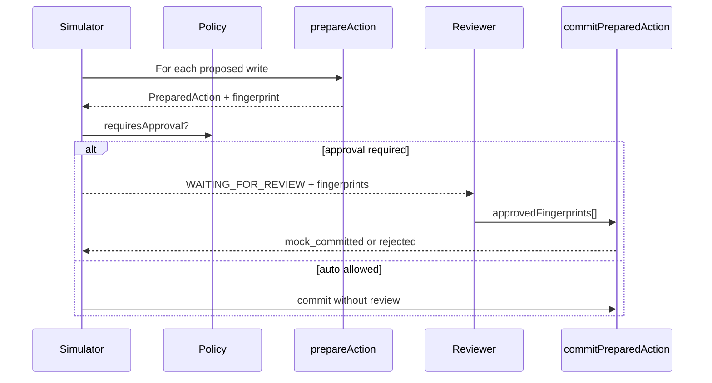

# Approval model

V1 approvals bind to **exact prepared actions**, not free-form replanning after review.

## Flow



## Fingerprint rules

- Fingerprint = `contentHash(payload)` with stable key ordering.
- `requireFingerprintMatch: true` — approval must list exact fingerprints.
- `separateCustomerFacingApproval: true` — customer-facing actions need explicit approval even when other actions are approved.
- Changing payload after preparation invalidates prior approvals.

## CLI

```bash
npm run loopgraph -- review approve <runId> --fingerprints <fp1,fp2>
npm run loopgraph -- review reject <runId> --comment "reason"
```

## No replanning guarantee

Reviewers approve **PreparedAction** records already in the trace. The agent cannot substitute a different payload post-approval without a new run and new fingerprints.

See also: [trace-model.md](./trace-model.md), [loop-spec.md](./loop-spec.md).
